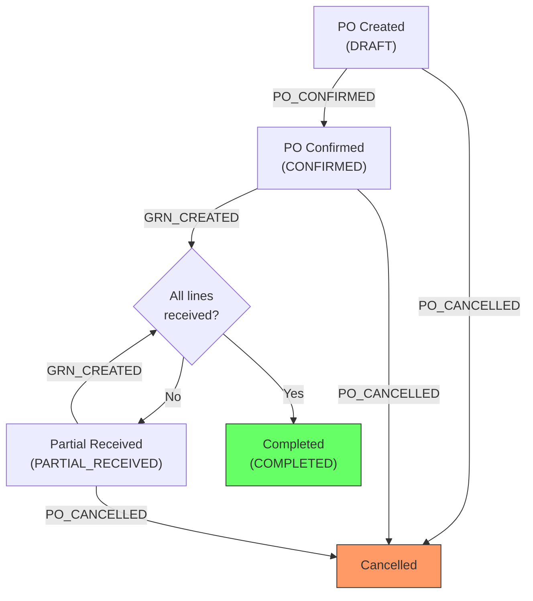
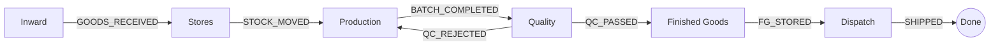

# PRD Guide for the Event System

This document tells you how to create a PRD that the development team can build from. Read the [Event System Architecture](./event-system-architecture.md) first -- it explains how the underlying system works. This document tells you how to structure your output.

The system is a general-purpose event engine. It does not come with a fixed set of events or reports -- **you define them**. Your job is to take a business process and translate it into events, data contracts, rules, and reports. The PRD you produce is what the developer will build from, so the more precise and complete it is, the less back-and-forth will be needed.

---

## Small vs. Large Systems: When to Split PRDs

Not every process fits in a single PRD. Before you start writing, assess the scope.

**A single PRD works when:**
- The process has a clear start and end (e.g., "Purchase Order lifecycle from creation to completion")
- It involves 1-3 entities with fewer than ~15 event types
- One person could reasonably understand the whole thing in one reading

**Multiple PRDs are needed when:**
- The system spans multiple distinct processes (e.g., an entire factory covering inward, production, QC, packing, and dispatch)
- Different teams or departments own different parts
- The total step count exceeds ~15-20, making a single document unwieldy
- Parts of the system can be built and delivered independently

### How to Structure Multiple PRDs

When the system is large, create an **overview PRD** and then **one PRD per module/subprocess**. Organize them in a folder:

```
docs/prds/
  {system-name}/
    00-overview.md           <- The overview PRD (includes overview flowchart)
    01-{first-module}.md     <- First module PRD (includes screen list + module flowchart)
    02-{second-module}.md    <- Second module PRD
    03-{third-module}.md     <- Third module PRD
    ...
    user-journeys.md         <- Companion doc: user journeys for ALL roles across modules
```

Number the files to indicate the natural order of the process flow (which module comes first, second, etc.), though modules may also run in parallel.

### The Overview PRD

The overview PRD is short. It does not contain step definitions or payload contracts. Its job is to:

1. **Describe the system** as a whole in 2-3 paragraphs -- what it does, who uses it, what the end-to-end flow looks like.

2. **List the modules** and what each one covers:

```
| # | Module | PRD | What It Covers |
|---|---|---|---|
| 1 | Inward | 01-inward.md | Raw material receiving, supplier GRN, QC at gate |
| 2 | Production | 02-production.md | Work orders, station-by-station processing, yield tracking |
| 3 | Quality | 03-quality.md | In-process QC, final QC, rejection handling |
| 4 | Dispatch | 04-dispatch.md | Packing, shipping, delivery confirmation |
```

3. **Show the end-to-end flow** across modules -- how does work move from one module to the next?

```
[Inward] --GOODS_RECEIVED--> [Production] --BATCH_COMPLETED--> [Quality] --QC_PASSED--> [Dispatch]
```

4. **List shared entities** -- entities that appear in multiple modules (e.g., items, locations, inventory levels). Specify which module is responsible for creating the entity and which modules reference it.

5. **List shared event types** -- event types that are emitted in one module but consumed by projections in another (e.g., `GOODS_RECEIVED` may be emitted by the Inward module but updates inventory projections used by Production).

6. **Define the build order** -- which modules should be built first? Are there dependencies? (e.g., "Inward must be built before Production because production depends on inventory levels populated by inward receiving.")

### Each Module PRD

Each module PRD follows the full structure described in the rest of this document (Process Overview, Entities, Steps, State Machines, Reports, Roles, Locations, Screen List, and Process Flowchart). It covers one self-contained part of the system.

A module PRD should:

- **Be self-contained enough to build independently.** A developer should be able to pick up one module PRD and build it without reading all the others. Reference the overview for cross-module context, but include everything needed for implementation within the module document.
- **Clearly mark cross-module boundaries.** When a step in your module emits an event that another module consumes, or when your module depends on an entity created by another module, call it out explicitly: "This step emits `GOODS_RECEIVED`, which is consumed by the Production module's inventory projection."
- **Define its own reports.** Each module defines the projections and reports relevant to its part of the process. Some reports may span modules (e.g., end-to-end cycle time) -- put those in the overview PRD.

### Example: A Factory System

```
docs/prds/
  mumbai-factory/
    00-overview.md
      - System description: "End-to-end factory management for Mumbai plant"
      - Modules: Inward, Stores, Production, Quality, Finished Goods, Dispatch
      - Overview flowchart (modules as blocks with connecting events)
      - Shared entities: items, locations, vendors, inventory_levels
      - Build order: Inward -> Stores -> Production -> Quality -> FG -> Dispatch

    user-journeys.md
      - Gate Clerk: receiving trucks, logging gate entries
      - Warehouse Clerk: processing GRNs, put-away tasks
      - Floor Supervisor: monitoring production stations, handling exceptions
      - QC Inspector: recording test results, pass/fail decisions
      - Dispatch Coordinator: picking, packing, shipping
      - Plant Manager: reviewing dashboards, approving escalations

    01-inward.md
      - Covers: Gate entry, supplier GRN, inward QC, rejection/return
      - Entities: GRN, Inward QC Record
      - Steps: GATE_ENTRY_LOGGED, GRN_CREATED, INWARD_QC_STARTED, INWARD_QC_COMPLETED, ...
      - Reports: Pending receipts, today's inward summary, rejection rate
      - Screen list: 5 screens (Gate Entry form, Receiving form, GRN list, GRN detail, Inward QC form)
      - Flowchart: Gate → GRN → QC → Accept/Reject

    02-stores.md
      - Covers: Put-away, bin allocation, stock transfers, cycle counts
      - Entities: Put-Away Task, Cycle Count
      - Steps: PUTAWAY_COMPLETED, STOCK_MOVED, CYCLE_COUNT_COMPLETED, STOCK_ADJUSTED, ...
      - Reports: Bin utilization, stock aging, cycle count variance
      - Screen list: 6 screens
      - Flowchart: Put-away → Storage → Transfer/Count

    03-production.md
      - Covers: Work orders, batch creation, station processing, yield tracking
      - Entities: Work Order, Production Batch
      - Steps: WO_CREATED, BATCH_CREATED, CUTTING_STARTED, CUTTING_COMPLETED, ...
      - Reports: WIP by station, daily throughput, yield percentage, batch tracking
      - Screen list: 8 screens
      - Flowchart: WO → Batch → Station 1 → Station 2 → ... → Complete

    04-quality.md
      - Covers: In-process QC, final QC, hold/release, rejection handling
      - Entities: QC Record
      - Steps: QC_STARTED, QC_COMPLETED, QC_ACCEPTED, QC_REJECTED, HOLD_PLACED, HOLD_RELEASED, ...
      - Reports: Pass/fail rate, rejection reasons, hold inventory
      - Screen list: 5 screens
      - Flowchart: QC Start → Test → Pass/Fail → Hold/Release

    05-finished-goods.md
      - Covers: FG receipt from production, FG storage, labeling
      - Entities: FG Receipt
      - Steps: FG_RECEIVED, FG_STORED, FG_LABELED, ...
      - Reports: FG inventory by product, aging
      - Screen list: 4 screens
      - Flowchart: FG Receipt → Storage → Labeling

    06-dispatch.md
      - Covers: Sales order picking, packing, shipping, delivery confirmation
      - Entities: Dispatch Order, Shipment
      - Steps: DISPATCH_ORDER_CREATED, PICKING_COMPLETED, PACKING_COMPLETED, SHIPPED, DELIVERED, ...
      - Reports: Pending dispatches, today's shipments, delivery performance
      - Screen list: 7 screens
      - Flowchart: Pick → Pack → Ship → Deliver
```

This is not a rigid template -- adjust the modules and structure to match the actual process. The key principle is: **each PRD should be a buildable unit that a developer can pick up and implement independently.**

---

## What a Single PRD Must Contain

A complete PRD has ten sections:

1. **Process Overview** -- What is this process, end to end?
2. **Entities and Aggregates** -- What are the "things" in this process?
3. **Process Steps** -- What happens at each step? (This is the bulk of the document.)
4. **State Machines** -- What are the valid statuses and transitions?
5. **Reports and Projections** -- What do people need to see?
6. **Roles and Permissions** -- Who can do what?
7. **Locations** -- Where do things happen? (if applicable)
8. **Screen List** -- What screens does this process need?
9. **Process Flowchart** -- What does the flow look like visually?

Plus one **separate companion document**:

10. **User Journey Document** -- How do real users experience the system day-to-day? (This is a separate file from the PRD -- see section 10 below for why and how.)

Each section is described below with instructions and a template.

---

## 1. Process Overview

A short description of the process from start to finish. One or two paragraphs. Name the process, describe its purpose, and list the major stages.

Then include a visual flow showing how the steps connect:

```
[Step 1] --event--> [Step 2] --event--> [Step 3] --event--> [Step 4]
```

**Template:**

```
### Process: {Process Name}

{1-2 paragraph description of the process: what triggers it, what stages it
passes through, what the end state is, and who is involved.}

Flow:

  {Step 1 Name}          {Step 2 Name}          {Step 3 Name}
      [ENTRY]                [ENTRY]                [ENTRY]
         |                       |                       |
    {EVENT_NAME}           {EVENT_NAME}           {EVENT_NAME}
         |                       |                       |
      (process)              (process)              (process)
         |                       |                       |
    {EVENT_NAME}           {EVENT_NAME}           {EVENT_NAME}
         |                       |                       |
      [EXIT]                  [EXIT]                  [EXIT]
```

---

## 2. Entities and Aggregates

List every entity (aggregate) that this process introduces or touches. For each one, define:

- **Name**: What is it called?
- **Aggregate type**: The string that will be used in `aggregate_type` (e.g., `"SalesOrder"`, `"ProductionBatch"`)
- **Relationships**: How does it connect to other entities? (e.g., "A GRN belongs to a Purchase Order")

**Template:**

```
### Entities

| Entity | Aggregate Type | Relationships |
|---|---|---|
| {Entity name} | {AggregateType} | {Belongs to X, contains many Y} |
| {Entity name} | {AggregateType} | {Referenced by Z} |
```

### Entity Field Definitions

For each entity, list the fields that the projection table should have. These are the columns the developer will create in the database. Think of this as "what does a row in this entity's table look like?"

**Template (one per entity):**

```
#### {Entity Name}

| Field | Type | Description |
|---|---|---|
| id | UUID | Primary key |
| {code/number field} | string | Human-readable identifier (see numbering format below) |
| {field_name} | {type} | {What this field represents} |
| {field_name} | {type} | {What this field represents} |
| status | string | Current lifecycle status (see State Machine section) |
| created_at | datetime | When the record was created |
| ... | | |
```

Don't include fields that are only ever queried from the event store (like "who created this" -- that's already in the event's `actor_id`). Only include fields that need to exist in the projection table for queries, filters, or display.

### Numbering Formats

Most entities need a human-readable code or number (e.g., PO-2024-0001, GRN-2024-0042, WO-001234). Define the format for each entity that has one:

```
### Numbering

| Entity | Prefix | Format | Example |
|---|---|---|---|
| {Entity} | {PREFIX} | {PREFIX}-{YYYY}-{NNNN} | PO-2024-0001 |
| {Entity} | {PREFIX} | {PREFIX}-{NNNNNN} | WO-001234 |
```

These are auto-generated by the system -- the user does not type them. The analyst should define the prefix and format; the developer handles the sequence.

---

## 3. Process Steps

This is the most important section. For each step in the process, fill in the following template. Every field matters.

**Template (copy once per step):**

```
### Step: {Step Name}

Event type: {EVENT_NAME}

Trigger:
  {What initiates this step. Be specific: "Operator scans batch barcode",
   "Manager clicks Approve button on PO detail page",
   "System auto-triggers when all lines are received", etc.}

Data points captured:
  {List every piece of information that is entered, scanned, selected, or
   calculated at this step. These become the event payload fields.}
  - {field_name}: {type} -- {description}
  - {field_name}: {type} -- {description}
  - ...

Payload:
  {The exact fields that go into the event's payload JSONB. This is the
   contract between the screen and the system.}
  {field_name}: {type}
  {field_name}: {type}
  ...

Aggregate: {aggregate_type} / {which field is the aggregate_id}

Location: {Does this step happen at a specific location? If yes, which
  location_id should the event carry? If no, leave as "None".}

Preconditions:
  {What must be true before this event can be emitted? List every check.}
  - {Entity} status must be {status}
  - {quantity} must be {condition}
  - {Other business rule}

Side effects:
  {What happens automatically when this event is processed? List every
   cascading update or follow-up event.}
  - {Projection table}: {what changes}
  - {Follow-up event}: {EVENT_NAME} emitted for {reason}
  - ...

Projections updated:
  {Which projection tables are touched by this event, and what fields change?}
  - {table_name}: {field} -> {new value or operation}
  - {table_name}: {field} += {value}
  - ...

Permissions:
  {What permission is required to perform this step?}
  - {permission_code}
```

### Guidance for filling in steps

**Trigger**: Be specific about the user action. "User creates order" is too vague. "Warehouse clerk scans item barcode on the receiving screen, enters quantity, and clicks Submit" is specific enough.

**Data points vs. Payload**: Data points are what the user sees and enters. Payload is what goes into the event. They're usually the same, but sometimes the system adds computed fields (like a generated order number) or the screen captures something that maps to a different payload field name.

**Event types**: You define the event types your process needs. Name them using the `NOUN_PAST_TENSE_VERB` convention (e.g., `ORDER_PLACED`, `BATCH_COMPLETED`, `TICKET_ESCALATED`). The architecture doc lists event types from other processes -- some of these may be useful for your process too (e.g., `GOODS_RECEIVED` already updates inventory), but you are not limited to them. Define whatever your process requires.

**Side effects**: This is where you describe cascading behavior. If completing one step should automatically trigger inventory updates, status changes on related entities, or follow-up events, list them here. If there are no side effects beyond updating the step's own projection, say "None beyond projection update."

**Preconditions**: Think about what could go wrong. What if someone tries to perform this step out of order? What if the quantity exceeds what's available? Each precondition becomes a validation check in the API.

---

## 4. State Machines

For each entity that has a lifecycle (statuses that change over time), document the state machine. This tells the developer exactly what transitions are legal.

**Template (one per entity with statuses):**

```
### {Entity Name} States

Statuses: {STATUS_A}, {STATUS_B}, {STATUS_C}, {STATUS_D}, ...

Transitions:

| From Status | Event | To Status |
|---|---|---|
| {STATUS_A} | {EVENT_NAME} | {STATUS_B} |
| {STATUS_B} | {EVENT_NAME} | {STATUS_C} |
| {STATUS_B} | {EVENT_NAME} | {STATUS_D} |
| ...         | ...          | ...         |

Notes:
- {Any special rules, e.g., "CANCELLED is a terminal state -- no transitions out"}
- {e.g., "COMPLETED can only be reached when all line quantities are fulfilled"}
```

Visualize it if helpful:

```
STATUS_A --EVENT_NAME--> STATUS_B --EVENT_NAME--> STATUS_C
                            |
                        EVENT_NAME
                            |
                            v
                        STATUS_D (terminal)
```

---

## 5. Reports and Projections

For each report or view the business needs, document what it shows and what keeps it updated. Start from the business question, not from the technical table.

**Template:**

```
### Reports

| # | Business Question | Projection Table | Key Fields | Updated By Events |
|---|---|---|---|---|
| 1 | "{Question in plain language}" | {table_name} | {field1, field2, ...} | {EVENT_A}, {EVENT_B} |
| 2 | "{Question in plain language}" | {table_name} | {field1, field2, ...} | {EVENT_A}, {EVENT_C} |
| ... | | | | |
```

### Guidance for reports

**Think about who looks at what.** A floor supervisor needs different views than a finance manager. List reports grouped by audience if that helps.

**Entity history is free.** You do not need to define a projection for "show me the full history of entity X" -- that's a direct query on `movement_events` filtered by `aggregate_type` and `aggregate_id`. It comes for free with every entity.

**Summary/aggregate reports need projections.** If the business needs "daily throughput by station" or "outstanding vendor balances" or "fulfillment rate this month", those need dedicated projection tables that are updated incrementally as events flow through.

**You define the projections.** The system does not come with predefined reports. You decide what the business needs to see, and those become projection tables. Some projections from other processes already exist (e.g., `inventory_levels` tracks quantity on hand per item per location) -- if your process involves inventory, that projection will be updated automatically when your events include inventory-related event types. But the reports specific to your process are yours to define from scratch.

---

## 6. Roles and Permissions

List every role involved in the process and what they're allowed to do. Map each action to a permission code.

**Template:**

```
### Roles

| Role | Description | Permissions |
|---|---|---|
| {Role Name} | {Who this person is} | {permission_1}, {permission_2}, ... |
| {Role Name} | {Who this person is} | {permission_1}, {permission_2}, ... |

### Permissions

| Permission Code | Description | Used By Step |
|---|---|---|
| events:{EVENT_NAME}:emit | Allowed to emit {event description} | {Step Name} |
| {resource}:{action} | {description} | {Step Name} |
```

Permission codes follow these patterns:
- `events:{EVENT_TYPE}:emit` -- permission to emit a specific event type
- `{resource}:{action}` -- resource-level permission (e.g., `purchase_orders:confirm`, `vendors:write`)
- `events:*:emit` -- wildcard, can emit any event
- `admin:*:*` -- full system access

---

## 7. Locations (if applicable)

If the process involves physical locations (warehouses, stations, counters, etc.), list them and how they map to the location hierarchy.

**Template:**

```
### Locations

| Location | Type | Code | Parent | Purpose |
|---|---|---|---|---|
| {Name} | warehouse/zone/bin | {CODE} | {parent code or "root"} | {What happens here} |
| {Name} | warehouse/zone/bin | {CODE} | {parent code} | {What happens here} |
```

If the process is purely document-based (approvals, invoicing) and does not involve physical locations, state that explicitly: "This process does not involve physical locations. Events will not carry a location_id."

If the process needs location types beyond `warehouse`, `zone`, and `bin`, call that out.

---

## 8. Screen List

Every process needs screens. Before anyone builds anything, we need to know exactly how many screens the system requires and what each one does. This gives us a clear scope of the UI work.

List every screen a user will interact with. For each screen, document what it shows, what actions are available, and which role uses it.

**Template:**

```
### Screen List

| # | Screen Name | Type | Used By | Purpose | Key Actions |
|---|---|---|---|---|---|
| 1 | {Screen name} | {list/detail/form/dashboard} | {Role} | {What this screen is for} | {Button/action 1, Button/action 2} |
| 2 | {Screen name} | {list/detail/form/dashboard} | {Role} | {What this screen is for} | {Button/action 1, Button/action 2} |
| ... | | | | | |
```

### Screen types

- **List**: A table/grid showing multiple records with filtering, sorting, and pagination (e.g., "All Purchase Orders", "Pending QC Batches")
- **Detail**: A single record view showing all information about one entity, its history, and available actions (e.g., "PO #1234 detail page")
- **Form**: A data entry screen for creating or editing something (e.g., "Create Purchase Order", "Record QC Results")
- **Dashboard**: A summary view with metrics, charts, or status cards for a role or area (e.g., "Floor Supervisor Dashboard", "Dispatch Overview")

### Guidance for the screen list

**Every event-emitting step needs at least one screen.** Go through your process steps and ask: where does the user trigger this event? That's a screen.

**List screens need detail screens.** If you have a list of purchase orders, you need a PO detail page. If you have a list of production batches, you need a batch detail page.

**Think about navigation.** How does the user get from one screen to another? A list screen typically links to detail screens. A detail screen typically has action buttons that open forms or trigger events.

**Group screens by role.** A warehouse clerk sees different screens than a floor supervisor or a finance manager. Grouping by role makes it easy to understand each person's interface.

**Example:**

```
### Screen List

| # | Screen Name | Type | Used By | Purpose | Key Actions |
|---|---|---|---|---|---|
| 1 | Purchase Orders | list | Procurement Manager | Browse all POs with status filters | Create New PO |
| 2 | Purchase Order Detail | detail | Procurement Manager | View PO lines, totals, GRN history | Confirm, Revise, Cancel |
| 3 | Create Purchase Order | form | Procurement Manager | Enter PO header, add line items | Save as Draft, Submit |
| 4 | Goods Receiving | form | Warehouse Clerk | Record received quantities against a PO | Submit Receipt |
| 5 | GRN Detail | detail | Warehouse Clerk | View what was received, when, by whom | -- |
| 6 | Inventory Levels | list | Warehouse Supervisor | Current stock by item and location | Export |
| 7 | Low Stock Alerts | dashboard | Warehouse Supervisor | Items below reorder point | Create PO |
```

---

## 9. Process Flowchart

Every PRD must include a process flowchart that shows the entire process visually -- all the steps, decision points, and branches in one diagram. This is the first thing anyone should look at to understand the process at a glance.

Create this as a text-based flowchart using Mermaid syntax (which renders in most markdown viewers and can be converted to images).

### What the flowchart should show

- **Every step** in the process as a node
- **The event** that moves the process from one step to the next (as edge labels)
- **Decision points** where the process can branch (e.g., QC pass vs. fail, full vs. partial receipt)
- **Terminal states** (completed, cancelled, rejected)
- **Swim lanes or groupings** by role or area, if that makes the flow clearer

### Template (Mermaid syntax):

````
```mermaid
flowchart TD
    A["{Step 1}"] -->|{EVENT_NAME}| B["{Step 2}"]
    B -->|{EVENT_NAME}| C{"{Decision Point}"}
    C -->|{Condition A}| D["{Step 3a}"]
    C -->|{Condition B}| E["{Step 3b}"]
    D -->|{EVENT_NAME}| F["{Step 4}"]
    E -->|{EVENT_NAME}| G["{Terminal State}"]
```
````

### Example:

````

````

### Guidance

**Start simple, then add detail.** First draw the happy path from start to finish. Then add the branches -- what happens on failure, cancellation, rejection, rework.

**One flowchart per module.** If you have multiple PRDs, each module gets its own flowchart. The overview PRD should have a high-level flowchart showing how modules connect.

**Label edges with event names.** This directly ties the visual flow to the events defined in your process steps. Someone reading the flowchart can look up any edge label in the step definitions for full detail.

**Show decision points explicitly.** Don't just draw a straight line from QC to the next step. Show the diamond: does it pass or fail? Each branch is a different event and a different path.

**For large systems with an overview PRD**, include two levels of flowcharts:

1. **Overview flowchart** (in `00-overview.md`): Shows modules as large blocks with the key events connecting them.

````

````

2. **Module flowcharts** (in each module PRD): Shows the detailed steps within that module.

---

## 10. User Journey Document (separate file)

This is the one deliverable that lives **outside** the PRD, as a companion document. The reason: a PRD is a technical contract (events, payloads, rules, screen list). The user journey is a **narrative** -- it tells the story of how real people move through the system day-to-day. Keeping it separate means the developer can reference both: the PRD for "what to build" and the journey for "what it should feel like."

Create this as a separate file alongside the PRD:
- Single PRD: `user-journeys.md` next to the PRD file
- Multi-PRD: `{system-name}/user-journeys.md` in the PRD folder (one file covering all roles across all modules)

### What the user journey document should contain

**One section per role.** Each role that uses the system gets its own journey. A warehouse clerk's day looks different from a supervisor's or a finance manager's.

**For each role, tell the story as a narrative.** Walk through a typical day or a typical task from start to finish. Describe what the user sees, what they do, and what happens next.

**Template:**

```
## {Role Name}

### Who they are
{One sentence: who is this person, where do they work, what's their job.}

### Their typical workflow

**{Task 1 name}**

1. {User opens/navigates to...}
2. {User sees... (describe what's on the screen -- what data, what state)}
3. {User does... (clicks, scans, enters data)}
4. {System responds... (what changes, what confirmation appears, where do they go next)}
5. ...

**{Task 2 name}**

1. ...

### What success looks like
{Describe the end state from this user's perspective. What have they accomplished?
What is the output -- a confirmed order, a received shipment, a dispatched truck?}
```

### Guidance

**Be concrete.** Don't write "the user creates a PO." Write "Priya opens the Purchase Orders screen, clicks 'Create New', selects vendor Tata Steel from the dropdown, adds 3 line items for M8 bolts, M10 nuts, and flat washers, enters quantities and prices, and clicks Save as Draft. The PO appears in her list with status DRAFT."

**Cover the happy path first, then edge cases.** Start with what happens when everything goes right. Then add sections for what happens when things go wrong -- QC failure, short shipment, rejection, cancellation.

**Show handoffs between roles.** When one person's action becomes another person's input, make that explicit. "Priya confirms the PO. The next morning, Raj at the warehouse sees it appear in his Pending Receipts list."

**Describe the final output.** Every process produces something -- a shipped order, a completed batch, a paid invoice. Describe what the end looks like: what screens show it as done, what reports reflect it, what the user can point to and say "that's complete."

### Example:

```
## Warehouse Clerk

### Who they are
Raj works at the Mumbai warehouse receiving dock. He processes incoming
shipments from suppliers against purchase orders.

### Their typical workflow

**Processing a goods receipt**

1. Raj opens the Goods Receiving screen at the start of his shift.
2. A truck arrives. Raj selects the PO number from the dropdown -- the system
   shows PO-2024-0087 from Tata Steel, with 3 line items.
3. He counts the delivered items and enters the received quantities:
   - M8 Bolts: ordered 500, received 500
   - M10 Nuts: ordered 1000, received 800 (short shipment)
   - Flat Washers: ordered 2000, received 2000
4. He adds a note on the M10 Nuts line: "Supplier confirmed remaining 200
   will arrive next week."
5. He clicks "Submit Receipt."
6. The system creates GRN-2024-0042. The screen shows a confirmation with
   the GRN number. The PO status changes to PARTIAL_RECEIVED.
7. Raj can see the GRN in his recent receipts list. Inventory levels for
   M8 Bolts and Flat Washers now show the full quantity at the warehouse.

**Checking inventory**

1. Raj's supervisor asks if they have enough M10 Nuts for production.
2. Raj opens the Inventory Levels screen and searches for M10 Nuts.
3. He sees: 800 on hand, 0 reserved, at WH-CENTRAL. He reports back.

### What success looks like
At the end of the day, every truck has been processed. GRNs match the
physical count. Inventory levels are accurate. The procurement team can
see which POs are partially received and follow up with suppliers.
```

---

## Checklist Before Submitting

Before handing over the PRD, verify:

**Core sections:**
- [ ] Every step in the process flow has a complete step definition
- [ ] Every event type is named in `NOUN_PAST_TENSE_VERB` format (e.g., `BATCH_CREATED`, not `CREATE_BATCH`)
- [ ] Every step's payload lists all fields with types
- [ ] Every step's preconditions are listed (what status must the entity be in?)
- [ ] Every step's side effects are listed (what cascades?)
- [ ] Every entity has a field definition table listing its projection table columns
- [ ] Every entity that needs a human-readable code has a numbering format defined
- [ ] Every entity with a lifecycle has a state machine with all transitions
- [ ] Every report/view the business needs is listed with the events that update it
- [ ] Every action is mapped to a permission and a role
- [ ] Aggregates are identified and their relationships are documented

**Screen list:**
- [ ] Every event-emitting step has at least one screen
- [ ] Every list screen has a corresponding detail screen
- [ ] Screen types are specified (list/detail/form/dashboard)
- [ ] Every screen is assigned to a role

**Process flowchart:**
- [ ] Happy path is shown from start to finish
- [ ] Decision points and branches are included (pass/fail, partial/complete, etc.)
- [ ] Edge labels match event type names from the step definitions
- [ ] Terminal states are clearly marked

**User journey document (separate file):**
- [ ] Every role that uses the system has a journey section
- [ ] Journeys are concrete narratives (named people, specific data, real scenarios)
- [ ] Handoffs between roles are described
- [ ] Edge cases and error scenarios are covered (not just the happy path)
- [ ] The final output / "what done looks like" is described for each role

---

## Example: A Completed Step (for reference)

Here is one fully filled-in step to show the expected level of detail:

```
### Step: Goods Receipt at Warehouse

Event type: GRN_CREATED

Trigger:
  Warehouse clerk opens the receiving screen, selects the Purchase Order from a
  dropdown, enters received quantities per line item, and clicks "Submit Receipt".

Data points captured:
  - purchase_order_id: UUID -- selected from PO dropdown
  - location_id: UUID -- the receiving location (pre-filled based on clerk's assigned location)
  - receipt_date: date -- defaults to today, can be changed
  - lines: list -- for each PO line:
    - po_line_id: UUID -- the PO line being received against
    - quantity_received: number -- how many units received
    - notes: string (optional) -- any remarks about condition, damage, etc.
  - notes: string (optional) -- general remarks for the entire receipt

Payload:
  id: UUID (generated)
  grn_number: string (generated, format GRN-YYYY-NNNN)
  purchase_order_id: UUID
  location_id: UUID
  receipt_date: date
  lines:
    - po_line_id: UUID
      quantity_received: number
      notes: string?
  notes: string?

Aggregate: GRN / id

Location: The receiving warehouse location (location_id from payload)

Preconditions:
  - Purchase Order status must be CONFIRMED or PARTIAL_RECEIVED
  - Each line's quantity_received must be > 0
  - Each line's quantity_received must not exceed the remaining quantity
    (po_line.quantity - po_line.quantity_received)

Side effects:
  - GRN record created
  - PO line quantity_received incremented per line
  - PO status updated to PARTIAL_RECEIVED or COMPLETED (if all lines fully received)
  - GOODS_RECEIVED event emitted for each line (cascades to inventory)
  - inventory_levels: quantity_on_hand increased at the receiving location

Projections updated:
  - goods_receipt_notes: new row (grn_number, purchase_order_id, location_id, receipt_date)
  - grn_lines: new rows per line (grn_id, po_line_id, item_id, quantity_received)
  - purchase_orders: status -> PARTIAL_RECEIVED or COMPLETED
  - purchase_order_lines: quantity_received += received amount per line
  - inventory_levels: quantity_on_hand += quantity per item at location (via cascaded GOODS_RECEIVED)

Permissions:
  - events:GRN_CREATED:emit (assigned to Warehouse Clerk role)
```
