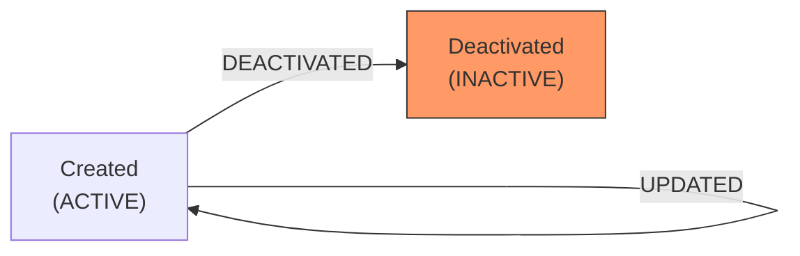

# Module 01 — Master Data

## 1. Process Overview

### Process: Master Data Management

Master data provides the configurable reference entities that all other modules depend on. This includes vendors (mills), customers (Haste), brands, products, fold types, tone codes, finish codes, quality codes, and trade numbers. Packaging SKUs are deferred to a future phase.

All master data entities are user-configurable — the facility manager and supervisors can create, update, and deactivate entries as needed. There are no hard-coded product lists, brand lists, or quality codes. The system ships with an empty configuration that users populate during onboarding and extend over time.

Master data has no linear process flow — it is a CRUD module. Entities are created when needed, updated when details change, and deactivated (never hard-deleted) when no longer relevant.

---

## 2. Entities and Aggregates

### Entities

| Entity | Aggregate Type | Relationships |
|---|---|---|
| Vendor | `Vendor` | Referenced by MRL (inbound), Not Acceptable Resolution |
| Customer | `Customer` | Referenced by Packing Program (Haste), Delivery Form, Todiya |
| Brand | `Brand` | Referenced by Packing Program, Bale |
| Product | `Product` | Belongs to a Brand. Referenced by Packing Program, Bale |
| Fold Type | `FoldType` | Referenced by Packing Program |
| Tone Code | `ToneCode` | Referenced by Classification (Module 04), Packing Program, Bale |
| Finish Code | `FinishCode` | Referenced by Classification (Module 04), Packing Program, Bale |
| Quality Code | `QualityCode` | Referenced by MRL (inbound), Inbound Receipt (Gate Pass) |
| Trade Number | `TradeNumber` | References a Product. Referenced by Bale, Delivery Form |
| Packaging SKU | `PackagingSku` | Deferred to future phase |

### Entity Field Definitions

#### Vendor

| Field | Type | Description |
|---|---|---|
| id | UUID | Primary key |
| code | string | Short code (e.g., `KALAPURNA`, `RSK`) |
| name | string | Full vendor name (e.g., "Kalapurna Mills") |
| vendor_type | string | `DYEING_MILL` or `PACKAGING_SUPPLIER` |
| address | string | Optional — vendor address |
| contact_info | string | Optional — phone or contact name |
| is_active | boolean | Soft-delete flag |
| created_at | datetime | When the record was created |

#### Customer

| Field | Type | Description |
|---|---|---|
| id | UUID | Primary key |
| code | string | Short code (e.g., `RAME`, `CB`, `VS`) |
| name | string | Full customer/party name — this is the "Haste" identifier |
| address | string | Optional — delivery address |
| contact_info | string | Optional — phone or contact name |
| is_active | boolean | Soft-delete flag |
| created_at | datetime | When the record was created |

#### Brand

| Field | Type | Description |
|---|---|---|
| id | UUID | Primary key |
| code | string | Short code (e.g., `SSTM`) |
| name | string | Full brand name (e.g., "Shree Shubhlaxmi Textile Mills") |
| is_active | boolean | Soft-delete flag |
| created_at | datetime | When the record was created |

#### Product

| Field | Type | Description |
|---|---|---|
| id | UUID | Primary key |
| code | string | Short code (e.g., `OFFICER`, `SPORTSMAN`) |
| name | string | Full product name (e.g., "Officer", "Sportsman", "KT-555") |
| brand_id | UUID (FK) | Which brand this product belongs to |
| is_active | boolean | Soft-delete flag |
| created_at | datetime | When the record was created |

#### Fold Type

| Field | Type | Description |
|---|---|---|
| id | UUID | Primary key |
| code | string | Short code (e.g., `BOOK`, `ROOF`, `2FOLD`, `B1F`) |
| name | string | Display name (e.g., "Book", "Roof", "2 Fold", "Book 3 fold") |
| is_active | boolean | Soft-delete flag |
| created_at | datetime | When the record was created |

#### Tone Code

| Field | Type | Description |
|---|---|---|
| id | UUID | Primary key |
| code | string | Short code (e.g., `O1W`) |
| name | string | Display name (e.g., "Off-White") |
| is_active | boolean | Soft-delete flag |
| created_at | datetime | When the record was created |

#### Finish Code

| Field | Type | Description |
|---|---|---|
| id | UUID | Primary key |
| code | string | Short code (e.g., `01`, `02`, `03`) |
| name | string | Display name (e.g., "Finish 01", "Finish 02") |
| is_active | boolean | Soft-delete flag |
| created_at | datetime | When the record was created |

#### Quality Code

| Field | Type | Description |
|---|---|---|
| id | UUID | Primary key |
| code | string | Quality code from vendor (e.g., `44x45P6`, `RC-8001`, `Lancer W/R`) |
| description | string | Optional description of the quality type |
| is_active | boolean | Soft-delete flag |
| created_at | datetime | When the record was created |

#### Trade Number

| Field | Type | Description |
|---|---|---|
| id | UUID | Primary key |
| code | string | The trade number (e.g., `S8072-58"`, `KT-11058`) |
| product_id | UUID (FK) | Which product this trade number belongs to |
| width | string | Fabric width (e.g., "58\"") |
| description | string | Optional additional description |
| is_active | boolean | Soft-delete flag |
| created_at | datetime | When the record was created |

#### Packaging SKU (Deferred)

> **Deferred to future phase.** Packaging material management is out of scope for the initial build. The Packaging SKU entity definition is retained here for reference but will not be implemented in Phase 1.

| Field | Type | Description |
|---|---|---|
| id | UUID | Primary key |
| code | string | Short code (e.g., `PLASTIC-SHEET`, `CARDBOARD-BOX`, `SSTM-STAMP`) |
| name | string | Full name (e.g., "Plastic sheet — large") |
| sku_type | string | `CONSUMABLE` or `REUSABLE` |
| unit_of_measure | string | UOM (e.g., "units", "kg", "rolls", "sheets") |
| is_active | boolean | Soft-delete flag |
| created_at | datetime | When the record was created |

### Numbering

Master data entities use user-defined codes, not auto-generated numbers. The `code` field on each entity is the human-readable identifier, entered by the user at creation time.

---

## 3. Process Steps

### Step: Create Vendor

Event type: `VENDOR_CREATED`

Trigger:
  Manager opens the Vendor form and enters vendor details. Clicks Save.

Data points captured:
  - code: string — unique short code
  - name: string — full vendor name
  - vendor_type: string — DYEING_MILL or PACKAGING_SUPPLIER
  - address: string (optional) — vendor address
  - contact_info: string (optional) — contact details

Payload:
  id: UUID (generated)
  code: string
  name: string
  vendor_type: string
  address: string?
  contact_info: string?

Aggregate: Vendor / id

Location: None

Preconditions:
  - Code must be unique among active vendors

Side effects:
  - None beyond projection update

Projections updated:
  - vendors: new row

Permissions:
  - master_data:vendors:write

---

### Step: Update Vendor

Event type: `VENDOR_UPDATED`

Trigger:
  Manager opens an existing vendor record, modifies fields, and clicks Save.

Data points captured:
  - id: UUID — which vendor to update
  - Changed fields only (name, address, contact_info, vendor_type)

Payload:
  id: UUID
  (only changed fields included)

Aggregate: Vendor / id

Location: None

Preconditions:
  - Vendor must exist and be active

Side effects:
  - None beyond projection update

Projections updated:
  - vendors: partial update of changed fields

Permissions:
  - master_data:vendors:write

---

### Step: Deactivate Vendor

Event type: `VENDOR_DEACTIVATED`

Trigger:
  Manager clicks Deactivate on a vendor record.

Data points captured:
  - id: UUID — which vendor to deactivate

Payload:
  id: UUID

Aggregate: Vendor / id

Location: None

Preconditions:
  - Vendor must exist and be active
  - No open MRLs referencing this vendor (warning, not blocking)

Side effects:
  - Vendor no longer appears in dropdown selections

Projections updated:
  - vendors: is_active -> false

Permissions:
  - master_data:vendors:write

---

### Step: Create Customer

Event type: `CUSTOMER_CREATED`

Trigger:
  Manager opens the Customer form and enters customer/party details. Clicks Save.

Data points captured:
  - code: string — unique short code
  - name: string — the Haste identifier (customer/party name)
  - address: string (optional)
  - contact_info: string (optional)

Payload:
  id: UUID (generated)
  code: string
  name: string
  address: string?
  contact_info: string?

Aggregate: Customer / id

Location: None

Preconditions:
  - Code must be unique among active customers

Side effects:
  - None beyond projection update

Projections updated:
  - customers: new row

Permissions:
  - master_data:customers:write

---

### Step: Update Customer

Event type: `CUSTOMER_UPDATED`

Trigger:
  Manager opens an existing customer record, modifies fields, and clicks Save.

Payload:
  id: UUID
  (only changed fields included)

Aggregate: Customer / id

Location: None

Preconditions:
  - Customer must exist and be active

Side effects:
  - None beyond projection update

Projections updated:
  - customers: partial update of changed fields

Permissions:
  - master_data:customers:write

---

### Step: Deactivate Customer

Event type: `CUSTOMER_DEACTIVATED`

Trigger:
  Manager clicks Deactivate on a customer record.

Payload:
  id: UUID

Aggregate: Customer / id

Location: None

Preconditions:
  - Customer must exist and be active

Side effects:
  - Customer no longer appears in dropdown selections

Projections updated:
  - customers: is_active -> false

Permissions:
  - master_data:customers:write

---

### Step: Create Brand

Event type: `BRAND_CREATED`

Trigger:
  Manager opens the Brand form and enters brand details. Clicks Save.

Payload:
  id: UUID (generated)
  code: string
  name: string

Aggregate: Brand / id

Location: None

Preconditions:
  - Code must be unique among active brands

Side effects:
  - None beyond projection update

Projections updated:
  - brands: new row

Permissions:
  - master_data:brands:write

---

### Step: Update Brand

Event type: `BRAND_UPDATED`

Trigger:
  Manager modifies brand details and clicks Save.

Payload:
  id: UUID
  (only changed fields)

Aggregate: Brand / id
Location: None
Preconditions: Brand must exist and be active
Side effects: None beyond projection update
Projections updated: brands: partial update
Permissions: master_data:brands:write

---

### Step: Deactivate Brand

Event type: `BRAND_DEACTIVATED`

Payload:
  id: UUID

Aggregate: Brand / id
Location: None
Preconditions: Brand must exist and be active
Side effects: Brand no longer appears in selections
Projections updated: brands: is_active -> false
Permissions: master_data:brands:write

---

### Step: Create Product

Event type: `PRODUCT_CREATED`

Trigger:
  Manager selects a brand from the dropdown, enters product details, and clicks Save.

Payload:
  id: UUID (generated)
  code: string
  name: string
  brand_id: UUID

Aggregate: Product / id

Location: None

Preconditions:
  - Code must be unique among active products
  - brand_id must reference an active brand

Side effects:
  - None beyond projection update

Projections updated:
  - products: new row

Permissions:
  - master_data:products:write

---

### Step: Update Product

Event type: `PRODUCT_UPDATED`

Payload:
  id: UUID
  (only changed fields — name, brand_id)

Aggregate: Product / id
Location: None
Preconditions: Product must exist and be active; brand_id must reference active brand if changed
Side effects: None beyond projection update
Projections updated: products: partial update
Permissions: master_data:products:write

---

### Step: Deactivate Product

Event type: `PRODUCT_DEACTIVATED`

Payload: id: UUID
Aggregate: Product / id
Location: None
Preconditions: Product must exist and be active
Side effects: Product no longer appears in selections
Projections updated: products: is_active -> false
Permissions: master_data:products:write

---

### Step: Create Fold Type

Event type: `FOLD_TYPE_CREATED`

Payload:
  id: UUID (generated)
  code: string
  name: string

Aggregate: FoldType / id
Location: None
Preconditions: Code must be unique among active fold types
Side effects: None beyond projection update
Projections updated: fold_types: new row
Permissions: master_data:fold_types:write

---

### Step: Update Fold Type

Event type: `FOLD_TYPE_UPDATED`

Payload: id: UUID, (changed fields)
Aggregate: FoldType / id
Preconditions: Must exist and be active
Projections updated: fold_types: partial update
Permissions: master_data:fold_types:write

---

### Step: Deactivate Fold Type

Event type: `FOLD_TYPE_DEACTIVATED`

Payload: id: UUID
Aggregate: FoldType / id
Preconditions: Must exist and be active
Projections updated: fold_types: is_active -> false
Permissions: master_data:fold_types:write

---

### Step: Create Tone Code

Event type: `TONE_CODE_CREATED`

Payload:
  id: UUID (generated)
  code: string
  name: string

Aggregate: ToneCode / id
Location: None
Preconditions: Code must be unique among active tone codes
Side effects: None beyond projection update
Projections updated: tone_codes: new row
Permissions: master_data:tone_codes:write

---

### Step: Update Tone Code

Event type: `TONE_CODE_UPDATED`

Payload: id: UUID, (changed fields)
Aggregate: ToneCode / id
Preconditions: Must exist and be active
Projections updated: tone_codes: partial update
Permissions: master_data:tone_codes:write

---

### Step: Deactivate Tone Code

Event type: `TONE_CODE_DEACTIVATED`

Payload: id: UUID
Aggregate: ToneCode / id
Preconditions: Must exist and be active
Projections updated: tone_codes: is_active -> false
Permissions: master_data:tone_codes:write

---

### Step: Create Finish Code

Event type: `FINISH_CODE_CREATED`

Payload:
  id: UUID (generated)
  code: string
  name: string

Aggregate: FinishCode / id
Location: None
Preconditions: Code must be unique among active finish codes
Side effects: None beyond projection update
Projections updated: finish_codes: new row
Permissions: master_data:finish_codes:write

---

### Step: Update Finish Code

Event type: `FINISH_CODE_UPDATED`

Payload: id: UUID, (changed fields)
Aggregate: FinishCode / id
Preconditions: Must exist and be active
Projections updated: finish_codes: partial update
Permissions: master_data:finish_codes:write

---

### Step: Deactivate Finish Code

Event type: `FINISH_CODE_DEACTIVATED`

Payload: id: UUID
Aggregate: FinishCode / id
Preconditions: Must exist and be active
Projections updated: finish_codes: is_active -> false
Permissions: master_data:finish_codes:write

---

### Step: Create Quality Code

Event type: `QUALITY_CODE_CREATED`

Payload:
  id: UUID (generated)
  code: string
  description: string?

Aggregate: QualityCode / id
Location: None
Preconditions: Code must be unique among active quality codes
Side effects: None beyond projection update
Projections updated: quality_codes: new row
Permissions: master_data:quality_codes:write

---

### Step: Update Quality Code

Event type: `QUALITY_CODE_UPDATED`

Payload: id: UUID, (changed fields)
Aggregate: QualityCode / id
Preconditions: Must exist and be active
Projections updated: quality_codes: partial update
Permissions: master_data:quality_codes:write

---

### Step: Deactivate Quality Code

Event type: `QUALITY_CODE_DEACTIVATED`

Payload: id: UUID
Aggregate: QualityCode / id
Preconditions: Must exist and be active
Projections updated: quality_codes: is_active -> false
Permissions: master_data:quality_codes:write

---

### Step: Create Trade Number

Event type: `TRADE_NUMBER_CREATED`

Trigger:
  Manager enters a trade number, selects the product it belongs to, and optionally specifies width.

Payload:
  id: UUID (generated)
  code: string
  product_id: UUID
  width: string?
  description: string?

Aggregate: TradeNumber / id
Location: None
Preconditions: Code must be unique; product_id must reference an active product
Side effects: None beyond projection update
Projections updated: trade_numbers: new row
Permissions: master_data:trade_numbers:write

---

### Step: Update Trade Number

Event type: `TRADE_NUMBER_UPDATED`

Payload: id: UUID, (changed fields)
Aggregate: TradeNumber / id
Preconditions: Must exist and be active
Projections updated: trade_numbers: partial update
Permissions: master_data:trade_numbers:write

---

### Step: Deactivate Trade Number

Event type: `TRADE_NUMBER_DEACTIVATED`

Payload: id: UUID
Aggregate: TradeNumber / id
Preconditions: Must exist and be active
Projections updated: trade_numbers: is_active -> false
Permissions: master_data:trade_numbers:write

---

### Step: Create Packaging SKU (Deferred)

> **Deferred to future phase.** The following Packaging SKU CRUD steps are retained for reference but will not be implemented in Phase 1.

Event type: `PACKAGING_SKU_CREATED`

Payload:
  id: UUID (generated)
  code: string
  name: string
  sku_type: string (CONSUMABLE or REUSABLE)
  unit_of_measure: string

Aggregate: PackagingSku / id
Location: None
Preconditions: Code must be unique among active packaging SKUs
Projections updated: packaging_skus: new row
Permissions: master_data:packaging_skus:write

---

### Step: Update Packaging SKU (Deferred)

Event type: `PACKAGING_SKU_UPDATED`

Payload: id: UUID, (changed fields)
Aggregate: PackagingSku / id
Preconditions: Must exist and be active
Projections updated: packaging_skus: partial update
Permissions: master_data:packaging_skus:write

---

### Step: Deactivate Packaging SKU (Deferred)

Event type: `PACKAGING_SKU_DEACTIVATED`

Payload: id: UUID
Aggregate: PackagingSku / id
Preconditions: Must exist and be active
Projections updated: packaging_skus: is_active -> false
Permissions: master_data:packaging_skus:write

---

## 4. State Machines

All master data entities follow the same simple lifecycle:

Statuses: `ACTIVE`, `INACTIVE`

Transitions:

| From Status | Event | To Status |
|---|---|---|
| (new) | `{ENTITY}_CREATED` | `ACTIVE` |
| `ACTIVE` | `{ENTITY}_DEACTIVATED` | `INACTIVE` |

Notes:
- No transition from INACTIVE back to ACTIVE. If a deactivated entity needs to be reused, create a new one.
- Deactivation is a soft delete — records remain for historical reference.
- Deactivated entities are excluded from dropdown selections but still visible in historical records.

---

## 5. Reports and Projections

### Reports

| # | Business Question | Projection Table | Key Fields | Updated By Events |
|---|---|---|---|---|
| 1 | "Show me all dyeing mill vendors" | `vendors` | code, name, vendor_type, is_active | `VENDOR_CREATED`, `VENDOR_UPDATED`, `VENDOR_DEACTIVATED` |
| 2 | "Show me all customers (Haste)" | `customers` | code, name, is_active | `CUSTOMER_CREATED`, `CUSTOMER_UPDATED`, `CUSTOMER_DEACTIVATED` |
| 3 | "What brands and products do we have?" | `brands`, `products` | code, name, brand_id, is_active | Brand and Product events |
| 4 | "What fold types are available?" | `fold_types` | code, name, is_active | Fold Type events |
| 5 | "What tone codes are available?" | `tone_codes` | code, name, is_active | Tone Code events |
| 6 | "What finish codes are available?" | `finish_codes` | code, name, is_active | Finish Code events |
| 7 | "What trade numbers exist for product X?" | `trade_numbers` | code, product_id, width, is_active | Trade Number events |
| ~~8~~ | ~~"What packaging items do we track?"~~ | ~~`packaging_skus`~~ | ~~code, name, sku_type, uom, is_active~~ | ~~Packaging SKU events~~ — Deferred |

---

## 6. Roles and Permissions

### Roles

| Role | Description | Permissions |
|---|---|---|
| Admin | System administrator | `admin:*:*` |
| Facility Manager | Creates and manages all master data | All `master_data:*:write` permissions |
| Supervisor | Can view master data, limited write access | `master_data:*:read` |

### Permissions

| Permission Code | Description | Used By Step |
|---|---|---|
| `master_data:vendors:write` | Create, update, deactivate vendors | Vendor CRUD |
| `master_data:customers:write` | Create, update, deactivate customers | Customer CRUD |
| `master_data:brands:write` | Create, update, deactivate brands | Brand CRUD |
| `master_data:products:write` | Create, update, deactivate products | Product CRUD |
| `master_data:fold_types:write` | Create, update, deactivate fold types | Fold Type CRUD |
| `master_data:tone_codes:write` | Create, update, deactivate tone codes | Tone Code CRUD |
| `master_data:finish_codes:write` | Create, update, deactivate finish codes | Finish Code CRUD |
| `master_data:quality_codes:write` | Create, update, deactivate quality codes | Quality Code CRUD |
| `master_data:trade_numbers:write` | Create, update, deactivate trade numbers | Trade Number CRUD |
| `master_data:packaging_skus:write` | Create, update, deactivate packaging SKUs | Packaging SKU CRUD (Deferred) |
| `master_data:*:read` | View any master data entity | All list/detail screens |

---

## 7. Locations

This module does not involve physical locations. Master data events will not carry a `location_id`.

---

## 8. Screen List

| # | Screen Name | Type | Used By | Purpose | Key Actions |
|---|---|---|---|---|---|
| 1 | Vendors | list | Manager | Browse all vendor mills and packaging suppliers | Create New, Filter by type |
| 2 | Vendor Detail | detail | Manager | View/edit a single vendor's details | Edit, Deactivate |
| 3 | Customers (Haste) | list | Manager | Browse all customers/parties | Create New |
| 4 | Customer Detail | detail | Manager | View/edit a single customer's details | Edit, Deactivate |
| 5 | Brands & Products | list | Manager | Browse brands with nested product lists | Create Brand, Create Product |
| 6 | Brand Detail | detail | Manager | View/edit brand, see its products | Edit, Deactivate, Add Product |
| 7 | Product Detail | detail | Manager | View/edit product, see its trade numbers | Edit, Deactivate |
| 8 | Fold Types | list | Manager | Browse all fold types | Create New, Edit inline, Deactivate |
| 9 | Tone Codes | list | Manager | Browse all tone codes | Create New, Edit inline, Deactivate |
| 10 | Finish Codes | list | Manager | Browse all finish codes | Create New, Edit inline, Deactivate |
| 11 | Quality Codes | list | Manager | Browse all quality codes | Create New, Edit inline, Deactivate |
| 12 | Trade Numbers | list | Manager | Browse all trade numbers with product filter | Create New, Edit, Deactivate |
| ~~13~~ | ~~Packaging SKUs~~ | ~~list~~ | ~~Manager~~ | ~~Browse all packaging items~~ | ~~Deferred to future phase~~ |

Note: Simple entities (Fold Types, Tone Codes, Finish Codes, Quality Codes) use inline editing on the list screen rather than a separate detail screen.

---

## 9. Process Flowchart

Master data is CRUD — there is no process flow. Each entity follows:

