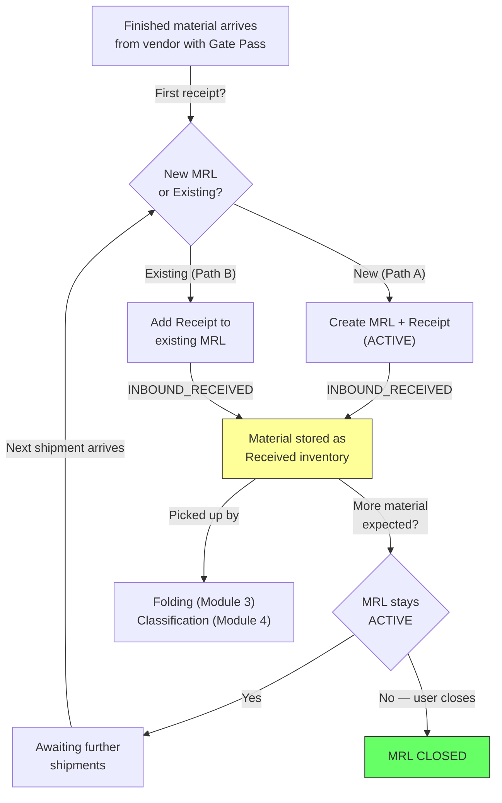

# Module 02 — Inbound Receipt

## 1. Process Overview

### Process: Inbound Receipt of Finished Material

This module tracks the inbound receipt of finished (dyed) material arriving at the Miroli facility from external vendor mills. There is no outbound tracking — the system does not record when greige cloth is dispatched to vendors. The process begins when a vendor's truck arrives at Miroli with dyed cloth and a Gate Pass.

The MRL (Miroli Lot) Number is a facility reference number created at the first inbound receipt. It serves as the lifetime tracking ID for a lot through every downstream process (folding, classification, packing, dispatch). A single MRL may receive material across multiple partial shipments — each shipment is a separate Inbound Receipt linked to the MRL.

The vendor's Gate Pass carries a note of the total greige metres originally sent and the pending greige balance. These are vendor-reported values captured as informational fields on the receipt — the system does not independently track outbound quantities.

No measurement or quality inspection happens at inbound receipt — the vendor's Gate Pass quantities are trusted at face value. Processing begins at the folding and classification stages.

Flow:

```
  First Inbound Receipt               Subsequent Inbound Receipts
       [ENTRY]                                [ENTRY]
          |                                      |
   INBOUND_RECEIVED                       INBOUND_RECEIVED
   (creates MRL + receipt)                (adds receipt to existing MRL)
          |                                      |
   MRL status = ACTIVE                    MRL status = ACTIVE
          |                                      |
   (material stored as                    (material stored as
    Received inventory)                    Received inventory)
          |                                      |
       [EXIT]                                 [EXIT]
```

---

## 2. Entities and Aggregates

### Entities

| Entity | Aggregate Type | Relationships |
|---|---|---|
| MRL (Miroli Lot) | `MRL` | Facility reference number for a lot of finished material. References Vendor. Contains many Inbound Receipts. Referenced by Folding, Classification, Packing, Todiya, NA Resolution. |
| Inbound Receipt | `InboundReceipt` | Belongs to an MRL. Each receipt represents one shipment of finished material arriving from the vendor. Contains optional per-roll detail. |
| Inbound Receipt Roll | Part of `InboundReceipt` | Optional per-roll detail within an inbound receipt — metres and weight for each physical roll. |

### Entity Field Definitions

#### MRL

| Field | Type | Description |
|---|---|---|
| id | UUID | Primary key |
| mrl_number | string | Human-readable MRL number (auto-generated with FY prefix) — facility reference for the lot |
| vendor_id | UUID (FK) | Which vendor mill the material was received from |
| quality_code_id | UUID (FK) | Quality code of the material |
| tone_code_id | UUID (FK) | Optional — tone code if known at receipt |
| metres_received | decimal | Running total of metres received (sum of all inbound receipts) |
| vendor_reported_greige_sent | decimal | Optional — total greige metres the vendor reports having received for processing (from Gate Pass) |
| vendor_reported_greige_pending | decimal | Optional — greige metres the vendor reports are still pending return (from Gate Pass) |
| status | string | Current lifecycle status (`ACTIVE` or `CLOSED`) |
| created_at | datetime | When the MRL was created (= first inbound receipt) |

#### Inbound Receipt

| Field | Type | Description |
|---|---|---|
| id | UUID | Primary key |
| receipt_number | string | Human-readable receipt number (auto-generated) |
| mrl_id | UUID (FK) | Which MRL this receipt is against |
| avak_date | date | Date material arrived at Miroli |
| lot_number | string | Vendor's lot number (from Gate Pass) |
| received_metres | decimal | Metres of finished material in this shipment (from Gate Pass, trusted) |
| quality_code_id | UUID (FK) | Quality code from Gate Pass |
| gsm | decimal | Grams per square metre (from Gate Pass) |
| width | string | Fabric width (e.g., "58\"") |
| rolls | integer | Number of physical rolls in shipment |
| gate_pass_reference | string | Vendor's Gate Pass document number |
| vendor_reported_greige_sent | decimal | Optional — total greige metres originally sent, as noted on Gate Pass |
| vendor_reported_greige_pending | decimal | Optional — greige metres still pending, as noted on Gate Pass |
| notes | string | Optional remarks |
| created_at | datetime | When the receipt was recorded |

#### Inbound Receipt Roll (optional per-roll detail)

| Field | Type | Description |
|---|---|---|
| id | UUID | Primary key |
| inbound_receipt_id | UUID (FK) | Parent inbound receipt |
| roll_number | integer | Sequence within the receipt (1, 2, 3...) |
| metres | decimal | Optional — metres for this roll (from Gate Pass roll-by-roll data) |
| weight_kg | decimal | Optional — weight in kg for this roll |

Note: Per-roll detail is optional. Users may record just the total rolls count on the receipt, or optionally break down metres and weight per individual roll when this data is available on the Gate Pass.

### Numbering

| Entity | Prefix | Format | Example |
|---|---|---|---|
| MRL | MRL | FY{YY}-MRL-{NNNN} | FY26-MRL-0526 |
| Inbound Receipt | IR | FY{YY}-IR-{NNNN} | FY26-IR-0042 |

---

## 3. Process Steps

### Step: Record Inbound Receipt (New MRL — Path A)

Event type: `INBOUND_RECEIVED`

Trigger:
  Supervisor opens the Record Inbound Receipt screen. No existing MRL is selected (or the user
  chooses "New MRL"). The user enters vendor, quality code, Gate Pass data, and clicks Submit.
  The system creates a new MRL and the first inbound receipt together in a single operation.

Data points captured:
  - vendor_id: UUID — selected from vendor dropdown (filtered to DYEING_MILL type)
  - quality_code_id: UUID — selected from quality code dropdown
  - tone_code_id: UUID (optional) — tone code if known
  - avak_date: date — date of arrival, defaults to today
  - lot_number: string — vendor's lot number from Gate Pass
  - received_metres: decimal — metres of finished material in this shipment from Gate Pass
  - gsm: decimal (optional) — from Gate Pass
  - width: string (optional) — from Gate Pass (e.g., "58\"")
  - rolls: integer (optional) — number of physical rolls
  - roll_details: list (optional) — per-roll breakdown, each containing:
    - roll_number: integer — sequence (1, 2, 3...)
    - metres: decimal (optional) — metres for this roll
    - weight_kg: decimal (optional) — weight in kg for this roll
  - gate_pass_reference: string — vendor's Gate Pass document number
  - vendor_reported_greige_sent: decimal (optional) — from Gate Pass note
  - vendor_reported_greige_pending: decimal (optional) — from Gate Pass note
  - notes: string (optional) — remarks

Payload:
  mrl:
    id: UUID (generated)
    mrl_number: string (generated)
    vendor_id: UUID
    quality_code_id: UUID
    tone_code_id: UUID?
    vendor_reported_greige_sent: decimal?
    vendor_reported_greige_pending: decimal?
    status: ACTIVE
  receipt:
    id: UUID (generated)
    receipt_number: string (generated)
    mrl_id: UUID (= mrl.id)
    avak_date: date
    lot_number: string
    received_metres: decimal
    quality_code_id: UUID
    gsm: decimal?
    width: string?
    rolls: integer?
    roll_details:
      - id: UUID (generated per roll)
        roll_number: integer
        metres: decimal?
        weight_kg: decimal?
    gate_pass_reference: string
    vendor_reported_greige_sent: decimal?
    vendor_reported_greige_pending: decimal?
    notes: string?

Aggregate: MRL / mrl.id (created), InboundReceipt / receipt.id (created)

Location: MIROLI

Preconditions:
  - vendor_id must reference an active vendor of type DYEING_MILL
  - received_metres must be > 0

Side effects:
  - MRL created with status ACTIVE, metres_received = received_metres
  - fabric_inventory: Received inventory created at MIROLI-RECEIVED

Projections updated:
  - mrls: new row (status = ACTIVE, metres_received = received_metres)
  - inbound_receipts: new row
  - fabric_inventory: new entry (mrl_id, lot_number, state = RECEIVED, metres = received_metres, location = MIROLI-RECEIVED)

Permissions:
  - events:INBOUND_RECEIVED:emit

---

### Step: Record Inbound Receipt (Existing MRL — Path B)

Event type: `INBOUND_RECEIVED`

Trigger:
  Supervisor opens the Record Inbound Receipt screen and selects an existing MRL from the
  dropdown (filtered to MRLs with status ACTIVE). The user enters Gate Pass data for the new
  shipment and clicks Submit. The system adds a new receipt to the existing MRL.

Data points captured:
  - mrl_id: UUID — selected from MRL dropdown (filtered to ACTIVE MRLs)
  - avak_date: date — date of arrival, defaults to today
  - lot_number: string — vendor's lot number from Gate Pass
  - received_metres: decimal — metres of finished material in this shipment from Gate Pass
  - quality_code_id: UUID — quality code from Gate Pass
  - gsm: decimal (optional) — from Gate Pass
  - width: string (optional) — from Gate Pass (e.g., "58\"")
  - rolls: integer (optional) — number of physical rolls
  - roll_details: list (optional) — per-roll breakdown, each containing:
    - roll_number: integer — sequence (1, 2, 3...)
    - metres: decimal (optional) — metres for this roll
    - weight_kg: decimal (optional) — weight in kg for this roll
  - gate_pass_reference: string — vendor's Gate Pass document number
  - vendor_reported_greige_sent: decimal (optional) — from Gate Pass note
  - vendor_reported_greige_pending: decimal (optional) — from Gate Pass note
  - notes: string (optional) — remarks

Payload:
  id: UUID (generated)
  receipt_number: string (generated)
  mrl_id: UUID
  avak_date: date
  lot_number: string
  received_metres: decimal
  quality_code_id: UUID
  gsm: decimal?
  width: string?
  rolls: integer?
  roll_details:
    - id: UUID (generated per roll)
      roll_number: integer
      metres: decimal?
      weight_kg: decimal?
  gate_pass_reference: string
  vendor_reported_greige_sent: decimal?
  vendor_reported_greige_pending: decimal?
  notes: string?

Aggregate: InboundReceipt / id

Location: MIROLI

Preconditions:
  - MRL must exist with status ACTIVE
  - received_metres must be > 0

Side effects:
  - MRL metres_received incremented by received_metres
  - MRL vendor_reported_greige_sent and vendor_reported_greige_pending updated if provided (latest Gate Pass values overwrite previous)
  - fabric_inventory: Received inventory created at MIROLI-RECEIVED

Projections updated:
  - inbound_receipts: new row
  - mrls: metres_received += received_metres, vendor-reported fields updated if provided
  - fabric_inventory: new entry (mrl_id, lot_number, state = RECEIVED, metres = received_metres, location = MIROLI-RECEIVED)

Permissions:
  - events:INBOUND_RECEIVED:emit

---

### Step: Update MRL (Correction)

Event type: `MRL_UPDATED`

Trigger:
  Manager opens an MRL record and corrects the vendor, quality code, tone code, or
  vendor-reported greige values. This is a correction, not a regular operation.

Payload:
  id: UUID
  (only changed fields: vendor_id, quality_code_id, tone_code_id, vendor_reported_greige_sent, vendor_reported_greige_pending)

Aggregate: MRL / id

Location: MIROLI

Preconditions:
  - MRL must exist

Side effects:
  - None (informational corrections only)

Projections updated:
  - mrls: partial update of corrected fields

Permissions:
  - events:MRL_UPDATED:emit

---

### Step: Close MRL

Event type: `MRL_CLOSED`

Trigger:
  Manager opens an MRL record and marks it as closed, indicating no more material is expected
  from the vendor for this lot. This can also be triggered automatically when all downstream
  processing (folding, classification, packing) is complete for all receipts under the MRL.

Payload:
  id: UUID
  closed_reason: string (optional) — e.g., "All material received", "Vendor confirmed complete"

Aggregate: MRL / id

Location: MIROLI

Preconditions:
  - MRL must exist with status ACTIVE

Side effects:
  - MRL status set to CLOSED

Projections updated:
  - mrls: status = CLOSED

Permissions:
  - events:MRL_CLOSED:emit

---

## 4. State Machines

### MRL States

Statuses: `ACTIVE`, `CLOSED`

Transitions:

| From Status | Event | To Status |
|---|---|---|
| (new) | `INBOUND_RECEIVED` (first receipt — Path A) | `ACTIVE` |
| `ACTIVE` | `INBOUND_RECEIVED` (subsequent receipt — Path B) | `ACTIVE` |
| `ACTIVE` | `MRL_CLOSED` (manual or automatic) | `CLOSED` |

```
(new) --INBOUND_RECEIVED (first receipt)--> ACTIVE
ACTIVE --INBOUND_RECEIVED (subsequent)----> ACTIVE
ACTIVE --MRL_CLOSED-----------------------> CLOSED
```

Notes:
- MRL is created in `ACTIVE` status at the first inbound receipt. There is no separate creation step.
- `ACTIVE` means more material may still arrive from the vendor. The MRL stays `ACTIVE` as long as the user has not closed it.
- `CLOSED` is terminal for the MRL status. It indicates no more inbound material is expected for this lot.
- Downstream processing (folding, classification, packing) does not change the MRL status — it operates on the individual inbound receipt and lot level.
- There is no "cancelled" MRL state. If material never arrives, no MRL is created in the first place.

---

## 5. Reports and Projections

### Reports

| # | Business Question | Projection Table | Key Fields | Updated By Events |
|---|---|---|---|---|
| 1 | "What arrived today / this week?" | `inbound_receipts` | avak_date, mrl_number, lot_number, received_metres | `INBOUND_RECEIVED` |
| 2 | "Full history of MRL #526" | `movement_events` (aggregate query) | All events for aggregate_type=MRL, aggregate_id=id | Automatic |
| 3 | "Total Received inventory awaiting processing" | `fabric_inventory` | state=RECEIVED, sum of metres | `INBOUND_RECEIVED` (and downstream events) |
| 4 | "Vendor-wise total metres received this month" | `inbound_receipts` joined to `mrls` | vendor_id, received_metres, avak_date | `INBOUND_RECEIVED` |
| 5 | "Vendor-reported greige pending balances" | `mrls` | vendor_id, mrl_number, vendor_reported_greige_sent, vendor_reported_greige_pending (filtered: pending > 0) | `INBOUND_RECEIVED`, `MRL_UPDATED` |
| 6 | "All active MRLs (material may still arrive)" | `mrls` | mrl_number, vendor, status (filtered: ACTIVE) | `INBOUND_RECEIVED`, `MRL_CLOSED` |

---

## 6. Roles and Permissions

### Roles

| Role | Description | Permissions |
|---|---|---|
| Facility Manager | Manages MRL corrections and closures, can also record receipts | `events:MRL_UPDATED:emit`, `events:MRL_CLOSED:emit`, `events:INBOUND_RECEIVED:emit` |
| Supervisor | Records inbound receipts (creates MRLs via first receipt) | `events:INBOUND_RECEIVED:emit` |

### Permissions

| Permission Code | Description | Used By Step |
|---|---|---|
| `events:INBOUND_RECEIVED:emit` | Record an inbound receipt (creates MRL on first receipt) | Record Inbound Receipt (Path A & B) |
| `events:MRL_UPDATED:emit` | Correct MRL details | Update MRL |
| `events:MRL_CLOSED:emit` | Close an MRL (no more material expected) | Close MRL |

---

## 7. Locations

| Location | Type | Code | Parent | Purpose |
|---|---|---|---|---|
| Miroli Facility | warehouse | `MIROLI` | root | All events in this module happen at Miroli |
| Received Storage | zone | `MIROLI-RECEIVED` | MIROLI | Where received finished material is stored awaiting processing |

---

## 8. Screen List

| # | Screen Name | Type | Used By | Purpose | Key Actions |
|---|---|---|---|---|---|
| 1 | Inbound Register | list | Manager, Supervisor | Browse all MRLs with status, vendor, and date filters. Shows MRL number, vendor, total received metres, vendor-reported greige pending, and status. | Record New Receipt, Filter by status/vendor |
| 2 | MRL Detail | detail | Manager, Supervisor | View MRL details, all inbound receipts against it, vendor-reported greige balances, full event history | Edit MRL, Close MRL, Record Receipt |
| 3 | Record Inbound Receipt | form | Supervisor | Two paths: (A) New MRL — enter vendor, quality code, and Gate Pass data to create MRL + receipt together; (B) Existing MRL — select MRL from dropdown, enter Gate Pass data. Both paths capture avak date, lot number, received metres, quality, GSM, width, rolls (with optional per-roll metres and weight), Gate Pass reference, vendor-reported greige values. | Submit |
| 4 | Inbound Receipts | list | Supervisor | Browse recent inbound receipts with date and MRL filters | View Receipt Detail |
| 5 | Inbound Receipt Detail | detail | Supervisor | View a single receipt — all Gate Pass data, linked MRL, vendor-reported greige values | -- |
| 6 | Vendor Greige Pending | dashboard | Manager | Summary view: vendor-reported greige metres pending per vendor, based on latest Gate Pass notes for active MRLs | Drill down to MRL |

---

## 9. Process Flowchart


