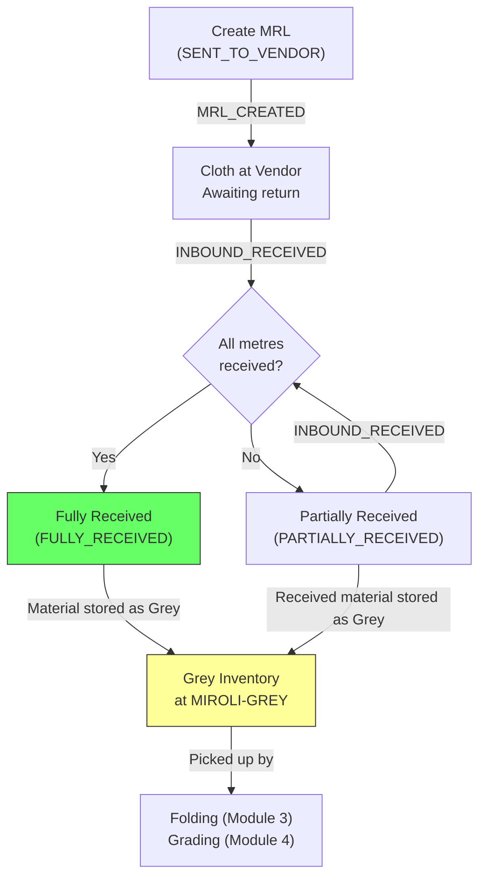

# Module 02 — Outbound & Inbound (MRL Lifecycle)

## 1. Process Overview

### Process: MRL Lifecycle — Outbound to Vendor & Inbound Receipt

This module tracks the round-trip lifecycle of cloth sent to external vendor mills for dyeing. It begins when RG Faith dispatches grey (woven) cloth to a vendor and assigns an MRL (Miroli) Number — the central tracking ID that follows the material through every downstream process. It ends when the vendor returns dyed cloth, which is received at Miroli, matched to the original MRL, and stored as Grey inventory.

A single MRL may return in multiple partial shipments. The system tracks the pending balance (metres sent minus metres received) and flags MRLs with outstanding balances. No measurement or quality inspection happens at inbound receipt — the vendor's Gate Pass quantities are trusted at face value. Processing begins at the folding and grading stages.

Flow:

```
  Outbound to Vendor         Vendor Processing          Inbound Receipt
      [ENTRY]                  (External)                  [ENTRY]
         |                                                     |
    MRL_CREATED                                        INBOUND_RECEIVED
         |                                                     |
    (dispatch cloth)          (dyeing at mill)          (receive + store)
         |                                                     |
    MRL_DISPATCHED                                     INBOUND_RECEIVED
         |                                              (partial returns)
      [EXIT]                                                [EXIT]
```

---

## 2. Entities and Aggregates

### Entities

| Entity | Aggregate Type | Relationships |
|---|---|---|
| MRL (Miroli Lot) | `MRL` | References Vendor. Contains many Inbound Receipts. Referenced by Folding, Grading, Packing, Todiya, NA Resolution. |
| Inbound Receipt | `InboundReceipt` | Belongs to an MRL. Each receipt represents one shipment returning from the vendor. |

### Entity Field Definitions

#### MRL

| Field | Type | Description |
|---|---|---|
| id | UUID | Primary key |
| mrl_number | string | Human-readable MRL number (auto-generated) |
| vendor_id | UUID (FK) | Which vendor mill the cloth was sent to |
| quality_code_id | UUID (FK) | Quality code of the grey cloth |
| tone_code_id | UUID (FK) | Optional — tone code if known at outbound |
| metres_sent | decimal | Total metres dispatched to vendor |
| date_sent | date | Date cloth was dispatched to vendor |
| metres_received | decimal | Running total of metres received back (sum of all inbound receipts) |
| pending_balance | decimal | Computed: metres_sent - metres_received |
| status | string | Current lifecycle status |
| created_at | datetime | When the MRL was created |

#### Inbound Receipt

| Field | Type | Description |
|---|---|---|
| id | UUID | Primary key |
| receipt_number | string | Human-readable receipt number (auto-generated) |
| mrl_id | UUID (FK) | Which MRL this receipt is against |
| avak_date | date | Date material arrived at Miroli |
| lot_number | string | Vendor's lot number (from Gate Pass) |
| grey_metres | decimal | Metres in this shipment (from Gate Pass, trusted) |
| quality_code_id | UUID (FK) | Quality code from Gate Pass |
| gsm | decimal | Grams per square metre (from Gate Pass) |
| width | string | Fabric width (e.g., "58\"") |
| rolls | integer | Number of physical rolls in shipment |
| gate_pass_reference | string | Vendor's Gate Pass document number |
| notes | string | Optional remarks |
| created_at | datetime | When the receipt was recorded |

### Numbering

| Entity | Prefix | Format | Example |
|---|---|---|---|
| MRL | MRL | MRL-{NNNN} | MRL-0526 |
| Inbound Receipt | IR | IR-{YYYY}-{NNNN} | IR-2026-0042 |

---

## 3. Process Steps

### Step: Create MRL (Outbound to Vendor)

Event type: `MRL_CREATED`

Trigger:
  Facility manager opens the Create MRL screen, selects a vendor from the dropdown, enters
  the metres being sent, quality code, and date. Clicks Submit.

Data points captured:
  - vendor_id: UUID — selected from vendor dropdown (filtered to DYEING_MILL type)
  - quality_code_id: UUID — selected from quality code dropdown
  - tone_code_id: UUID (optional) — tone code if known
  - metres_sent: decimal — total metres dispatched
  - date_sent: date — defaults to today, can be changed

Payload:
  id: UUID (generated)
  mrl_number: string (generated)
  vendor_id: UUID
  quality_code_id: UUID
  tone_code_id: UUID?
  metres_sent: decimal
  date_sent: date

Aggregate: MRL / id

Location: MIROLI

Preconditions:
  - vendor_id must reference an active vendor of type DYEING_MILL
  - metres_sent must be > 0

Side effects:
  - fabric_inventory: creates "Sent to Vendor" inventory entry for this MRL

Projections updated:
  - mrls: new row (status = SENT_TO_VENDOR)
  - fabric_inventory: new entry (mrl_id, state = SENT_TO_VENDOR, metres = metres_sent)

Permissions:
  - events:MRL_CREATED:emit

---

### Step: Record Inbound Receipt

Event type: `INBOUND_RECEIVED`

Trigger:
  Supervisor opens the Inbound Receipt screen, selects an MRL from the dropdown (filtered to
  MRLs with status SENT_TO_VENDOR or PARTIALLY_RECEIVED), enters Gate Pass data, and clicks Submit.

Data points captured:
  - mrl_id: UUID — selected from MRL dropdown
  - avak_date: date — date of arrival, defaults to today
  - lot_number: string — vendor's lot number from Gate Pass
  - grey_metres: decimal — metres in this shipment from Gate Pass
  - quality_code_id: UUID — quality code from Gate Pass
  - gsm: decimal (optional) — from Gate Pass
  - width: string (optional) — from Gate Pass (e.g., "58\"")
  - rolls: integer (optional) — number of physical rolls
  - gate_pass_reference: string — vendor's Gate Pass document number
  - notes: string (optional) — remarks

Payload:
  id: UUID (generated)
  receipt_number: string (generated)
  mrl_id: UUID
  avak_date: date
  lot_number: string
  grey_metres: decimal
  quality_code_id: UUID
  gsm: decimal?
  width: string?
  rolls: integer?
  gate_pass_reference: string
  notes: string?

Aggregate: InboundReceipt / id

Location: MIROLI

Preconditions:
  - MRL status must be SENT_TO_VENDOR or PARTIALLY_RECEIVED
  - grey_metres must be > 0
  - grey_metres must not exceed MRL pending balance (metres_sent - metres_received)

Side effects:
  - MRL metres_received incremented by grey_metres
  - MRL pending_balance recalculated
  - MRL status updated:
    - If pending_balance > 0: PARTIALLY_RECEIVED
    - If pending_balance = 0: FULLY_RECEIVED
  - fabric_inventory: Grey inventory created at MIROLI-GREY

Projections updated:
  - inbound_receipts: new row
  - mrls: metres_received += grey_metres, pending_balance recalculated, status updated
  - fabric_inventory: new entry (mrl_id, lot_number, state = GREY, metres = grey_metres, location = MIROLI-GREY)

Permissions:
  - events:INBOUND_RECEIVED:emit

---

### Step: Update MRL (Correction)

Event type: `MRL_UPDATED`

Trigger:
  Manager opens an MRL record and corrects the metres_sent or other outbound details.
  This is a correction, not a regular operation.

Payload:
  id: UUID
  (only changed fields: metres_sent, vendor_id, quality_code_id, tone_code_id, date_sent)

Aggregate: MRL / id

Location: MIROLI

Preconditions:
  - MRL must exist
  - If metres_sent is reduced, new value must be >= metres_received (can't go below what's already received)

Side effects:
  - pending_balance recalculated

Projections updated:
  - mrls: partial update, pending_balance recalculated

Permissions:
  - events:MRL_UPDATED:emit

---

## 4. State Machines

### MRL States

Statuses: `SENT_TO_VENDOR`, `PARTIALLY_RECEIVED`, `FULLY_RECEIVED`

Transitions:

| From Status | Event | To Status |
|---|---|---|
| (new) | `MRL_CREATED` | `SENT_TO_VENDOR` |
| `SENT_TO_VENDOR` | `INBOUND_RECEIVED` (partial) | `PARTIALLY_RECEIVED` |
| `SENT_TO_VENDOR` | `INBOUND_RECEIVED` (full) | `FULLY_RECEIVED` |
| `PARTIALLY_RECEIVED` | `INBOUND_RECEIVED` (partial) | `PARTIALLY_RECEIVED` |
| `PARTIALLY_RECEIVED` | `INBOUND_RECEIVED` (full — balance reaches 0) | `FULLY_RECEIVED` |

```
SENT_TO_VENDOR --INBOUND_RECEIVED (partial)--> PARTIALLY_RECEIVED
SENT_TO_VENDOR --INBOUND_RECEIVED (full)-----> FULLY_RECEIVED
PARTIALLY_RECEIVED --INBOUND_RECEIVED (partial)--> PARTIALLY_RECEIVED
PARTIALLY_RECEIVED --INBOUND_RECEIVED (full)-----> FULLY_RECEIVED
```

Notes:
- FULLY_RECEIVED is terminal for the MRL status. Downstream processing (folding, grading, packing) does not change the MRL status — it operates on the inbound receipt / lot level.
- There is no "cancelled" MRL state. If cloth is not sent, the MRL is not created in the first place.

---

## 5. Reports and Projections

### Reports

| # | Business Question | Projection Table | Key Fields | Updated By Events |
|---|---|---|---|---|
| 1 | "What is the pending balance at each vendor?" | `mrls` | vendor_id, metres_sent, metres_received, pending_balance, status | `MRL_CREATED`, `INBOUND_RECEIVED` |
| 2 | "Show me all MRLs with outstanding balances" | `mrls` | mrl_number, vendor, pending_balance (filtered: > 0) | `MRL_CREATED`, `INBOUND_RECEIVED` |
| 3 | "What arrived today / this week?" | `inbound_receipts` | avak_date, mrl_number, lot_number, grey_metres | `INBOUND_RECEIVED` |
| 4 | "Full history of MRL #526" | `movement_events` (aggregate query) | All events for aggregate_type=MRL, aggregate_id=id | Automatic |
| 5 | "Total Grey inventory awaiting processing" | `fabric_inventory` | state=GREY, sum of metres | `INBOUND_RECEIVED` (and downstream events) |
| 6 | "Vendor-wise total metres sent/received this month" | `mrls` | vendor_id, metres_sent, metres_received, date_sent | `MRL_CREATED`, `INBOUND_RECEIVED` |

---

## 6. Roles and Permissions

### Roles

| Role | Description | Permissions |
|---|---|---|
| Facility Manager | Creates MRLs, manages outbound decisions | `events:MRL_CREATED:emit`, `events:MRL_UPDATED:emit`, `events:INBOUND_RECEIVED:emit` |
| Supervisor | Records inbound receipts | `events:INBOUND_RECEIVED:emit` |

### Permissions

| Permission Code | Description | Used By Step |
|---|---|---|
| `events:MRL_CREATED:emit` | Create a new MRL (outbound to vendor) | Create MRL |
| `events:MRL_UPDATED:emit` | Correct MRL details | Update MRL |
| `events:INBOUND_RECEIVED:emit` | Record an inbound receipt | Record Inbound Receipt |

---

## 7. Locations

| Location | Type | Code | Parent | Purpose |
|---|---|---|---|---|
| Miroli Facility | warehouse | `MIROLI` | root | All events in this module happen at Miroli |
| Grey Storage | zone | `MIROLI-GREY` | MIROLI | Where received material is stored as Grey inventory |

---

## 8. Screen List

| # | Screen Name | Type | Used By | Purpose | Key Actions |
|---|---|---|---|---|---|
| 1 | MRL Register | list | Manager, Supervisor | Browse all MRLs with status, vendor, and balance filters | Create New MRL, Filter by status/vendor |
| 2 | MRL Detail | detail | Manager, Supervisor | View MRL details, all inbound receipts against it, pending balance, full event history | Edit MRL, Record Receipt |
| 3 | Create MRL | form | Manager | Enter outbound details — vendor, metres, quality code, date | Submit |
| 4 | Record Inbound Receipt | form | Supervisor | Select MRL, enter Gate Pass data — avak date, lot number, metres, quality, GSM, width, rolls | Submit |
| 5 | Inbound Receipts | list | Supervisor | Browse recent inbound receipts with date and MRL filters | View Receipt Detail |
| 6 | Inbound Receipt Detail | detail | Supervisor | View a single receipt — all Gate Pass data, linked MRL | — |
| 7 | Vendor Pending Balances | dashboard | Manager | Summary view: total metres outstanding per vendor, MRLs with pending balance | Drill down to MRL |

---

## 9. Process Flowchart


