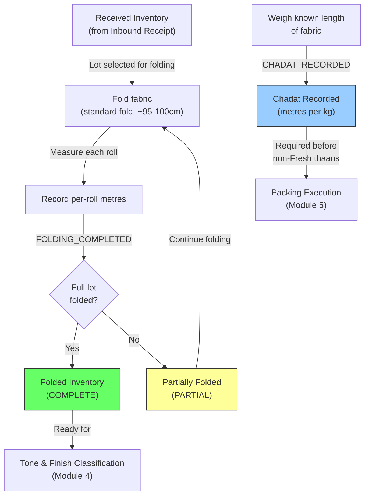

# Module 03 — Folding & Measurement

## 1. Process Overview

### Process: Folding, Measurement, and Chadat Recording

This module covers the physical folding and measurement of finished material at the Miroli facility. Workers take incoming rolls and fold them using a standard fold (~95-100cm). The fold length is uniform and not tracked as a variable. Folding is a measurement and handling step, not a cutting step. Workers measure each roll as they fold, recording metres per roll. This converts vendor-reported received metres into RG Faith-verified folding metres.

Chadat (metres-to-kilogram conversion factor) is recorded as a **separate event** for a lot. It is calculated by weighing a known length of fabric. Chadat must be recorded before any gradation entry (non-Fresh thaan) can be logged during packing execution (Module 05), since Fent, Rags, and Chindi are measured in kg and need Chadat for conversion.

Folding operates per roll within a lot. Each roll's metres are recorded individually, enabling downstream traceability (roll → thaan → bale).

After folding, material proceeds to Tone & Finish Classification (Module 04). Classification requires folding to be complete — the material must be folded before it can be classified.

Flow:

```
  Retrieve Lot              Fold & Measure            Record & Reconcile
     [ENTRY]                   [ENTRY]                    [ENTRY]
        |                         |                           |
   LOT_SELECTED             (physical process)          FOLDING_COMPLETED
        |                         |                           |
     (retrieve)               (fold + measure)           (record data)
        |                         |                           |
   Gate Pass retrieved        Folds created              Chadat calculated
        |                         |                           |
     [EXIT]                    [EXIT]                      [EXIT]
```

---

## 2. Entities and Aggregates

### Entities

| Entity | Aggregate Type | Relationships |
|---|---|---|
| Folding Record | `FoldingRecord` | Belongs to an Inbound Receipt (and therefore an MRL). One folding record per lot. Contains many Roll Measurements. |
| Roll Measurement | Part of `FoldingRecord` | One entry per physical roll within a lot. Records metres per roll. |
| Chadat Record | `ChadatRecord` | One per lot. Records the metres-to-kg conversion factor. Separate event from folding. |

### Entity Field Definitions

#### Folding Record

| Field | Type | Description |
|---|---|---|
| id | UUID | Primary key |
| inbound_receipt_id | UUID (FK) | Which inbound receipt / lot this folding applies to |
| mrl_id | UUID (FK) | Denormalized from inbound receipt — the parent MRL |
| received_metres | decimal | Metres as reported by vendor's Gate Pass (copied from inbound receipt for reference) |
| folding_metres | decimal | Total metres as measured by RG Faith during folding (sum of all roll measurements) |
| shrinkage_metres | decimal | Computed: received_metres - folding_metres |
| shrinkage_percentage | decimal | Computed: (shrinkage_metres / received_metres) * 100 |
| roll_count | integer | Number of physical rolls measured |
| status | string | COMPLETE or PARTIAL (if only part of the lot has been folded) |
| folding_date | date | When folding was performed |
| notes | string | Optional remarks |
| created_at | datetime | When the record was created |

#### Roll Measurement

| Field | Type | Description |
|---|---|---|
| id | UUID | Primary key |
| folding_record_id | UUID (FK) | Parent folding record |
| roll_number | integer | Sequence within the lot (1, 2, 3...) |
| metres | decimal | Metres measured for this roll |
| notes | string | Optional remarks for this roll |

#### Chadat Record

| Field | Type | Description |
|---|---|---|
| id | UUID | Primary key |
| inbound_receipt_id | UUID (FK) | Which lot |
| mrl_id | UUID (FK) | Denormalized |
| chadat | decimal | Metres per kilogram — calculated from weighing a known length of fabric |
| measurement_method | string | Optional — how the Chadat was calculated (e.g., "weighed 10m section") |
| recorded_date | date | When Chadat was recorded |
| notes | string | Optional remarks |
| created_at | datetime | When the record was created |

Note: Chadat is a separate event from folding. It must be recorded before any non-Fresh thaan can be logged during packing execution (Module 05). The system should validate this precondition.

### Numbering

Folding records do not have a separate human-readable number. They are identified by the MRL number + lot number of the inbound receipt they belong to.

---

## 3. Process Steps

### Step: Record Folding Completion

Event type: `FOLDING_COMPLETED`

Trigger:
  Supervisor opens the Record Folding screen, selects a lot from the dropdown
  (filtered to lots in Received state that have not been fully folded), enters the measured
  metres per roll. Clicks Submit.

Data points captured:
  - inbound_receipt_id: UUID — which lot was folded
  - roll_measurements: list — per-roll entries, each containing:
    - roll_number: integer — sequence (1, 2, 3...)
    - metres: decimal — metres measured for this roll
    - notes: string (optional)
  - folding_date: date — defaults to today
  - notes: string (optional)

Payload:
  id: UUID (generated)
  inbound_receipt_id: UUID
  mrl_id: UUID (resolved from inbound receipt)
  received_metres: decimal (copied from inbound receipt)
  folding_metres: decimal (sum of all roll metres)
  shrinkage_metres: decimal (computed)
  shrinkage_percentage: decimal (computed)
  roll_count: integer (count of rolls)
  roll_measurements:
    - id: UUID (generated per roll)
      roll_number: integer
      metres: decimal
      notes: string?
  folding_date: date
  status: string (COMPLETE or PARTIAL)
  notes: string?

Aggregate: FoldingRecord / id

Location: MIROLI-FG (Folding/Classification area)

Preconditions:
  - Inbound receipt must exist
  - Lot must have Received inventory (material has been received)
  - At least one roll measurement required
  - Each roll metres must be > 0
  - No existing COMPLETE folding record for this inbound receipt (prevent duplicate completion)

Side effects:
  - fabric_inventory: material state updated from RECEIVED to FOLDED (for the folded quantity)
  - fabric_inventory: location updated to MIROLI-FG
  - Individual roll records created (used for downstream traceability: roll → thaan → bale)

Projections updated:
  - folding_records: new row
  - roll_measurements: new rows per roll
  - fabric_inventory: state -> FOLDED, metres = folding_metres, location -> MIROLI-FG

Permissions:
  - events:FOLDING_COMPLETED:emit

---

### Step: Record Chadat

Event type: `CHADAT_RECORDED`

Trigger:
  Supervisor opens the Record Chadat screen, selects a lot, enters the Chadat value
  (metres per kg, calculated from weighing a known length of fabric). Clicks Submit.
  This is a separate event from folding and can happen before, during, or after folding.
  However, Chadat MUST be recorded before any non-Fresh thaan can be logged in packing (Module 05).

Data points captured:
  - inbound_receipt_id: UUID — which lot
  - chadat: decimal — metres per kg
  - measurement_method: string (optional) — how it was calculated
  - recorded_date: date — defaults to today
  - notes: string (optional)

Payload:
  id: UUID (generated)
  inbound_receipt_id: UUID
  mrl_id: UUID (resolved)
  chadat: decimal
  measurement_method: string?
  recorded_date: date
  notes: string?

Aggregate: ChadatRecord / id

Location: MIROLI-FG

Preconditions:
  - Inbound receipt must exist
  - chadat must be > 0
  - No existing Chadat record for this lot (one per lot)

Side effects:
  - Chadat value available for downstream modules (packing gradation)

Projections updated:
  - chadat_records: new row
  - Gradation Report: chadat field populated (when report exists for this MRL)

Permissions:
  - events:CHADAT_RECORDED:emit

---

### Step: Update Folding Record (Correction)

Event type: `FOLDING_UPDATED`

Trigger:
  Supervisor opens an existing folding record and corrects roll measurement values
  (e.g., measurement error discovered).

Payload:
  id: UUID
  (only changed fields: roll measurements, notes)
  folding_metres: decimal (recomputed from updated roll measurements)
  shrinkage_metres: decimal (recomputed)
  shrinkage_percentage: decimal (recomputed)

Aggregate: FoldingRecord / id

Location: MIROLI-FG

Preconditions:
  - Folding record must exist
  - Material must not yet be packed (downstream state check — if thaans already produced from this lot's rolls, correction requires manager approval)

Side effects:
  - fabric_inventory: metres updated if folding_metres changed
  - Roll measurement records updated

Projections updated:
  - folding_records: partial update
  - roll_measurements: updated
  - fabric_inventory: metres adjusted

Permissions:
  - events:FOLDING_UPDATED:emit

---

### Step: Update Chadat Record (Correction)

Event type: `CHADAT_UPDATED`

Trigger:
  Supervisor corrects a previously recorded Chadat value.

Payload:
  id: UUID
  chadat: decimal (new value)
  notes: string?

Aggregate: ChadatRecord / id

Location: MIROLI-FG

Preconditions:
  - Chadat record must exist
  - If non-Fresh thaans have already been logged using the old Chadat, a warning is shown (but not blocking)

Side effects:
  - Gradation Report recalculated if Chadat changed (kg-to-metres conversions for Fent/Rags/Chindi)

Projections updated:
  - chadat_records: partial update
  - gradation_reports: recalculated

Permissions:
  - events:CHADAT_UPDATED:emit

---

## 4. State Machines

### Folding Record States

Statuses: `PARTIAL`, `COMPLETE`

Transitions:

| From Status | Event | To Status |
|---|---|---|
| (new) | `FOLDING_COMPLETED` (partial lot folded) | `PARTIAL` |
| (new) | `FOLDING_COMPLETED` (full lot folded) | `COMPLETE` |
| `PARTIAL` | `FOLDING_COMPLETED` (remaining lot folded) | `COMPLETE` |

Notes:
- PARTIAL status is rare. Most lots are folded in a single session. Partial folding may occur for very large lots processed over multiple days.
- The system should support recording folding in increments for partial processing.

### Chadat Record States

Chadat records do not have lifecycle states — once recorded, the value is available. It can be corrected via `CHADAT_UPDATED`.

---

## 5. Reports and Projections

### Reports

| # | Business Question | Projection Table | Key Fields | Updated By Events |
|---|---|---|---|---|
| 1 | "What received material has not been folded yet?" | `fabric_inventory` | state=RECEIVED, mrl_number, lot_number, metres | `INBOUND_RECEIVED`, `FOLDING_COMPLETED` |
| 2 | "What was the shrinkage for MRL #526?" | `folding_records` | received_metres, folding_metres, shrinkage_metres, shrinkage_percentage | `FOLDING_COMPLETED` |
| 3 | "What is the Chadat for lot X?" | `chadat_records` | chadat, mrl_id | `CHADAT_RECORDED` |
| 4 | "Average shrinkage percentage across all lots this month" | `folding_records` | shrinkage_percentage, folding_date | `FOLDING_COMPLETED` |
| 5 | "How much has been folded today?" | `folding_records` | folding_metres, folding_date | `FOLDING_COMPLETED` |
| 6 | "Metre reconciliation: Gate Pass vs Folding for lot X" | `folding_records` | received_metres, folding_metres, shrinkage | `FOLDING_COMPLETED` |
| 7 | "Roll-level metres breakdown for lot X" | `roll_measurements` | roll_number, metres, folding_record_id | `FOLDING_COMPLETED` |
| 8 | "Which lots are missing Chadat?" | `chadat_records` + `folding_records` | Lots with folding but no Chadat | `FOLDING_COMPLETED`, `CHADAT_RECORDED` |

---

## 6. Roles and Permissions

### Roles

| Role | Description | Permissions |
|---|---|---|
| Supervisor | Records folding completion, Chadat, and corrections | `events:FOLDING_COMPLETED:emit`, `events:CHADAT_RECORDED:emit`, `events:FOLDING_UPDATED:emit`, `events:CHADAT_UPDATED:emit` |
| Facility Manager | Oversight, can also record and correct | `events:FOLDING_COMPLETED:emit`, `events:CHADAT_RECORDED:emit`, `events:FOLDING_UPDATED:emit`, `events:CHADAT_UPDATED:emit` |

### Permissions

| Permission Code | Description | Used By Step |
|---|---|---|
| `events:FOLDING_COMPLETED:emit` | Record folding completion for a lot (with per-roll metres) | Record Folding Completion |
| `events:CHADAT_RECORDED:emit` | Record Chadat for a lot | Record Chadat |
| `events:FOLDING_UPDATED:emit` | Correct a folding record | Update Folding Record |
| `events:CHADAT_UPDATED:emit` | Correct a Chadat record | Update Chadat Record |

---

## 7. Locations

| Location | Type | Code | Parent | Purpose |
|---|---|---|---|---|
| Received Storage | zone | `MIROLI-RECEIVED` | MIROLI | Source — received material is picked from here |
| Folding/Classification Area | zone | `MIROLI-FG` | MIROLI | Where folding happens, material moves here during processing |

---

## 8. Screen List

| # | Screen Name | Type | Used By | Purpose | Key Actions |
|---|---|---|---|---|---|
| 1 | Pending Folding | list | Supervisor | Browse lots with received material awaiting folding — shows MRL number, lot number, received metres | Select lot to fold |
| 2 | Record Folding | form | Supervisor | Enter per-roll folding data — add roll measurements (roll number + metres) | Submit |
| 3 | Record Chadat | form | Supervisor | Enter Chadat value for a lot — metres per kg | Submit |
| 4 | Folding Records | list | Supervisor, Manager | Browse completed folding records with MRL, shrinkage, and date filters | View detail, Edit (correction) |
| 5 | Folding Record Detail | detail | Supervisor, Manager | View full folding data — per-roll metres, total metres, shrinkage, linked Chadat | Edit (correct values) |
| 6 | Metre Reconciliation | dashboard | Manager | Side-by-side comparison: Gate Pass metres vs folding metres for recent lots, shrinkage trends | Drill down to lot |

---

## 9. Process Flowchart



Notes:
- Folding is a measurement and handling step — fabric is folded (standard fold, ~95-100cm) and measured per roll. No cutting happens during folding.
- Chadat is recorded as a separate event. It must exist before any non-Fresh thaan can be logged during packing execution (Module 05).
- After folding, material proceeds to Tone & Finish Classification (Module 04). Classification requires the material to be folded first.
