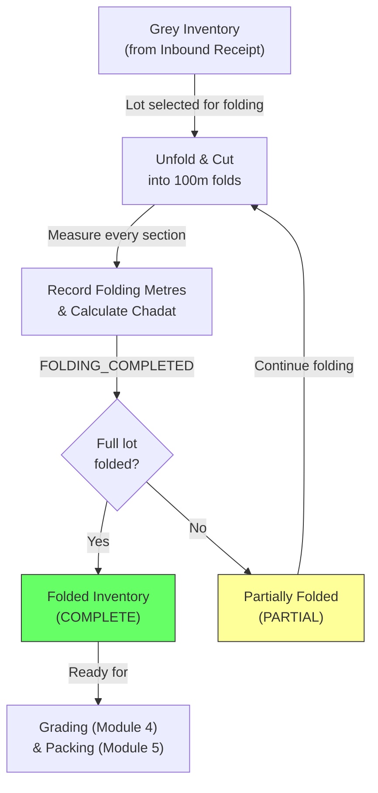

# Module 03 — Folding & Measurement

## 1. Process Overview

### Process: Folding, Measurement, and Chadat Calculation

This module covers the physical processing of grey material into standard 100-metre folds at the Miroli facility. Workers unfold incoming rolls (which can be 1,000+ metres), cut them into 100-metre sections, and measure every section — converting vendor-reported grey metres into RG Faith-verified folding metres. The Chadat (metres-to-kilogram conversion factor) is calculated by weighing a standard fold, providing the bridge between metres (used for Fresh grade) and kilograms (used for all other grades).

Folding and quality grading (Module 04) are **independent activities** — neither requires the other as a prerequisite. Material can be folded before graded, graded before folded, or both done concurrently. The system must not enforce any sequence between them.

Folding operates at the inbound receipt / lot level. A single folding session processes one lot (one inbound receipt against one MRL).

Flow:

```
  Retrieve Lot              Fold & Measure            Record & Reconcile
     [ENTRY]                   [ENTRY]                    [ENTRY]
        |                         |                           |
   LOT_SELECTED             (physical process)          FOLDING_COMPLETED
        |                         |                           |
     (retrieve)               (cut + measure)            (record data)
        |                         |                           |
   Gate Pass retrieved        100m folds created         Chadat calculated
        |                         |                           |
     [EXIT]                    [EXIT]                      [EXIT]
```

---

## 2. Entities and Aggregates

### Entities

| Entity | Aggregate Type | Relationships |
|---|---|---|
| Folding Record | `FoldingRecord` | Belongs to an Inbound Receipt (and therefore an MRL). One folding record per lot. |

### Entity Field Definitions

#### Folding Record

| Field | Type | Description |
|---|---|---|
| id | UUID | Primary key |
| inbound_receipt_id | UUID (FK) | Which inbound receipt / lot this folding applies to |
| mrl_id | UUID (FK) | Denormalized from inbound receipt — the parent MRL |
| gate_pass_metres | decimal | Metres as reported by vendor's Gate Pass (copied from inbound receipt for reference) |
| folding_metres | decimal | Total metres as measured by RG Faith during folding |
| shrinkage_metres | decimal | Computed: gate_pass_metres - folding_metres |
| shrinkage_percentage | decimal | Computed: (shrinkage_metres / gate_pass_metres) * 100 |
| chadat | decimal | Metres per kilogram — calculated from weighing a 100m fold |
| fold_count | integer | Number of 100m folds produced |
| remainder_metres | decimal | Leftover metres that don't make a full 100m fold |
| status | string | COMPLETE or PARTIAL (if only part of the lot has been folded) |
| folding_date | date | When folding was performed |
| notes | string | Optional remarks |
| created_at | datetime | When the record was created |

### Numbering

Folding records do not have a separate human-readable number. They are identified by the MRL number + lot number of the inbound receipt they belong to.

---

## 3. Process Steps

### Step: Record Folding Completion

Event type: `FOLDING_COMPLETED`

Trigger:
  Supervisor opens the Record Folding screen, selects an inbound receipt / lot from the dropdown
  (filtered to lots in Grey state that have not been fully folded), enters the measured folding
  metres, Chadat value, and fold count. Clicks Submit.

Data points captured:
  - inbound_receipt_id: UUID — which lot was folded
  - folding_metres: decimal — total metres measured by RG Faith
  - chadat: decimal — metres per kg, calculated from weighing a 100m fold
  - fold_count: integer — number of 100m folds produced
  - remainder_metres: decimal — leftover metres (e.g., 12m from a 1,012m roll)
  - folding_date: date — defaults to today
  - notes: string (optional)

Payload:
  id: UUID (generated)
  inbound_receipt_id: UUID
  mrl_id: UUID (resolved from inbound receipt)
  gate_pass_metres: decimal (copied from inbound receipt)
  folding_metres: decimal
  shrinkage_metres: decimal (computed)
  shrinkage_percentage: decimal (computed)
  chadat: decimal
  fold_count: integer
  remainder_metres: decimal
  folding_date: date
  status: string (COMPLETE or PARTIAL)
  notes: string?

Aggregate: FoldingRecord / id

Location: MIROLI-FG (Folding/Grading area)

Preconditions:
  - Inbound receipt must exist
  - Lot must have Grey inventory (material has been received)
  - folding_metres must be > 0
  - chadat must be > 0
  - No existing COMPLETE folding record for this inbound receipt (prevent duplicate completion)

Side effects:
  - fabric_inventory: material state updated from GREY to FOLDED (for the folded quantity)
  - fabric_inventory: location updated to MIROLI-FG
  - Gradation Report projection updated with folding metres and Chadat (if grading has started)

Projections updated:
  - folding_records: new row
  - fabric_inventory: state -> FOLDED, metres = folding_metres, location -> MIROLI-FG
  - gradation_reports: folding_metres and chadat updated (if report exists for this MRL)

Permissions:
  - events:FOLDING_COMPLETED:emit

---

### Step: Update Folding Record (Correction)

Event type: `FOLDING_UPDATED`

Trigger:
  Supervisor opens an existing folding record and corrects values (e.g., measurement error
  discovered, Chadat recalculated).

Payload:
  id: UUID
  (only changed fields: folding_metres, chadat, fold_count, remainder_metres, notes)
  shrinkage_metres: decimal (recomputed)
  shrinkage_percentage: decimal (recomputed)

Aggregate: FoldingRecord / id

Location: MIROLI-FG

Preconditions:
  - Folding record must exist
  - Material must not yet be packed (downstream state check — if bales already produced from this lot, correction requires manager approval)

Side effects:
  - fabric_inventory: metres updated if folding_metres changed
  - Gradation Report projection recalculated if Chadat changed

Projections updated:
  - folding_records: partial update
  - fabric_inventory: metres adjusted
  - gradation_reports: recalculated if Chadat changed

Permissions:
  - events:FOLDING_UPDATED:emit

---

## 4. State Machines

### Folding Record States

Statuses: `PARTIAL`, `COMPLETE`

Transitions:

| From Status | Event | To Status |
|---|---|---|
| (new) | `FOLDING_COMPLETED` (partial lot folded) | `PARTIAL` |
| (new) | `FOLDING_COMPLETED` (full lot folded) | `COMPLETE` |
| `PARTIAL` | `FOLDING_COMPLETED` (remaining lot folded) | `COMPLETE` |

Notes:
- PARTIAL status is rare. Most lots are folded in a single session. Partial folding may occur for very large lots processed over multiple days.
- The system should support recording folding in increments for partial processing.

---

## 5. Reports and Projections

### Reports

| # | Business Question | Projection Table | Key Fields | Updated By Events |
|---|---|---|---|---|
| 1 | "What Grey material has not been folded yet?" | `fabric_inventory` | state=GREY, mrl_number, lot_number, metres | `INBOUND_RECEIVED`, `FOLDING_COMPLETED` |
| 2 | "What was the shrinkage for MRL #526?" | `folding_records` | gate_pass_metres, folding_metres, shrinkage_metres, shrinkage_percentage | `FOLDING_COMPLETED` |
| 3 | "What is the Chadat for lot X?" | `folding_records` | chadat, mrl_id | `FOLDING_COMPLETED` |
| 4 | "Average shrinkage percentage across all lots this month" | `folding_records` | shrinkage_percentage, folding_date | `FOLDING_COMPLETED` |
| 5 | "How much has been folded today?" | `folding_records` | folding_metres, folding_date | `FOLDING_COMPLETED` |
| 6 | "Metre reconciliation: Gate Pass vs Folding for lot X" | `folding_records` | gate_pass_metres, folding_metres, shrinkage | `FOLDING_COMPLETED` |

---

## 6. Roles and Permissions

### Roles

| Role | Description | Permissions |
|---|---|---|
| Supervisor | Records folding completion and corrections | `events:FOLDING_COMPLETED:emit`, `events:FOLDING_UPDATED:emit` |
| Facility Manager | Oversight, can also record and correct | `events:FOLDING_COMPLETED:emit`, `events:FOLDING_UPDATED:emit` |

### Permissions

| Permission Code | Description | Used By Step |
|---|---|---|
| `events:FOLDING_COMPLETED:emit` | Record folding completion for a lot | Record Folding Completion |
| `events:FOLDING_UPDATED:emit` | Correct a folding record | Update Folding Record |

---

## 7. Locations

| Location | Type | Code | Parent | Purpose |
|---|---|---|---|---|
| Grey Storage | zone | `MIROLI-GREY` | MIROLI | Source — material is picked from here |
| Folding/Grading Area | zone | `MIROLI-FG` | MIROLI | Where folding happens, material moves here during processing |

---

## 8. Screen List

| # | Screen Name | Type | Used By | Purpose | Key Actions |
|---|---|---|---|---|---|
| 1 | Pending Folding | list | Supervisor | Browse Grey lots awaiting folding — shows MRL number, lot number, grey metres | Select lot to fold |
| 2 | Record Folding | form | Supervisor | Enter folding data — folding metres, Chadat, fold count, remainder | Submit |
| 3 | Folding Records | list | Supervisor, Manager | Browse completed folding records with MRL, shrinkage, and date filters | View detail, Edit (correction) |
| 4 | Folding Record Detail | detail | Supervisor, Manager | View full folding data — metres comparison, shrinkage, Chadat, fold breakdown | Edit (correct values) |
| 5 | Metre Reconciliation | dashboard | Manager | Side-by-side comparison: Gate Pass metres vs folding metres for recent lots, shrinkage trends | Drill down to lot |

---

## 9. Process Flowchart



Note: Folding and Grading (Module 4) are independent — grading may have already started or completed before folding finishes for the same lot. The system does not enforce ordering between them.
