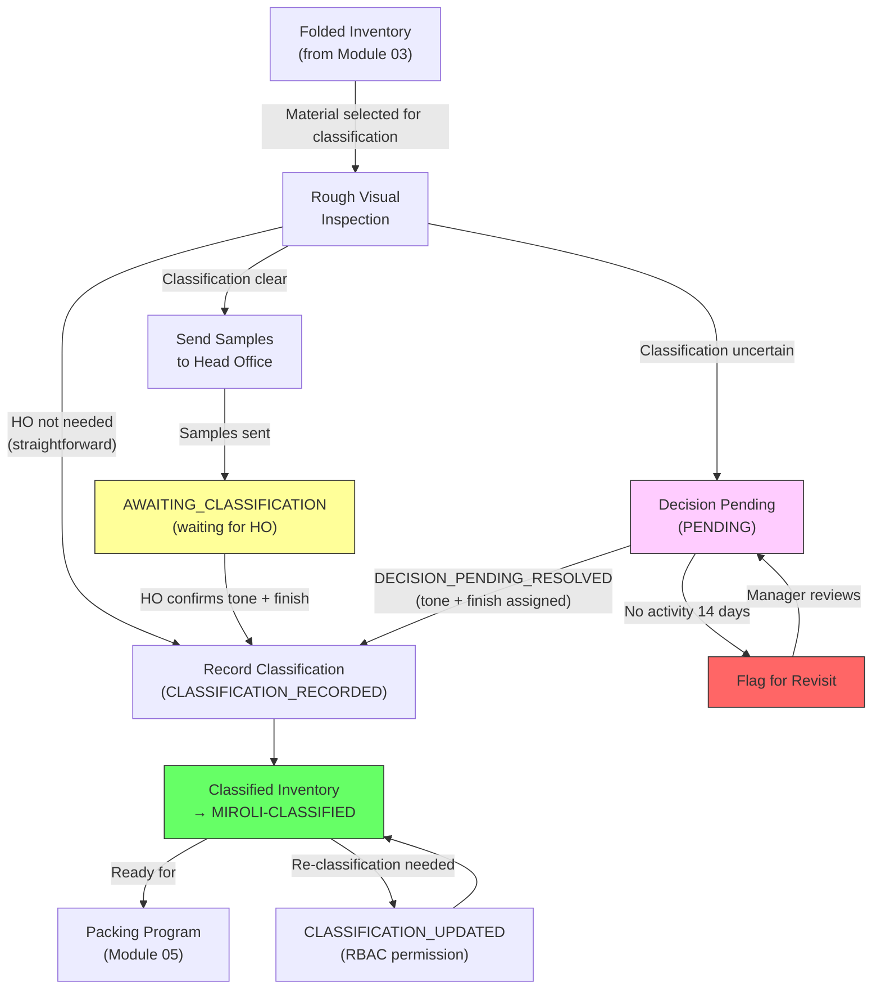

# Module 04 — Tone & Finish Classification

## 1. Process Overview

### Process: Tone and Finish Classification of Folded Material

This module covers the assignment of two classification attributes — **Tone** and **Finish** — to material after folding at Miroli. Classification determines the visual and tactile characteristics of the fabric, which are required before packing programs can be issued. This module does **not** handle quality grading. Gradation (Fresh, Good Cut, Fent, Rags, Chindi, Not Acceptable) happens only as a byproduct of packing execution in Module 05.

The classification process involves coordination between the factory floor and the Head Office (HO). A rough visual inspection at the factory identifies candidate tone and finish values. Samples are then sent to HO for confirmation. Once HO confirms the tone and finish (via phone or message), a factory worker records the classification in the system. Material is then "Classified" and eligible for packing programs.

Classification granularity is flexible — it can be applied per roll, per lot, or per partial lot. The system must support classification at any of these levels.

Borderline or uncertain cases enter a "Decision Pending" state for classification uncertainty (not quality uncertainty). Decision Pending entries with no activity for 14 days are flagged for revisit.

Tone is selected from the Tone Code master data (Module 01). Finish is selected from the Finish Code master data — a new master data entity (id, code, name, is_active, created_at) that must be added to Module 01.

Flow:

```
  Rough Inspection          HO Confirmation           Record Classification
     [ENTRY]                   [ENTRY]                    [ENTRY]
        |                         |                           |
  (visual inspection)        Samples sent to HO         CLASSIFICATION_RECORDED
        |                         |                           |
  identify candidate         HO confirms tone            (record in system)
  tone + finish               and finish                      |
        |                         |                     Material → CLASSIFIED
     [EXIT]                    [EXIT]                      [EXIT]
```

---

## 2. Entities and Aggregates

### Entities

| Entity | Aggregate Type | Relationships |
|---|---|---|
| Classification Record | `ClassificationRecord` | Belongs to an MRL and optionally an Inbound Receipt. Multiple classification records per MRL (one per scope — roll, lot, or partial lot). |
| Decision Pending Entry | `DecisionPendingEntry` | Belongs to an Inbound Receipt / MRL. Created when tone/finish classification is uncertain. |

### Entity Field Definitions

#### Classification Record

| Field | Type | Description |
|---|---|---|
| id | UUID | Primary key |
| mrl_id | UUID (FK) | Which MRL this classification applies to |
| inbound_receipt_id | UUID (FK) | Which lot (optional — classification may span lots) |
| tone_code_id | UUID (FK) | Assigned tone code from Tone Code master data (Module 01) |
| finish_code_id | UUID (FK) | Assigned finish code from Finish Code master data (Module 01) |
| scope_type | string | ROLL, LOT, or PARTIAL — granularity of this classification |
| scope_roll_ids | list of UUID | If scope_type = ROLL, which specific rolls are covered by this classification |
| metres_classified | decimal | Metres of material covered by this classification |
| samples_sent_date | date | When samples were sent to HO (optional — may be skipped if HO confirms without samples) |
| ho_confirmed_date | date | When HO confirmed tone and finish (optional — may be confirmed immediately) |
| classification_date | date | When the factory worker recorded the classification in the system |
| notes | string | Optional remarks |
| created_at | datetime | When the record was created |

#### Decision Pending Entry

| Field | Type | Description |
|---|---|---|
| id | UUID | Primary key |
| inbound_receipt_id | UUID (FK) | Which lot |
| mrl_id | UUID (FK) | Denormalized |
| metres | decimal | Metres of material with unclear classification |
| remark | string | Why tone/finish classification is uncertain |
| status | string | PENDING, RESOLVED |
| resolved_tone_code_id | UUID (FK) | Tone code assigned when resolved (null while pending) |
| resolved_finish_code_id | UUID (FK) | Finish code assigned when resolved (null while pending) |
| resolved_at | datetime | When the decision was made (null while pending) |
| last_activity_at | datetime | Last time a comment or update was made — used for 14-day aging |
| created_at | datetime | When the entry was created |

### Numbering

Classification records do not have separate human-readable numbers. They are identified by MRL number and scope (lot, roll, or partial lot).

---

## 3. Process Steps

### Step: Record Classification

Event type: `CLASSIFICATION_RECORDED`

Trigger:
  Classification worker or supervisor opens the Record Classification screen, selects an MRL
  (filtered to material in FOLDED or AWAITING_CLASSIFICATION state), selects a tone code and
  finish code, specifies the scope (roll, lot, or partial lot), enters metres classified, and
  optionally records sample and HO confirmation dates. Clicks Submit.

Data points captured:
  - mrl_id: UUID — which MRL
  - inbound_receipt_id: UUID (optional) — which specific lot, if classification is lot-level
  - tone_code_id: UUID — selected from Tone Code master data
  - finish_code_id: UUID — selected from Finish Code master data
  - scope_type: string — ROLL, LOT, or PARTIAL
  - scope_roll_ids: list of UUID — if scope_type = ROLL, which rolls (empty otherwise)
  - metres_classified: decimal — metres covered by this classification
  - samples_sent_date: date (optional) — when samples were sent to HO
  - ho_confirmed_date: date (optional) — when HO confirmed
  - classification_date: date — defaults to today
  - notes: string (optional)

Payload:
  id: UUID (generated)
  mrl_id: UUID
  inbound_receipt_id: UUID?
  tone_code_id: UUID
  finish_code_id: UUID
  scope_type: string
  scope_roll_ids: list of UUID
  metres_classified: decimal
  samples_sent_date: date?
  ho_confirmed_date: date?
  classification_date: date
  notes: string?

Aggregate: ClassificationRecord / id

Location: MIROLI-FG (Folding/Classification area)

Preconditions:
  - MRL must exist
  - Material must be in FOLDED or AWAITING_CLASSIFICATION state
  - tone_code_id must reference an active Tone Code
  - finish_code_id must reference an active Finish Code
  - scope_type must be one of: ROLL, LOT, PARTIAL
  - If scope_type = ROLL, scope_roll_ids must not be empty
  - metres_classified must be > 0
  - Cumulative classified metres must not exceed the available folded metres for the MRL

Side effects:
  - fabric_inventory: state updated from FOLDED to CLASSIFIED for the classified metres
  - fabric_inventory: location updated to MIROLI-CLASSIFIED
  - fabric_inventory: tone_code_id and finish_code_id set on the classified inventory

Projections updated:
  - classification_records: new row
  - fabric_inventory: state -> CLASSIFIED, location -> MIROLI-CLASSIFIED, tone and finish set

Permissions:
  - events:CLASSIFICATION_RECORDED:emit

---

### Step: Update Classification (Re-classification)

Event type: `CLASSIFICATION_UPDATED`

Trigger:
  Facility Manager opens an existing classification record and changes the tone code or finish
  code. This is a re-classification — correcting or revising a previous classification.
  No approval workflow — RBAC permission check only.

Data points captured:
  - id: UUID — which classification record to update
  - tone_code_id: UUID (optional — only if changed)
  - finish_code_id: UUID (optional — only if changed)
  - notes: string (optional) — reason for re-classification

Payload:
  id: UUID
  tone_code_id: UUID?
  finish_code_id: UUID?
  notes: string?

Aggregate: ClassificationRecord / id

Location: MIROLI-FG

Preconditions:
  - Classification record must exist
  - If tone_code_id provided, must reference an active Tone Code
  - If finish_code_id provided, must reference an active Finish Code
  - User must have `events:CLASSIFICATION_UPDATED:emit` permission (RBAC check)

Side effects:
  - fabric_inventory: tone_code_id and/or finish_code_id updated for affected metres

Projections updated:
  - classification_records: partial update (tone and/or finish changed)
  - fabric_inventory: tone and/or finish updated

Permissions:
  - events:CLASSIFICATION_UPDATED:emit

---

### Step: Record Decision Pending

Event type: `DECISION_PENDING_CREATED`

Trigger:
  Supervisor encounters fabric where tone/finish classification is uncertain. Opens the Decision
  Pending screen, enters the metres and a remark explaining the classification uncertainty.
  Clicks Submit.

Data points captured:
  - inbound_receipt_id: UUID — which lot
  - metres: decimal — metres of material with unclear classification
  - remark: string — why classification is uncertain

Payload:
  id: UUID (generated)
  inbound_receipt_id: UUID
  mrl_id: UUID (resolved)
  metres: decimal
  remark: string

Aggregate: DecisionPendingEntry / id

Location: MIROLI-FG

Preconditions:
  - Inbound receipt must exist
  - Material must be in FOLDED state
  - metres must be > 0

Side effects:
  - fabric_inventory: state -> DECISION_PENDING for these metres
  - Decision pending aging clock starts (14-day flag)

Projections updated:
  - decision_pending_entries: new row (status = PENDING, last_activity_at = now)
  - fabric_inventory: state -> DECISION_PENDING

Permissions:
  - events:DECISION_PENDING_CREATED:emit

---

### Step: Add Comment to Decision Pending

Event type: `DECISION_PENDING_COMMENTED`

Trigger:
  Supervisor or manager adds a comment or update to an existing Decision Pending entry.
  This resets the 14-day activity clock.

Payload:
  id: UUID (the decision pending entry)
  comment: string

Aggregate: DecisionPendingEntry / id

Location: MIROLI-FG

Preconditions:
  - Decision pending entry must exist with status = PENDING

Side effects:
  - last_activity_at reset to now (resets 14-day aging clock)

Projections updated:
  - decision_pending_entries: last_activity_at -> now

Permissions:
  - events:DECISION_PENDING_COMMENTED:emit

---

### Step: Resolve Decision Pending

Event type: `DECISION_PENDING_RESOLVED`

Trigger:
  Supervisor resolves a Decision Pending entry by assigning a tone code and finish code. This
  effectively converts the entry into a classification record.

Data points captured:
  - id: UUID — which decision pending entry
  - tone_code_id: UUID — the assigned tone code
  - finish_code_id: UUID — the assigned finish code
  - notes: string (optional)

Payload:
  id: UUID
  tone_code_id: UUID
  finish_code_id: UUID
  metres: decimal (from original entry)
  notes: string?

Aggregate: DecisionPendingEntry / id

Location: MIROLI-FG

Preconditions:
  - Decision pending entry must exist with status = PENDING
  - tone_code_id must reference an active Tone Code
  - finish_code_id must reference an active Finish Code

Side effects:
  - Creates a `CLASSIFICATION_RECORDED` event for the resolved material (cascading event)
  - All side effects of CLASSIFICATION_RECORDED apply (inventory state update, tone/finish assignment)

Projections updated:
  - decision_pending_entries: status -> RESOLVED, resolved_tone_code_id and resolved_finish_code_id set, resolved_at set
  - (Plus all projections from the cascaded CLASSIFICATION_RECORDED event)

Permissions:
  - events:DECISION_PENDING_RESOLVED:emit

---

## 4. State Machines

### Material Classification States (per section of fabric)

Statuses: `FOLDED`, `AWAITING_CLASSIFICATION`, `CLASSIFIED`, `DECISION_PENDING`

Transitions:

| From Status | Event | To Status |
|---|---|---|
| `FOLDED` | (classification begins — samples sent to HO) | `AWAITING_CLASSIFICATION` |
| `AWAITING_CLASSIFICATION` | `CLASSIFICATION_RECORDED` | `CLASSIFIED` |
| `FOLDED` | `CLASSIFICATION_RECORDED` (direct, no HO step) | `CLASSIFIED` |
| `FOLDED` | `DECISION_PENDING_CREATED` | `DECISION_PENDING` |
| `DECISION_PENDING` | `DECISION_PENDING_RESOLVED` | `CLASSIFIED` |
| `CLASSIFIED` | `CLASSIFICATION_UPDATED` | `CLASSIFIED` (tone/finish changed) |

Notes:
- Material enters this module in `FOLDED` state (from Module 03).
- `AWAITING_CLASSIFICATION` is an optional intermediate state for when samples have been sent to HO but confirmation has not yet been received.
- Classification can happen directly from `FOLDED` to `CLASSIFIED` if HO confirms immediately or if the classification is straightforward.
- `DECISION_PENDING` entries with no activity for 14 days should be flagged for revisit.
- Re-classification (`CLASSIFICATION_UPDATED`) keeps material in `CLASSIFIED` state but changes the tone/finish attributes.

### Decision Pending States

Statuses: `PENDING`, `RESOLVED`

| From Status | Event | To Status |
|---|---|---|
| (new) | `DECISION_PENDING_CREATED` | `PENDING` |
| `PENDING` | `DECISION_PENDING_RESOLVED` | `RESOLVED` |

---

## 5. Reports and Projections

### Reports

| # | Business Question | Projection Table | Key Fields | Updated By Events |
|---|---|---|---|---|
| 1 | "What material is awaiting classification?" | `fabric_inventory` | state=FOLDED or AWAITING_CLASSIFICATION, mrl_number, metres | `FOLDING_COMPLETED`, `CLASSIFICATION_RECORDED` |
| 2 | "What material has been classified with tone X / finish Y?" | `classification_records` + `fabric_inventory` | tone_code_id, finish_code_id, mrl_number, metres_classified | `CLASSIFICATION_RECORDED`, `CLASSIFICATION_UPDATED` |
| 3 | "Classification history for MRL #526" | `classification_records` | mrl_id, tone_code_id, finish_code_id, scope_type, classification_date | `CLASSIFICATION_RECORDED`, `CLASSIFICATION_UPDATED` |
| 4 | "What lots have Decision Pending entries (classification uncertainty)?" | `decision_pending_entries` | status=PENDING, mrl_number, metres, last_activity_at | `DECISION_PENDING_CREATED`, `DECISION_PENDING_COMMENTED`, `DECISION_PENDING_RESOLVED` |
| 5 | "Decision Pending entries older than 14 days with no activity" | `decision_pending_entries` | status=PENDING, last_activity_at < 14 days ago | `DECISION_PENDING_CREATED`, `DECISION_PENDING_COMMENTED` |
| 6 | "Classification summary: how many metres classified today?" | `classification_records` | classification_date, metres_classified | `CLASSIFICATION_RECORDED` |
| 7 | "Tone distribution: what percentage of classified material has each tone?" | `classification_records` | tone_code_id, metres_classified (aggregated) | `CLASSIFICATION_RECORDED`, `CLASSIFICATION_UPDATED` |

---

## 6. Roles and Permissions

### Roles

| Role | Description | Permissions |
|---|---|---|
| Classification Worker | Records tone and finish classification for inspected fabric | `events:CLASSIFICATION_RECORDED:emit` |
| Supervisor | Records classifications, manages Decision Pending entries | `events:CLASSIFICATION_RECORDED:emit`, `events:DECISION_PENDING_CREATED:emit`, `events:DECISION_PENDING_COMMENTED:emit`, `events:DECISION_PENDING_RESOLVED:emit` |
| Facility Manager | Full access to classification module including re-classification | All classification permissions + `events:CLASSIFICATION_UPDATED:emit` |

### Permissions

| Permission Code | Description | Used By Step |
|---|---|---|
| `events:CLASSIFICATION_RECORDED:emit` | Record a tone and finish classification | Record Classification |
| `events:CLASSIFICATION_UPDATED:emit` | Re-classify material (change tone/finish) — RBAC only, no approval workflow | Update Classification |
| `events:DECISION_PENDING_CREATED:emit` | Create a Decision Pending entry for classification uncertainty | Record Decision Pending |
| `events:DECISION_PENDING_COMMENTED:emit` | Comment on a Decision Pending entry | Add Comment |
| `events:DECISION_PENDING_RESOLVED:emit` | Resolve a Decision Pending entry with tone and finish | Resolve Decision Pending |

---

## 7. Locations

| Location | Type | Code | Parent | Purpose |
|---|---|---|---|---|
| Folding/Classification Area | zone | `MIROLI-FG` | MIROLI | Where rough inspection and classification recording happen |
| Classified Storage | zone | `MIROLI-CLASSIFIED` | MIROLI | Where classified material awaits packing programs |

---

## 8. Screen List

| # | Screen Name | Type | Used By | Purpose | Key Actions |
|---|---|---|---|---|---|
| 1 | Pending Classification | list | Worker, Supervisor | Browse folded material awaiting tone/finish classification — shows MRL number, lot, metres | Select material to classify |
| 2 | Record Classification | form | Worker, Supervisor | Enter tone code and finish code — select scope (roll/lot/partial), enter metres, optional HO dates | Submit |
| 3 | Classification Records | list | Supervisor, Manager | Browse all classification records — filter by MRL, tone, finish, date range | View detail |
| 4 | Classification Detail | detail | Supervisor, Manager | View one classification — tone, finish, scope, metres, dates. Re-classification available here for Facility Manager. | Edit (re-classify) |
| 5 | Decision Pending | list | Supervisor, Manager | Browse all pending classification decisions — shows aging (days since last activity), 14-day alerts | Add Comment, Resolve |
| 6 | Decision Pending Detail | detail | Supervisor, Manager | View one pending entry — history of comments, resolve with tone and finish | Comment, Resolve |
| 7 | Classification Dashboard | dashboard | Manager | Today's classification activity, pending vs classified totals, tone/finish distribution | Drill down to records |

---

## 9. Process Flowchart



Note: Classification determines tone (e.g., O1W) and finish (e.g., 01, 02, 03) — these are visual/tactile attributes, not quality grades. Gradation (Fresh, Good Cut, Fent, Rags, Chindi, Not Acceptable) happens during packing execution in Module 05 as thaans are logged, and feeds the Gradation Report. These are strict terminology distinctions: "classification" = tone/finish assignment; "gradation" = quality sorting during packing.
