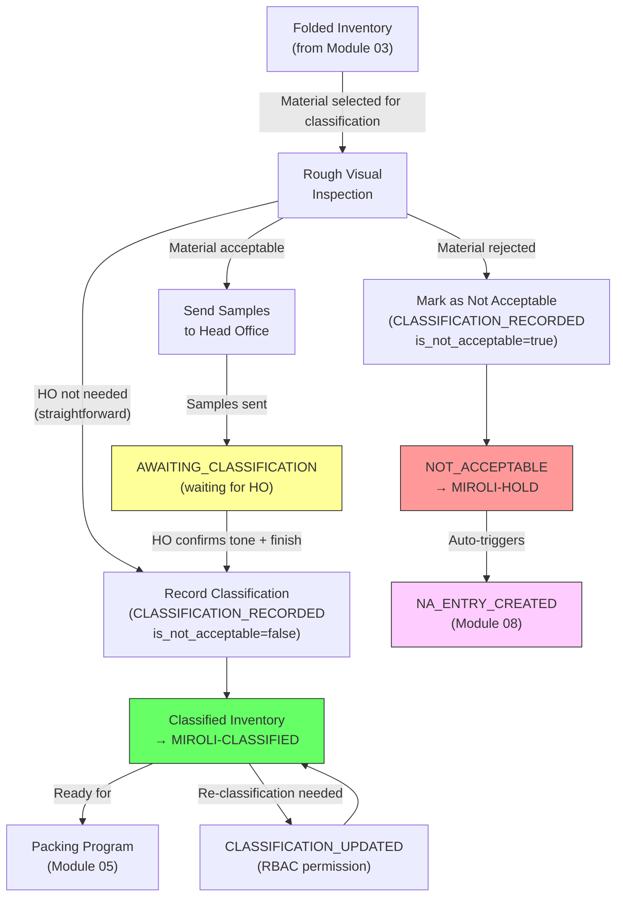

# Module 04 — Tone & Finish Classification

## 1. Process Overview

### Process: Tone and Finish Classification of Folded Material

This module covers the assignment of two classification attributes — **Tone** and **Finish** — to material after folding at Miroli, OR the rejection of material as **Not Acceptable**. Classification determines the visual and tactile characteristics of the fabric, which are required before packing programs can be issued. Material marked as Not Acceptable at this stage enters a resolution workflow (Module 08) with three possible outcomes: vendor pickup, disposal, or manager reclassification. This module does **not** handle packing gradation. Gradation (Fresh, Good Cut, Fent, Rags, Chindi) happens only as a byproduct of packing execution in Module 05.

The classification process involves coordination between the factory floor and the Head Office (HO). A rough visual inspection at the factory identifies candidate tone and finish values. Samples are then sent to HO for confirmation. Once HO confirms the tone and finish (via phone or message), a factory worker records the classification in the system. Material is then "Classified" and eligible for packing programs.

Classification granularity is flexible — it can be applied per roll, per lot, or per partial lot. The system must support classification at any of these levels.

Tone is selected from the Tone Code master data (Module 01). Finish is selected from the Finish Code master data — a new master data entity (id, code, name, is_active, created_at) that must be added to Module 01.

Flow:

```
  Rough Inspection          HO Confirmation           Record Classification
     [ENTRY]                   [ENTRY]                    [ENTRY]
        |                         |                           |
  (visual inspection)        Samples sent to HO         CLASSIFICATION_RECORDED
        |                         |                           |
  Option 1: Classify        HO confirms tone            Option 1: tone + finish assigned
  (assign tone + finish)     and finish                      |
        |                         |                     Material → CLASSIFIED
  Option 2: Reject          Option 2: Material              |
  (mark Not Acceptable)      rejected                   Option 2: is_not_acceptable=true
        |                         |                           |
     [EXIT]                    [EXIT]                  Material → NOT_ACCEPTABLE
                                                             |
                                                        NA_ENTRY_CREATED
                                                        (Module 08 workflow)
                                                             |
                                                          [EXIT]
```

---

## 2. Entities and Aggregates

### Entities

| Entity | Aggregate Type | Relationships |
|---|---|---|
| Classification Record | `ClassificationRecord` | Belongs to an MRL and optionally an Inbound Receipt. Multiple classification records per MRL (one per scope — roll, lot, or partial lot). |

### Entity Field Definitions

#### Classification Record

| Field | Type | Description |
|---|---|---|
| id | UUID | Primary key |
| mrl_id | UUID (FK) | Which MRL this classification applies to |
| inbound_receipt_id | UUID (FK) | Which lot (optional — classification may span lots) |
| is_not_acceptable | boolean | True if material is marked as Not Acceptable (tone_code_id and finish_code_id will be null). False if normal classification. |
| rejection_reason | string | Reason for Not Acceptable marking (required if is_not_acceptable=true, null otherwise) |
| tone_code_id | UUID (FK) | Assigned tone code from Tone Code master data (Module 01). Null if is_not_acceptable=true, required if false. |
| finish_code_id | UUID (FK) | Assigned finish code from Finish Code master data (Module 01). Null if is_not_acceptable=true, required if false. |
| scope_type | string | ROLL, LOT, or PARTIAL — granularity of this classification |
| scope_roll_ids | list of UUID | If scope_type = ROLL, which specific rolls are covered by this classification |
| metres_classified | decimal | Metres of material covered by this classification |
| samples_sent_date | date | When samples were sent to HO (optional — may be skipped if HO confirms without samples) |
| ho_confirmed_date | date | When HO confirmed tone and finish (optional — may be confirmed immediately) |
| classification_date | date | When the factory worker recorded the classification in the system |
| notes | string | Optional remarks |
| created_at | datetime | When the record was created |

### Numbering

Classification records do not have separate human-readable numbers. They are identified by MRL number and scope (lot, roll, or partial lot).

---

## 3. Process Steps

### Step: Record Classification

Event type: `CLASSIFICATION_RECORDED`

Trigger:
  Classification worker or supervisor opens the Record Classification screen, selects an MRL
  (filtered to material in FOLDED or AWAITING_CLASSIFICATION state).

  Option 1 (Classify): Selects a tone code and finish code, specifies the scope (roll, lot, or partial lot), enters metres classified, and optionally records sample and HO confirmation dates. Sets is_not_acceptable = false.

  Option 2 (Mark Not Acceptable): Marks material as Not Acceptable, enters rejection reason, specifies metres. Sets is_not_acceptable = true, tone_code_id and finish_code_id remain null.

  Clicks Submit.

Data points captured:
  - mrl_id: UUID — which MRL
  - inbound_receipt_id: UUID (optional) — which specific lot, if classification is lot-level
  - is_not_acceptable: boolean — true if material rejected, false if classified
  - tone_code_id: UUID — selected from Tone Code master data (null if is_not_acceptable=true, required if false)
  - finish_code_id: UUID — selected from Finish Code master data (null if is_not_acceptable=true, required if false)
  - rejection_reason: string — reason for rejection (required if is_not_acceptable=true, null otherwise)
  - scope_type: string — ROLL, LOT, or PARTIAL
  - scope_roll_ids: list of UUID — if scope_type = ROLL, which rolls (empty otherwise)
  - metres_classified: decimal — metres covered by this classification
  - samples_sent_date: date (optional) — when samples were sent to HO
  - ho_confirmed_date: date (optional) — when HO confirmed
  - classification_date: date — defaults to today
  - notes: string (optional)

Payload:
  id: UUID (generated)
  mrl_id: UUID
  inbound_receipt_id: UUID?
  is_not_acceptable: boolean
  tone_code_id: UUID (null if is_not_acceptable=true)
  finish_code_id: UUID (null if is_not_acceptable=true)
  rejection_reason: string (if is_not_acceptable=true)
  scope_type: string
  scope_roll_ids: list of UUID
  metres_classified: decimal
  samples_sent_date: date?
  ho_confirmed_date: date?
  classification_date: date
  notes: string?

Aggregate: ClassificationRecord / id

Location: MIROLI-FG (Folding/Classification area)

Preconditions:
  - MRL must exist
  - Material must be in FOLDED or AWAITING_CLASSIFICATION state
  - If is_not_acceptable = false: tone_code_id and finish_code_id must be provided and reference active codes
  - If is_not_acceptable = true: tone_code_id and finish_code_id must be null, rejection_reason required
  - scope_type must be one of: ROLL, LOT, PARTIAL
  - If scope_type = ROLL, scope_roll_ids must not be empty
  - metres_classified must be > 0
  - Cumulative classified metres must not exceed the available folded metres for the MRL

Side effects:
  - If is_not_acceptable = false:
    * fabric_inventory: state → CLASSIFIED, location → MIROLI-CLASSIFIED
    * fabric_inventory: tone_code_id and finish_code_id set
  - If is_not_acceptable = true:
    * fabric_inventory: state → NOT_ACCEPTABLE, location → MIROLI-HOLD
    * Auto-triggers NA_ENTRY_CREATED event (Module 08)
    * Entry created on Reprocess List

Projections updated:
  - classification_records: new row
  - fabric_inventory: state -> CLASSIFIED, location -> MIROLI-CLASSIFIED, tone and finish set

Permissions:
  - events:CLASSIFICATION_RECORDED:emit

---

### Step: Update Classification (Re-classification)

Event type: `CLASSIFICATION_UPDATED`

Trigger:
  Facility Manager opens an existing classification record and changes the tone code or finish
  code. This is a re-classification — correcting or revising a previous classification.
  No approval workflow — RBAC permission check only.

Data points captured:
  - id: UUID — which classification record to update
  - tone_code_id: UUID (optional — only if changed)
  - finish_code_id: UUID (optional — only if changed)
  - notes: string (optional) — reason for re-classification

Payload:
  id: UUID
  tone_code_id: UUID?
  finish_code_id: UUID?
  notes: string?

Aggregate: ClassificationRecord / id

Location: MIROLI-FG

Preconditions:
  - Classification record must exist
  - If tone_code_id provided, must reference an active Tone Code
  - If finish_code_id provided, must reference an active Finish Code
  - User must have `events:CLASSIFICATION_UPDATED:emit` permission (RBAC check)

Side effects:
  - fabric_inventory: tone_code_id and/or finish_code_id updated for affected metres

Projections updated:
  - classification_records: partial update (tone and/or finish changed)
  - fabric_inventory: tone and/or finish updated

Permissions:
  - events:CLASSIFICATION_UPDATED:emit

---

## 4. State Machines

### Material Classification States (per section of fabric)

Statuses: `FOLDED`, `AWAITING_CLASSIFICATION`, `CLASSIFIED`, `NOT_ACCEPTABLE`

Transitions:

| From Status | Event | To Status |
|---|---|---|
| `FOLDED` | (classification begins — samples sent to HO) | `AWAITING_CLASSIFICATION` |
| `AWAITING_CLASSIFICATION` | `CLASSIFICATION_RECORDED` (is_not_acceptable=false) | `CLASSIFIED` |
| `FOLDED` | `CLASSIFICATION_RECORDED` (is_not_acceptable=false, direct, no HO step) | `CLASSIFIED` |
| `FOLDED` | `CLASSIFICATION_RECORDED` (is_not_acceptable=true) | `NOT_ACCEPTABLE` |
| `AWAITING_CLASSIFICATION` | `CLASSIFICATION_RECORDED` (is_not_acceptable=true) | `NOT_ACCEPTABLE` |
| `CLASSIFIED` | `CLASSIFICATION_UPDATED` | `CLASSIFIED` (tone/finish changed) |

Notes:
- Material enters this module in `FOLDED` state (from Module 03).
- `AWAITING_CLASSIFICATION` is an optional intermediate state for when samples have been sent to HO but confirmation has not yet been received.
- Classification can happen directly from `FOLDED` to `CLASSIFIED` if HO confirms immediately or if the classification is straightforward.
- Material can be marked as `NOT_ACCEPTABLE` at classification — this triggers Module 08 resolution workflow (vendor pickup, disposal, or reclassification).
- Re-classification (`CLASSIFICATION_UPDATED`) keeps material in `CLASSIFIED` state but changes the tone/finish attributes.

---

## 5. Reports and Projections

### Reports

| # | Business Question | Projection Table | Key Fields | Updated By Events |
|---|---|---|---|---|
| 1 | "What material is awaiting classification?" | `fabric_inventory` | state=FOLDED or AWAITING_CLASSIFICATION, mrl_number, metres | `FOLDING_COMPLETED`, `CLASSIFICATION_RECORDED` |
| 2 | "What material has been classified with tone X / finish Y?" | `classification_records` + `fabric_inventory` | tone_code_id, finish_code_id, mrl_number, metres_classified | `CLASSIFICATION_RECORDED`, `CLASSIFICATION_UPDATED` |
| 3 | "Classification history for MRL #526" | `classification_records` | mrl_id, tone_code_id, finish_code_id, scope_type, classification_date | `CLASSIFICATION_RECORDED`, `CLASSIFICATION_UPDATED` |
| 4 | "What material has been marked as Not Acceptable?" | `fabric_inventory` | state=NOT_ACCEPTABLE, mrl_number, metres, rejection_reason | `CLASSIFICATION_RECORDED` |
| 5 | "Classification summary: how many metres classified today?" | `classification_records` | classification_date, metres_classified | `CLASSIFICATION_RECORDED` |
| 6 | "Tone distribution: what percentage of classified material has each tone?" | `classification_records` | tone_code_id, metres_classified (aggregated) | `CLASSIFICATION_RECORDED`, `CLASSIFICATION_UPDATED` |

---

## 6. Roles and Permissions

### Roles

| Role | Description | Permissions |
|---|---|---|
| Classification Worker | Records tone and finish classification for inspected fabric, or marks material as Not Acceptable | `events:CLASSIFICATION_RECORDED:emit` |
| Supervisor | Records classifications and Not Acceptable markings | `events:CLASSIFICATION_RECORDED:emit` |
| Facility Manager | Full access to classification module including re-classification | All classification permissions + `events:CLASSIFICATION_UPDATED:emit` |

### Permissions

| Permission Code | Description | Used By Step |
|---|---|---|
| `events:CLASSIFICATION_RECORDED:emit` | Record a tone and finish classification OR mark material as Not Acceptable | Record Classification |
| `events:CLASSIFICATION_UPDATED:emit` | Re-classify material (change tone/finish) — RBAC only, no approval workflow | Update Classification |

---

## 7. Locations

| Location | Type | Code | Parent | Purpose |
|---|---|---|---|---|
| Folding/Classification Area | zone | `MIROLI-FG` | MIROLI | Where rough inspection and classification recording happen |
| Classified Storage | zone | `MIROLI-CLASSIFIED` | MIROLI | Where classified material awaits packing programs |
| Not Acceptable Hold | zone | `MIROLI-HOLD` | MIROLI | Where material marked as Not Acceptable awaits resolution (Module 08) |

---

## 8. Screen List

| # | Screen Name | Type | Used By | Purpose | Key Actions |
|---|---|---|---|---|---|
| 1 | Pending Classification | list | Worker, Supervisor | Browse folded material awaiting tone/finish classification — shows MRL number, lot, metres | Select material to classify |
| 2 | Record Classification | form | Worker, Supervisor | Enter tone code and finish code OR mark as Not Acceptable — select scope (roll/lot/partial), enter metres, optional HO dates, rejection reason if NA | Submit |
| 3 | Classification Records | list | Supervisor, Manager | Browse all classification records — filter by MRL, tone, finish, date range | View detail |
| 4 | Classification Detail | detail | Supervisor, Manager | View one classification — tone, finish, scope, metres, dates. Re-classification available here for Facility Manager. | Edit (re-classify) |
| 5 | Classification Dashboard | dashboard | Manager | Today's classification activity, pending vs classified totals, tone/finish distribution, Not Acceptable count | Drill down to records |

---

## 9. Process Flowchart



Note: Classification determines tone (e.g., O1W) and finish (e.g., 01, 02, 03) — these are visual/tactile attributes, not quality grades. Material can also be marked as Not Acceptable at this stage, which triggers the resolution workflow in Module 08. Gradation (Fresh, Good Cut, Fent, Rags, Chindi) happens during packing execution in Module 05 as thaans are logged, and feeds the Gradation Report. These are strict terminology distinctions: "classification" = tone/finish assignment OR Not Acceptable rejection; "gradation" = quality sorting during packing.
