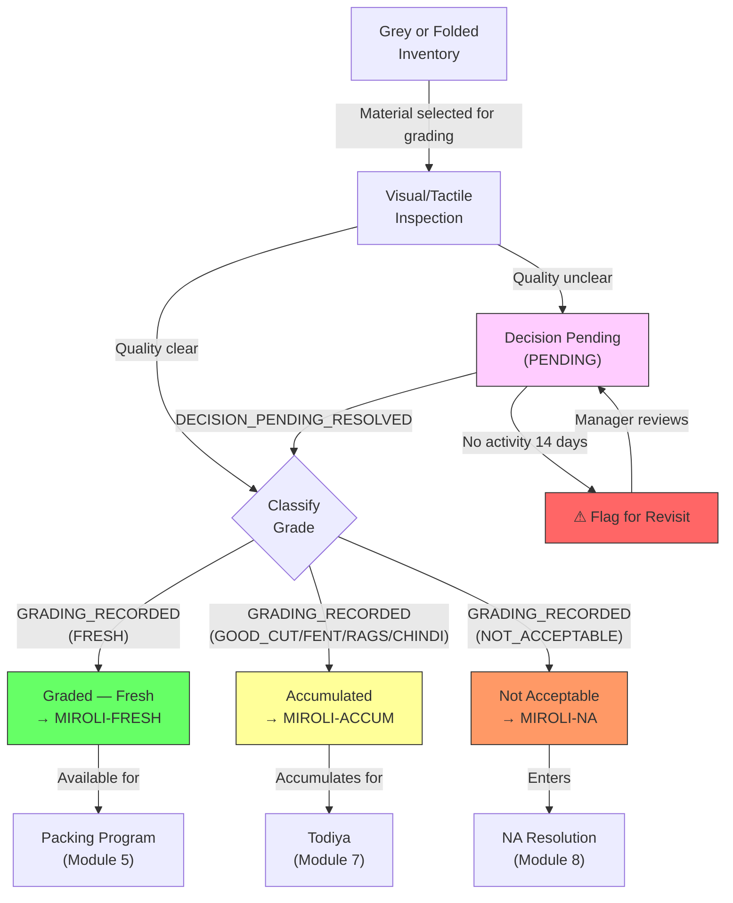

# Module 04 — Quality Grading

## 1. Process Overview

### Process: Quality Inspection, Grade Classification, and Gradation Report

This module covers the quality inspection of fabric at Miroli. Workers visually and tactilely inspect each fold or section and classify it into one of six grades: Fresh (best quality, in metres), Good Cut, Fent, Rags, Chindi (descending quality, in kilograms), or Not Acceptable (rejected, in metres). The output is a progressive Gradation Report — the single most important document in the facility — which tracks the yield breakdown for each lot.

Quality grading and folding (Module 03) are **independent activities**. Material can be graded before folded, after folded, or concurrently. The system must not enforce any sequence between them.

Grading is judgment-based — no automated instruments or quantitative thresholds. Workers rely on experience to classify fabric. Borderline cases enter a "Decision Pending" state and must be revisited within 14 days.

Fresh material flows to packing programs (Module 05). Good Cut, Fent, Rags, and Chindi flow to accumulation for Todiya (Module 07). Not Acceptable material flows to the resolution process (Module 08).

Flow:

```
  Inspection              Classification            Routing
    [ENTRY]                  [ENTRY]                 [ENTRY]
       |                        |                       |
  (visual/tactile)        GRADING_RECORDED         Material routed
       |                        |                       |
    inspect fabric         assign grade            ┌─ Fresh → Packing (5)
       |                        |                  ├─ G/C,F,R,Ch → Todiya (7)
    identify defects       weigh non-Fresh         ├─ N/A → Resolution (8)
       |                        |                  └─ Decision Pending
    [EXIT]                   [EXIT]                  [EXIT]
```

---

## 2. Entities and Aggregates

### Entities

| Entity | Aggregate Type | Relationships |
|---|---|---|
| Grading Entry | `GradingEntry` | Belongs to an Inbound Receipt / MRL. Multiple grading entries per lot (one per section graded). |
| Gradation Report | `GradationReport` | One per MRL. Progressive — updated as grading entries are recorded. Computed projection, not directly created by user. |
| Decision Pending Entry | `DecisionPendingEntry` | Belongs to an Inbound Receipt / MRL. Created when material quality is unclear. |

### Entity Field Definitions

#### Grading Entry

| Field | Type | Description |
|---|---|---|
| id | UUID | Primary key |
| inbound_receipt_id | UUID (FK) | Which lot this grading applies to |
| mrl_id | UUID (FK) | Denormalized — parent MRL |
| grade | string | One of: FRESH, GOOD_CUT, FENT, RAGS, CHINDI, NOT_ACCEPTABLE |
| metres | decimal | Metres for this section (all grades) |
| kilograms | decimal | Weight in kg (for Good Cut, Fent, Rags, Chindi — converted via Chadat). Zero for Fresh and Not Acceptable. |
| chadat | decimal | Chadat used for conversion (from folding record or manually entered) |
| grading_date | date | When grading was performed |
| notes | string | Optional remarks (defect description, etc.) |
| created_at | datetime | When the entry was created |

#### Gradation Report (projection)

| Field | Type | Description |
|---|---|---|
| id | UUID | Primary key |
| mrl_id | UUID (FK) | One report per MRL |
| mrl_number | string | Denormalized for display |
| metres_sent | decimal | From MRL — original metres sent to vendor |
| gate_pass_metres | decimal | From Inbound Receipt — what Gate Pass reported |
| folding_metres | decimal | From Folding Record — RG Faith's measurement (null if not yet folded) |
| total_graded_metres | decimal | Sum of all grading entries in metres |
| fresh_metres | decimal | Sum of FRESH grading entries |
| fresh_percentage | decimal | (fresh_metres / total_graded_metres) * 100 |
| good_cut_kg | decimal | Sum of GOOD_CUT in kg |
| good_cut_metres | decimal | Converted via Chadat |
| fent_kg | decimal | Sum of FENT in kg |
| fent_metres | decimal | Converted via Chadat |
| rags_kg | decimal | Sum of RAGS in kg |
| rags_metres | decimal | Converted via Chadat |
| chindi_kg | decimal | Sum of CHINDI in kg |
| chindi_metres | decimal | Converted via Chadat |
| not_acceptable_metres | decimal | Sum of NOT_ACCEPTABLE in metres |
| shrinkage_metres | decimal | gate_pass_metres - total_graded_metres (ongoing) |
| is_complete | boolean | True when total_graded_metres covers the full lot |
| updated_at | datetime | Last time the report was updated |

#### Decision Pending Entry

| Field | Type | Description |
|---|---|---|
| id | UUID | Primary key |
| inbound_receipt_id | UUID (FK) | Which lot |
| mrl_id | UUID (FK) | Denormalized |
| metres | decimal | Metres of material with unclear quality |
| remark | string | Why the decision is pending |
| status | string | PENDING, RESOLVED |
| resolved_grade | string | The grade assigned when resolved (null while pending) |
| resolved_at | datetime | When the decision was made (null while pending) |
| last_activity_at | datetime | Last time a comment or update was made — used for 14-day aging |
| created_at | datetime | When the entry was created |

### Numbering

Grading entries do not have separate human-readable numbers. The Gradation Report is identified by MRL number.

---

## 3. Process Steps

### Step: Record Grading Entry

Event type: `GRADING_RECORDED`

Trigger:
  Worker or supervisor opens the Record Grading screen, selects an inbound receipt / lot,
  enters the grade, metres or kg (with Chadat conversion), and any remarks. Clicks Submit.
  This step is repeated for every section of fabric graded — grading is incremental.

Data points captured:
  - inbound_receipt_id: UUID — which lot
  - grade: string — FRESH, GOOD_CUT, FENT, RAGS, CHINDI, or NOT_ACCEPTABLE
  - metres: decimal — metres of this section (for Fresh and Not Acceptable, entered directly; for others, converted from kg via Chadat)
  - kilograms: decimal — weight in kg (for Good Cut, Fent, Rags, Chindi; zero for Fresh/NA)
  - chadat: decimal — conversion factor used (auto-filled from folding record if available, otherwise manually entered)
  - grading_date: date — defaults to today
  - notes: string (optional) — defect description

Payload:
  id: UUID (generated)
  inbound_receipt_id: UUID
  mrl_id: UUID (resolved)
  grade: string
  metres: decimal
  kilograms: decimal
  chadat: decimal
  grading_date: date
  notes: string?

Aggregate: GradingEntry / id

Location: MIROLI-FG (Folding/Grading area)

Preconditions:
  - Inbound receipt must exist
  - Lot must have Grey or Folded inventory
  - grade must be one of the six valid values
  - For FRESH and NOT_ACCEPTABLE: metres must be > 0, kilograms = 0
  - For GOOD_CUT, FENT, RAGS, CHINDI: kilograms must be > 0, metres computed from chadat
  - Cumulative graded metres must not exceed lot's available metres

Side effects:
  - Gradation Report projection updated (incremental recalculation)
  - fabric_inventory updated based on grade:
    - FRESH: state -> GRADED_FRESH, location -> MIROLI-FRESH
    - GOOD_CUT: state -> ACCUMULATED, location -> MIROLI-ACCUM
    - FENT: state -> ACCUMULATED, location -> MIROLI-ACCUM
    - RAGS: state -> ACCUMULATED, location -> MIROLI-ACCUM
    - CHINDI: state -> ACCUMULATED, location -> MIROLI-ACCUM
    - NOT_ACCEPTABLE: state -> NOT_ACCEPTABLE, location -> MIROLI-NA

Projections updated:
  - grading_entries: new row
  - gradation_reports: incremental update (add metres/kg to grade totals, recalculate percentages)
  - fabric_inventory: new entries per grade with appropriate state and location
  - accumulation_stock: if grade is GOOD_CUT/FENT/RAGS/CHINDI, add to accumulation totals

Permissions:
  - events:GRADING_RECORDED:emit

---

### Step: Record Decision Pending

Event type: `DECISION_PENDING_CREATED`

Trigger:
  Supervisor encounters fabric where quality is unclear. Opens the Decision Pending screen,
  enters the metres and a remark explaining the uncertainty. Clicks Submit.

Data points captured:
  - inbound_receipt_id: UUID — which lot
  - metres: decimal — metres of material with unclear quality
  - remark: string — why quality is uncertain

Payload:
  id: UUID (generated)
  inbound_receipt_id: UUID
  mrl_id: UUID (resolved)
  metres: decimal
  remark: string

Aggregate: DecisionPendingEntry / id

Location: MIROLI-FG

Preconditions:
  - Inbound receipt must exist
  - metres must be > 0

Side effects:
  - fabric_inventory: state -> DECISION_PENDING for these metres
  - Decision pending aging clock starts (14-day flag)

Projections updated:
  - decision_pending_entries: new row (status = PENDING, last_activity_at = now)
  - fabric_inventory: state -> DECISION_PENDING

Permissions:
  - events:DECISION_PENDING_CREATED:emit

---

### Step: Add Comment to Decision Pending

Event type: `DECISION_PENDING_COMMENTED`

Trigger:
  Supervisor or manager adds a comment or update to an existing Decision Pending entry.
  This resets the 14-day activity clock.

Payload:
  id: UUID (the decision pending entry)
  comment: string

Aggregate: DecisionPendingEntry / id

Location: MIROLI-FG

Preconditions:
  - Decision pending entry must exist with status = PENDING

Side effects:
  - last_activity_at reset to now (resets 14-day aging clock)

Projections updated:
  - decision_pending_entries: last_activity_at -> now

Permissions:
  - events:DECISION_PENDING_COMMENTED:emit

---

### Step: Resolve Decision Pending

Event type: `DECISION_PENDING_RESOLVED`

Trigger:
  Supervisor resolves a Decision Pending entry by assigning a grade. This effectively converts
  the entry into a grading entry.

Data points captured:
  - id: UUID — which decision pending entry
  - resolved_grade: string — the assigned grade (any of the six valid grades)
  - kilograms: decimal — weight if resolved as non-Fresh grade
  - chadat: decimal — conversion factor if needed
  - notes: string (optional)

Payload:
  id: UUID
  resolved_grade: string
  metres: decimal (from original entry)
  kilograms: decimal
  chadat: decimal
  notes: string?

Aggregate: DecisionPendingEntry / id

Location: MIROLI-FG

Preconditions:
  - Decision pending entry must exist with status = PENDING
  - resolved_grade must be one of the six valid values

Side effects:
  - Creates a `GRADING_RECORDED` event for the resolved material (cascading event)
  - All side effects of GRADING_RECORDED apply (inventory routing, gradation report update)

Projections updated:
  - decision_pending_entries: status -> RESOLVED, resolved_grade set, resolved_at set
  - (Plus all projections from the cascaded GRADING_RECORDED event)

Permissions:
  - events:DECISION_PENDING_RESOLVED:emit

---

## 4. State Machines

### Material Grading States (per section of fabric)

Statuses: `GREY`, `FOLDED`, `GRADED_FRESH`, `ACCUMULATED`, `NOT_ACCEPTABLE`, `DECISION_PENDING`

Transitions:

| From Status | Event | To Status |
|---|---|---|
| `GREY` or `FOLDED` | `GRADING_RECORDED` (grade=FRESH) | `GRADED_FRESH` |
| `GREY` or `FOLDED` | `GRADING_RECORDED` (grade=GOOD_CUT/FENT/RAGS/CHINDI) | `ACCUMULATED` |
| `GREY` or `FOLDED` | `GRADING_RECORDED` (grade=NOT_ACCEPTABLE) | `NOT_ACCEPTABLE` |
| `GREY` or `FOLDED` | `DECISION_PENDING_CREATED` | `DECISION_PENDING` |
| `DECISION_PENDING` | `DECISION_PENDING_RESOLVED` | Depends on resolved grade |

Notes:
- Grading can operate on GREY material (before folding) or FOLDED material (after folding). Both are valid entry states.
- DECISION_PENDING lots with no activity for 14 days should be flagged for revisit.

### Decision Pending States

Statuses: `PENDING`, `RESOLVED`

| From Status | Event | To Status |
|---|---|---|
| (new) | `DECISION_PENDING_CREATED` | `PENDING` |
| `PENDING` | `DECISION_PENDING_RESOLVED` | `RESOLVED` |

---

## 5. Reports and Projections

### Reports

| # | Business Question | Projection Table | Key Fields | Updated By Events |
|---|---|---|---|---|
| 1 | "Gradation Report for MRL #526" | `gradation_reports` | All grade breakdowns, metres, percentages | `GRADING_RECORDED`, `FOLDING_COMPLETED` |
| 2 | "What Fresh material is available for packing?" | `fabric_inventory` | state=GRADED_FRESH, mrl_number, metres | `GRADING_RECORDED` |
| 3 | "What is the Fresh yield percentage across all lots this month?" | `gradation_reports` | fresh_percentage, mrl_id | `GRADING_RECORDED` |
| 4 | "What lots have Decision Pending material?" | `decision_pending_entries` | status=PENDING, mrl_number, metres, last_activity_at | `DECISION_PENDING_CREATED`, `DECISION_PENDING_COMMENTED`, `DECISION_PENDING_RESOLVED` |
| 5 | "Decision Pending entries older than 14 days with no activity" | `decision_pending_entries` | status=PENDING, last_activity_at < 14 days ago | `DECISION_PENDING_CREATED`, `DECISION_PENDING_COMMENTED` |
| 6 | "How much Not Acceptable material is pending return?" | `fabric_inventory` | state=NOT_ACCEPTABLE, mrl_number, metres | `GRADING_RECORDED` |
| 7 | "Grade breakdown: what percentage goes to each grade overall?" | `gradation_reports` | All grade totals aggregated | `GRADING_RECORDED` |
| 8 | "What material has been graded but not yet folded?" | `fabric_inventory` + `folding_records` | Cross-reference: graded lots without folding records | `GRADING_RECORDED`, `FOLDING_COMPLETED` |

---

## 6. Roles and Permissions

### Roles

| Role | Description | Permissions |
|---|---|---|
| Grading Worker | Records grades for inspected fabric | `events:GRADING_RECORDED:emit` |
| Supervisor | Grades, manages Decision Pending entries | `events:GRADING_RECORDED:emit`, `events:DECISION_PENDING_CREATED:emit`, `events:DECISION_PENDING_COMMENTED:emit`, `events:DECISION_PENDING_RESOLVED:emit` |
| Facility Manager | Full access to grading module | All grading permissions |

### Permissions

| Permission Code | Description | Used By Step |
|---|---|---|
| `events:GRADING_RECORDED:emit` | Record a grading entry | Record Grading Entry |
| `events:DECISION_PENDING_CREATED:emit` | Create a Decision Pending entry | Record Decision Pending |
| `events:DECISION_PENDING_COMMENTED:emit` | Comment on a Decision Pending entry | Add Comment |
| `events:DECISION_PENDING_RESOLVED:emit` | Resolve a Decision Pending entry with a grade | Resolve Decision Pending |

---

## 7. Locations

| Location | Type | Code | Parent | Purpose |
|---|---|---|---|---|
| Folding/Grading Area | zone | `MIROLI-FG` | MIROLI | Where inspection and grading happen |
| Graded Storage (Fresh) | zone | `MIROLI-FRESH` | MIROLI | Fresh material routed here after grading |
| Accumulation Area | zone | `MIROLI-ACCUM` | MIROLI | Good Cut, Fent, Rags, Chindi routed here |
| Not Acceptable Storage | zone | `MIROLI-NA` | MIROLI | Not Acceptable material stored separately |

---

## 8. Screen List

| # | Screen Name | Type | Used By | Purpose | Key Actions |
|---|---|---|---|---|---|
| 1 | Pending Grading | list | Worker, Supervisor | Browse lots with Grey or Folded material awaiting grading | Select lot to grade |
| 2 | Record Grading | form | Worker, Supervisor | Enter grade for a section — select grade, enter metres/kg, Chadat auto-filled | Submit |
| 3 | Gradation Report | detail | Supervisor, Manager | View progressive report for one MRL — metre progression, grade breakdown, percentages | Print, Export |
| 4 | Gradation Reports | list | Manager | Browse all gradation reports — filter by MRL, date range, vendor | View report |
| 5 | Decision Pending | list | Supervisor, Manager | Browse all pending decisions — shows ageing (days since last activity), 14-day alerts | Add Comment, Resolve |
| 6 | Decision Pending Detail | detail | Supervisor, Manager | View one pending entry — history of comments, resolve with grade | Comment, Resolve |
| 7 | Grading Summary Dashboard | dashboard | Manager | Today's grading activity, Fresh yield trend, grade distribution | Drill down to reports |

---

## 9. Process Flowchart


