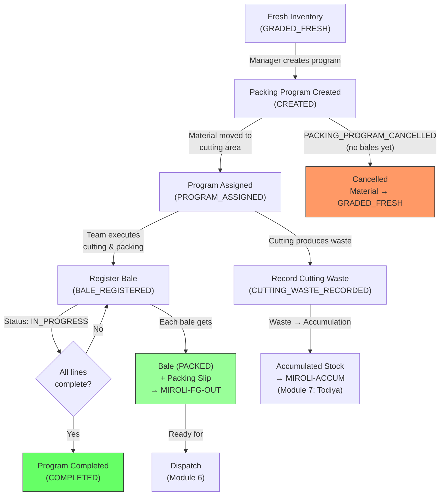

# Module 05 — Packing Program & Execution

## 1. Process Overview

### Process: Packing Program Creation, Cutting, Baling, and Packing Slip Generation

This module transforms graded Fresh material into branded, packed bales — the finished product. The facility manager creates a Packing Program (work order) specifying how to cut, fold, brand, and package the fabric. The team executes it, producing finished bales with bale numbers, brand stamps, product assignments, trade numbers, and packing slips. Cutting waste (Good Cut, Fent, Chindi produced during cutting) is recorded and fed into the accumulation stock for Todiya (Module 07).

Packing programs are triggered by: sales orders from head office (~95%), proactive inventory advancement by the manager (~5%), or Todiya repacking (handled in Module 07). This module covers regular (Fresh) packing programs only — Todiya packing programs are documented in Module 07 but follow the same execution flow.

A single lot can produce multiple packing programs (different customers, products, brands). A single physical form may contain multiple "cutting numbers" — each is a separate packing program in the system.

**No fixed rules** govern brand/product assignment. Any lot can become any brand/product combination. The manager decides at packing program creation time.

Flow:

```
  Program Creation          Cutting & Packing           Bale Registration
      [ENTRY]                   [ENTRY]                     [ENTRY]
         |                         |                            |
  PACKING_PROGRAM_           CUTTING_STARTED              BALE_REGISTERED
  CREATED                        |                            |
         |                   (cut, fold, brand,           (assign bale no,
    (manager creates          stamp, package)              trade number,
     work order)                  |                        packing slip)
         |                   CUTTING_WASTE_                    |
  Material allocated          RECORDED                    BALE_REGISTERED
         |                         |                            |
      [EXIT]                    [EXIT]                       [EXIT]
```

---

## 2. Entities and Aggregates

### Entities

| Entity | Aggregate Type | Relationships |
|---|---|---|
| Packing Program | `PackingProgram` | References MRL, Inbound Receipt. Contains many Packing Program Lines. Produces many Bales. |
| Packing Program Line | Part of `PackingProgram` | Belongs to a Packing Program. Defines one line item (one product/customer/cut-length combination). |
| Bale | `Bale` | Belongs to a Packing Program. References Brand, Product, Trade Number, Customer. |

### Entity Field Definitions

#### Packing Program

| Field | Type | Description |
|---|---|---|
| id | UUID | Primary key |
| program_number | string | Human-readable program number (auto-generated) |
| program_type | string | `REGULAR` or `TODIYA` |
| mrl_id | UUID (FK) | Source MRL (may be null for Todiya programs sourcing from multiple MRLs) |
| inbound_receipt_id | UUID (FK) | Source lot (may be null for Todiya) |
| lot_number | string | Vendor lot number (denormalized for display) |
| quality_code_id | UUID (FK) | Quality code of the source material |
| tone_code_id | UUID (FK) | Tone code |
| width | string | Fabric width (e.g., "58\"") |
| chadat | decimal | Chadat for this lot (from folding record) |
| total_metres_allocated | decimal | Total metres of Fresh material allocated to this program |
| total_metres_packed | decimal | Running total of metres actually packed into bales |
| total_bales | integer | Running count of bales produced |
| cutting_waste_kg | decimal | Total cutting waste recorded (all grades) |
| status | string | Current lifecycle status |
| program_date | date | Date the program was created |
| notes | string | Manager's special instructions |
| created_at | datetime | When the record was created |

#### Packing Program Line

| Field | Type | Description |
|---|---|---|
| id | UUID | Primary key |
| packing_program_id | UUID (FK) | Parent packing program |
| line_number | integer | Sequence within the program (1, 2, 3...) |
| brand_id | UUID (FK) | Brand stamp for this line |
| product_id | UUID (FK) | Product assignment |
| trade_number_id | UUID (FK) | Trade number / SKU reference |
| fold_type_id | UUID (FK) | How to fold (Book, Roof, 2Fold, etc.) |
| customer_id | UUID (FK) | Haste — which customer this line is for |
| cut_length_metres | decimal | Length per piece (e.g., 20m, 25m, 30m) |
| pieces_per_bale | integer | Number of pieces per bale |
| planned_bales | integer | Number of bales planned for this line |
| planned_metres | decimal | Computed: cut_length * pieces_per_bale * planned_bales |
| actual_bales | integer | Bales actually produced (updated during execution) |
| actual_metres | decimal | Metres actually packed |
| sample_required | boolean | Whether a sample piece is needed |
| sample_notes | string | Special sample instructions (brochure, packaging) |

#### Bale

| Field | Type | Description |
|---|---|---|
| id | UUID | Primary key |
| bale_number | integer | Human-readable bale number (auto-generated running serial) |
| packing_program_id | UUID (FK) | Which packing program produced this bale |
| packing_program_line_id | UUID (FK) | Which line item this bale is from |
| mrl_id | UUID (FK) | Source MRL (denormalized) |
| lot_number | string | Source lot (denormalized) |
| brand_id | UUID (FK) | Brand stamp on this bale |
| product_id | UUID (FK) | Product name |
| trade_number_id | UUID (FK) | Trade number / SKU |
| fold_type_id | UUID (FK) | How fabric was folded |
| tone_code_id | UUID (FK) | Tone code |
| width | string | Fabric width |
| customer_id | UUID (FK) | Haste — intended customer |
| cut_length_metres | decimal | Length per piece in this bale |
| pieces | integer | Number of pieces in this bale |
| total_metres | decimal | Total metres in this bale |
| status | string | Current lifecycle status (PACKED, DISPATCHED) |
| packing_date | date | Date the bale was packed |
| created_at | datetime | When the record was created |

### Numbering

| Entity | Prefix | Format | Example |
|---|---|---|---|
| Packing Program | PP | PP-{YYYY}-{NNNN} | PP-2026-0087 |
| Bale | (none) | {NNNNNN} (running serial) | 37432 |

---

## 3. Process Steps

### Step: Create Packing Program

Event type: `PACKING_PROGRAM_CREATED`

Trigger:
  Facility manager opens the Create Packing Program screen. Selects Fresh material source
  (MRL / lot), enters line items specifying brand, product, trade number, fold type, customer,
  cut length, pieces per bale, and number of bales. Clicks Submit.

Data points captured:
  - mrl_id: UUID — source MRL
  - inbound_receipt_id: UUID — source lot
  - quality_code_id: UUID
  - tone_code_id: UUID
  - width: string
  - chadat: decimal (auto-filled from folding record)
  - total_metres_allocated: decimal (sum of all line planned_metres)
  - program_date: date
  - notes: string (optional)
  - lines: list of line items, each containing:
    - brand_id: UUID
    - product_id: UUID
    - trade_number_id: UUID
    - fold_type_id: UUID
    - customer_id: UUID
    - cut_length_metres: decimal
    - pieces_per_bale: integer
    - planned_bales: integer
    - sample_required: boolean
    - sample_notes: string?

Payload:
  id: UUID (generated)
  program_number: string (generated)
  program_type: "REGULAR"
  mrl_id: UUID
  inbound_receipt_id: UUID
  lot_number: string (resolved)
  quality_code_id: UUID
  tone_code_id: UUID
  width: string
  chadat: decimal
  total_metres_allocated: decimal
  program_date: date
  notes: string?
  lines:
    - id: UUID (generated per line)
      line_number: integer
      brand_id: UUID
      product_id: UUID
      trade_number_id: UUID
      fold_type_id: UUID
      customer_id: UUID
      cut_length_metres: decimal
      pieces_per_bale: integer
      planned_bales: integer
      planned_metres: decimal (computed)
      sample_required: boolean
      sample_notes: string?

Aggregate: PackingProgram / id

Location: MIROLI-PACK

Preconditions:
  - Source lot must have GRADED_FRESH inventory
  - total_metres_allocated must not exceed available Fresh metres for this lot
  - All referenced master data (brand, product, trade number, fold type, customer) must be active
  - At least one line item required

Side effects:
  - fabric_inventory: Fresh material state changes from GRADED_FRESH to PROGRAM_ASSIGNED
  - fabric_inventory: location changes to MIROLI-PACK (material physically moved to cutting area)

Projections updated:
  - packing_programs: new row (status = CREATED)
  - packing_program_lines: new rows per line
  - fabric_inventory: state -> PROGRAM_ASSIGNED, location -> MIROLI-PACK for allocated metres

Permissions:
  - events:PACKING_PROGRAM_CREATED:emit

---

### Step: Register Bale

Event type: `BALE_REGISTERED`

Trigger:
  Worker or supervisor opens the Register Bale screen for an active packing program, selects
  the line item, enters pieces count and total metres, and clicks Submit. A bale number is
  auto-assigned. This step is repeated for each bale produced.

Data points captured:
  - packing_program_id: UUID
  - packing_program_line_id: UUID — which line this bale is from
  - pieces: integer — number of fabric pieces in the bale
  - total_metres: decimal — total metres in the bale
  - packing_date: date — defaults to today

Payload:
  id: UUID (generated)
  bale_number: integer (generated — next in running serial)
  packing_program_id: UUID
  packing_program_line_id: UUID
  mrl_id: UUID (from program)
  lot_number: string (from program)
  brand_id: UUID (from line)
  product_id: UUID (from line)
  trade_number_id: UUID (from line)
  fold_type_id: UUID (from line)
  tone_code_id: UUID (from program)
  width: string (from program)
  customer_id: UUID (from line)
  cut_length_metres: decimal (from line)
  pieces: integer
  total_metres: decimal
  packing_date: date

Aggregate: Bale / id

Location: MIROLI-PACK

Preconditions:
  - Packing program must exist with status CREATED or IN_PROGRESS
  - Line item must belong to this program
  - pieces must be > 0
  - total_metres must be > 0

Side effects:
  - Packing program: total_bales incremented, total_metres_packed incremented
  - Packing program line: actual_bales incremented, actual_metres incremented
  - Packing program status -> IN_PROGRESS (if was CREATED)
  - fabric_inventory: state changes from PROGRAM_ASSIGNED to PACKED
  - Packing slip auto-generated (dispatch-ready trigger)
  - If all lines are complete (actual_bales >= planned_bales for all lines):
    packing program status -> COMPLETED

Projections updated:
  - bales: new row (status = PACKED)
  - packing_programs: total_bales++, total_metres_packed += total_metres, status updated
  - packing_program_lines: actual_bales++, actual_metres += total_metres
  - fabric_inventory: state -> PACKED, location -> MIROLI-FG-OUT

Permissions:
  - events:BALE_REGISTERED:emit

---

### Step: Record Cutting Waste

Event type: `CUTTING_WASTE_RECORDED`

Trigger:
  Supervisor records the cutting waste produced during a packing program's execution. Opens
  the Record Waste screen for a packing program, enters weight per grade (Good Cut kg, Fent kg,
  Chindi kg). Clicks Submit.

Data points captured:
  - packing_program_id: UUID
  - good_cut_kg: decimal
  - fent_kg: decimal
  - chindi_kg: decimal
  - notes: string (optional)

Payload:
  id: UUID (generated)
  packing_program_id: UUID
  mrl_id: UUID (from program)
  good_cut_kg: decimal
  fent_kg: decimal
  chindi_kg: decimal
  total_waste_kg: decimal (sum)
  recording_date: date
  notes: string?

Aggregate: PackingProgram / id

Location: MIROLI-PACK

Preconditions:
  - Packing program must exist with status IN_PROGRESS or COMPLETED

Side effects:
  - Packing program: cutting_waste_kg updated
  - accumulation_stock: Good Cut, Fent, Chindi incremented by respective amounts
  - fabric_inventory: new ACCUMULATED entries at MIROLI-ACCUM

Projections updated:
  - packing_programs: cutting_waste_kg updated
  - accumulation_stock: good_cut_kg += good_cut_kg, fent_kg += fent_kg, chindi_kg += chindi_kg
  - fabric_inventory: new entries (state = ACCUMULATED, location = MIROLI-ACCUM)

Permissions:
  - events:CUTTING_WASTE_RECORDED:emit

---

### Step: Cancel Packing Program (Reversal)

Event type: `PACKING_PROGRAM_CANCELLED`

Trigger:
  Manager cancels a packing program that has not yet produced any bales. Material is returned
  to GRADED_FRESH state. Rare in practice but the system should allow it.

Payload:
  id: UUID
  reason: string

Aggregate: PackingProgram / id

Location: MIROLI-PACK

Preconditions:
  - Packing program status must be CREATED (no bales produced yet)
  - Cannot cancel if any bales have been registered

Side effects:
  - fabric_inventory: state reverts from PROGRAM_ASSIGNED to GRADED_FRESH
  - fabric_inventory: location reverts to MIROLI-FRESH

Projections updated:
  - packing_programs: status -> CANCELLED
  - fabric_inventory: state -> GRADED_FRESH, location -> MIROLI-FRESH

Permissions:
  - events:PACKING_PROGRAM_CANCELLED:emit

---

## 4. State Machines

### Packing Program States

Statuses: `CREATED`, `IN_PROGRESS`, `COMPLETED`, `CANCELLED`

Transitions:

| From Status | Event | To Status |
|---|---|---|
| (new) | `PACKING_PROGRAM_CREATED` | `CREATED` |
| `CREATED` | `BALE_REGISTERED` (first bale) | `IN_PROGRESS` |
| `CREATED` | `PACKING_PROGRAM_CANCELLED` | `CANCELLED` |
| `IN_PROGRESS` | `BALE_REGISTERED` (all lines complete) | `COMPLETED` |
| `IN_PROGRESS` | `BALE_REGISTERED` (not all complete) | `IN_PROGRESS` |

```
CREATED --BALE_REGISTERED--> IN_PROGRESS --BALE_REGISTERED (all done)--> COMPLETED
   |
   +--PACKING_PROGRAM_CANCELLED--> CANCELLED (terminal)
```

Notes:
- CANCELLED is terminal. Only allowed before any bales are registered.
- COMPLETED is terminal. All planned bales have been produced.
- IN_PROGRESS can receive additional bales until all lines are complete.

### Bale States

Statuses: `PACKED`, `DISPATCHED`

| From Status | Event | To Status |
|---|---|---|
| (new) | `BALE_REGISTERED` | `PACKED` |
| `PACKED` | `DELIVERY_CREATED` (Module 06) | `DISPATCHED` |

Notes:
- A bale is dispatch-ready the moment its packing slip is generated (which happens at `BALE_REGISTERED`). No approval step.
- Fresh bales are typically dispatched immediately. Todiya bales may wait.

---

## 5. Reports and Projections

### Reports

| # | Business Question | Projection Table | Key Fields | Updated By Events |
|---|---|---|---|---|
| 1 | "What packing programs are active?" | `packing_programs` | status=CREATED or IN_PROGRESS, program_number, lot, progress | All packing events |
| 2 | "Show me packing program PP-2026-0087" | `packing_programs` + `packing_program_lines` + `bales` | All program details, line items, bales produced | All packing events |
| 3 | "What bales have been packed today?" | `bales` | bale_number, brand, product, customer, metres, packing_date | `BALE_REGISTERED` |
| 4 | "Total bales packed this month" | `bales` | count, sum of metres, grouped by date/product/brand | `BALE_REGISTERED` |
| 5 | "What Fresh material is allocated to programs but not yet packed?" | `fabric_inventory` | state=PROGRAM_ASSIGNED, metres | `PACKING_PROGRAM_CREATED`, `BALE_REGISTERED` |
| 6 | "What is the Fresh material available for new programs?" | `fabric_inventory` | state=GRADED_FRESH, mrl, lot, metres | `GRADING_RECORDED`, `PACKING_PROGRAM_CREATED` |
| 7 | "Cutting waste summary — how much waste per program?" | `packing_programs` | cutting_waste_kg, program_number | `CUTTING_WASTE_RECORDED` |
| 8 | "Bale register — all bales with full details" | `bales` | All fields, filterable by date, brand, product, customer | `BALE_REGISTERED` |
| 9 | "Packed bales awaiting dispatch" | `bales` | status=PACKED, bale_number, customer | `BALE_REGISTERED`, `DELIVERY_CREATED` |

---

## 6. Roles and Permissions

### Roles

| Role | Description | Permissions |
|---|---|---|
| Facility Manager | Creates packing programs, cancels programs | `events:PACKING_PROGRAM_CREATED:emit`, `events:PACKING_PROGRAM_CANCELLED:emit`, `events:BALE_REGISTERED:emit`, `events:CUTTING_WASTE_RECORDED:emit` |
| Supervisor | Registers bales, records waste | `events:BALE_REGISTERED:emit`, `events:CUTTING_WASTE_RECORDED:emit` |
| Packing Worker | Registers bales | `events:BALE_REGISTERED:emit` |

### Permissions

| Permission Code | Description | Used By Step |
|---|---|---|
| `events:PACKING_PROGRAM_CREATED:emit` | Create a packing program | Create Packing Program |
| `events:BALE_REGISTERED:emit` | Register a packed bale | Register Bale |
| `events:CUTTING_WASTE_RECORDED:emit` | Record cutting waste | Record Cutting Waste |
| `events:PACKING_PROGRAM_CANCELLED:emit` | Cancel a packing program (reversal) | Cancel Packing Program |

---

## 7. Locations

| Location | Type | Code | Parent | Purpose |
|---|---|---|---|---|
| Graded Storage (Fresh) | zone | `MIROLI-FRESH` | MIROLI | Source — Fresh material picked from here |
| Cutting/Packing Area | zone | `MIROLI-PACK` | MIROLI | Where programs are executed — material moved here on allocation |
| Finished Goods | zone | `MIROLI-FG-OUT` | MIROLI | Packed bales stored here awaiting dispatch |
| Accumulation Area | zone | `MIROLI-ACCUM` | MIROLI | Cutting waste routed here |

---

## 8. Screen List

| # | Screen Name | Type | Used By | Purpose | Key Actions |
|---|---|---|---|---|---|
| 1 | Packing Programs | list | Manager | Browse all programs with status, MRL, progress filters | Create New Program |
| 2 | Packing Program Detail | detail | Manager, Supervisor | View program header, line items, bales produced, waste recorded, progress | Register Bale, Record Waste, Cancel |
| 3 | Create Packing Program | form | Manager | Select Fresh material source, add line items with brand/product/customer/cut specs | Submit |
| 4 | Register Bale | form | Supervisor, Worker | Select program line, enter pieces and metres | Submit (auto-assigns bale number) |
| 5 | Record Cutting Waste | form | Supervisor | Enter waste by grade (Good Cut kg, Fent kg, Chindi kg) for a program | Submit |
| 6 | Bale Register | list | Manager, Supervisor | Browse all bales — filter by date, brand, product, customer, status | View bale detail |
| 7 | Bale Detail | detail | Manager, Supervisor | View full bale identity — all attributes, packing slip preview, event history | Print Packing Slip |
| 8 | Fresh Material Available | list | Manager | Browse GRADED_FRESH inventory — shows MRL, lot, metres available for allocation | Create Program from this lot |
| 9 | Packing Dashboard | dashboard | Manager | Today's packing activity, bales produced, programs in progress, waste summary | Drill down |

---

## 9. Process Flowchart


