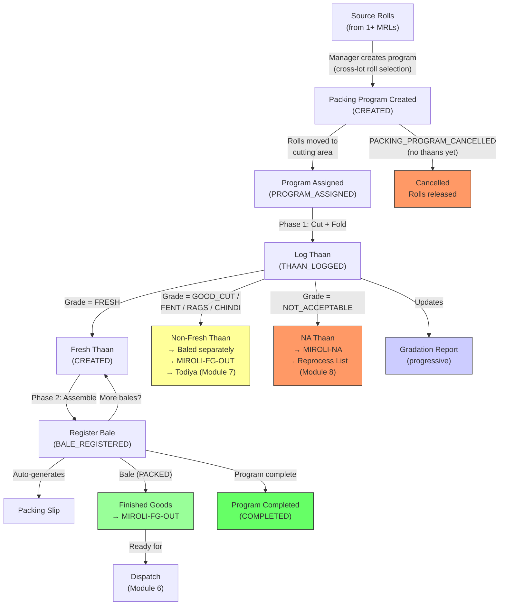

# Module 05 — Packing Program & Execution

## 1. Process Overview

### Process: Cross-Lot Packing Program Creation, Thaan Logging, Embedded Gradation, and Bale Assembly

This module transforms rolls into branded, packed bales — the finished product. A packing program is a work order that can source rolls from **multiple MRLs** (cross-lot selection). Execution happens in two explicit phases: **Phase 1 (Cut + Fold to Thaan)** produces individually logged thaans from source rolls, and **Phase 2 (Assemble Thaans to Bale)** groups thaans into finished bales with bale numbers, brand stamps, product assignments, trade numbers, and packing slips.

**Gradation is embedded in packing execution.** There is no standalone grading step. During Phase 1, as each roll is cut, the majority produces Fresh thaans. Any non-Fresh material (Good Cut, Fent, Rags, Chindi) is logged as non-Fresh thaans with the appropriate grade — this IS the gradation. The Gradation Report is a progressive projection updated every time a thaan is logged. Not Acceptable material identified during cutting is logged in metres and creates an entry on the Reprocess List (Module 08).

Packing programs are triggered by: sales orders from head office (~95%), proactive inventory advancement by the manager (~5%), or Todiya repacking (handled in Module 07). This module covers regular (Fresh) packing programs only — Todiya packing programs are documented in Module 07 but follow the same execution flow.

A single lot can contribute rolls to multiple packing programs. A single packing program can source rolls from multiple lots. A single physical form may contain multiple "cutting numbers" — each is a separate packing program in the system.

**No fixed rules** govern brand/product assignment. Any lot can become any brand/product combination. The manager decides at packing program creation time.

**All thaans are baled during regular packing** — Fresh thaans into dispatch-ready bales, non-Fresh thaans (Good Cut, Fent, Rags, Chindi) into separate non-Fresh bales. Non-Fresh bales sit at MIROLI-FG-OUT until a Todiya buyer is found (Module 07).

Flow:

```
  Phase 0: Program Creation     Phase 1: Cut + Fold → Thaan     Phase 2: Assemble → Bale
         [ENTRY]                        [ENTRY]                        [ENTRY]
            |                              |                              |
  PACKING_PROGRAM_CREATED            THAAN_LOGGED                  BALE_REGISTERED
            |                              |                              |
     (manager creates work          (cut roll to length,          (select Fresh thaans,
      order, selects rolls           fold per fold type,           assemble into bale,
      from 1+ MRLs)                  log thaan with grade)         auto-generate slip)
            |                              |                              |
     Rolls allocated              Gradation Report updated         Bale (PACKED)
            |                              |                              |
         [EXIT]                         [EXIT]                         [EXIT]
```

---

## 2. Entities and Aggregates

### Entities

| Entity | Aggregate Type | Relationships |
|---|---|---|
| Packing Program | `PackingProgram` | References a list of source rolls (spanning one or more MRLs). Contains many Packing Program Lines. Produces many Thaans and Bales. |
| Packing Program Line | Part of `PackingProgram` | Belongs to a Packing Program. Defines one line item (one brand/product/customer/cut-length combination). |
| Thaan | `Thaan` | Belongs to a Packing Program. References one source roll and one MRL. May belong to a Bale (once assembled). Intermediate unit between roll and bale. |
| Bale | `Bale` | Belongs to a Packing Program. Contains multiple Thaans. References Brand, Product, Trade Number, Customer. |
| Gradation Report | Projection | One per MRL. Progressive — updated as thaans are logged. Computed projection, not directly created by user. Moved here from Module 04. |

### Entity Field Definitions

#### Packing Program

| Field | Type | Description |
|---|---|---|
| id | UUID | Primary key |
| program_number | string | Human-readable program number (auto-generated) |
| program_type | string | `REGULAR` or `TODIYA` |
| fold_type_id | UUID (FK) | Fold type for this program — program-level attribute (Book, Roof, 2Fold, etc.) |
| quality_code_id | UUID (FK) | Quality code of the source material |
| tone_code_id | UUID (FK) | Tone code |
| width | string | Fabric width (e.g., "58\"") |
| source_rolls | list | List of source rolls, each entry containing: roll_id (UUID), mrl_id (UUID), metres_available (decimal) |
| total_metres_allocated | decimal | Total metres across all source rolls allocated to this program |
| planned_bales | integer | Advisory bale count — the program can produce more or fewer bales than planned |
| total_thaans_logged | integer | Running count of thaans produced (all grades) |
| total_fresh_thaans | integer | Running count of Fresh thaans produced |
| total_metres_packed | decimal | Running total of metres actually packed into bales |
| total_bales | integer | Running count of bales produced |
| status | string | Current lifecycle status |
| program_date | date | Date the program was created |
| notes | string | Manager's special instructions |
| created_at | datetime | When the record was created |

#### Packing Program Line

| Field | Type | Description |
|---|---|---|
| id | UUID | Primary key |
| packing_program_id | UUID (FK) | Parent packing program |
| line_number | integer | Sequence within the program (1, 2, 3...) |
| brand_id | UUID (FK) | Brand stamp for this line |
| product_id | UUID (FK) | Product assignment |
| trade_number_id | UUID (FK) | Trade number / SKU reference |
| customer_id | UUID (FK) | Haste — which customer this line is for |
| cut_length_metres | decimal | Length per piece (e.g., 20m, 25m, 30m) |
| pieces_per_bale | integer | Number of pieces (thaans) per bale |
| planned_bales | integer | Advisory number of bales planned for this line |
| planned_metres | decimal | Computed: cut_length * pieces_per_bale * planned_bales |
| actual_bales | integer | Bales actually produced (updated during execution) |
| actual_metres | decimal | Metres actually packed |
| sample_required | boolean | Whether a sample piece is needed |
| sample_notes | string | Special sample instructions (brochure, packaging) |

#### Thaan

| Field | Type | Description |
|---|---|---|
| id | UUID | Primary key |
| thaan_number | integer | Auto-generated running serial |
| packing_program_id | UUID (FK) | Which packing program produced this thaan |
| source_roll_id | UUID (FK) | Which roll this thaan was cut from (one thaan = one source roll) |
| mrl_id | UUID (FK) | Denormalized from roll — which MRL |
| grade | string | FRESH, GOOD_CUT, FENT, RAGS, CHINDI, or NOT_ACCEPTABLE |
| metres | decimal | For Fresh, Good Cut, and Not Acceptable thaans (always in metres) |
| kilograms | decimal | For Fent, Rags, and Chindi thaans (always in kg; metres derived via Chadat) |
| bale_id | UUID (FK) | Which bale this thaan was assembled into (null until baling) |
| status | string | Current lifecycle status: CREATED, BALED, UNPACKED (for Todiya) |
| created_at | datetime | When the thaan was logged |

#### Bale

| Field | Type | Description |
|---|---|---|
| id | UUID | Primary key |
| bale_number | integer | Human-readable bale number (auto-generated running serial) |
| source | string | `REGULAR` or `TODIYA` — how this bale was created |
| packing_program_id | UUID (FK) | Which packing program produced this bale (null for Todiya bales) |
| packing_program_line_id | UUID (FK) | Which line item this bale is from (null for Todiya bales) |
| todiya_instruction_id | UUID (FK) | Which Todiya Instruction produced this bale (null for regular bales) |
| brand_id | UUID (FK) | Brand stamp on this bale |
| product_id | UUID (FK) | Product name |
| trade_number_id | UUID (FK) | Trade number / SKU |
| fold_type_id | UUID (FK) | How fabric was folded (from program) |
| tone_code_id | UUID (FK) | Tone code (from program) |
| width | string | Fabric width (from program) |
| customer_id | UUID (FK) | Haste — intended customer |
| cut_length_metres | decimal | Length per piece in this bale |
| thaan_count | integer | Number of thaans in this bale |
| total_metres | decimal | Total metres in this bale (sum of thaan metres) |
| status | string | Current lifecycle status (PACKED, DISPATCHED) |
| packing_date | date | Date the bale was packed |
| created_at | datetime | When the record was created |

#### Gradation Report (projection)

| Field | Type | Description |
|---|---|---|
| id | UUID | Primary key |
| mrl_id | UUID (FK) | One report per MRL |
| mrl_number | string | Denormalized for display |
| gate_pass_metres | decimal | From Inbound Receipt — what Gate Pass reported |
| folding_metres | decimal | From Folding Record — RG Faith's measurement (null if not yet folded) |
| total_fresh_metres | decimal | Sum of FRESH thaans in metres |
| good_cut_metres | decimal | Sum of GOOD_CUT thaans in metres |
| fent_kg | decimal | Sum of FENT thaans in kg |
| fent_metres | decimal | Converted via Chadat |
| rags_kg | decimal | Sum of RAGS thaans in kg |
| rags_metres | decimal | Converted via Chadat |
| chindi_kg | decimal | Sum of CHINDI thaans in kg |
| chindi_metres | decimal | Converted via Chadat |
| not_acceptable_metres | decimal | Sum of NOT_ACCEPTABLE thaans in metres |
| total_graded_metres | decimal | Sum of all grades in metres |
| fresh_percentage | decimal | (total_fresh_metres / total_graded_metres) * 100 |
| shrinkage_metres | decimal | folding_metres - total_graded_metres (ongoing; null if folding not yet recorded) |
| updated_at | datetime | Last time the report was updated |

### Numbering

| Entity | Prefix | Format | Example |
|---|---|---|---|
| Packing Program | PP | PP-{YYYY}-{NNNN} | PP-2026-0087 |
| Thaan | (none) | {NNNNNN} (running serial) | 104832 |
| Bale | (none) | {NNNNNN} (running serial) | 37432 |

---

## 3. Process Steps

### Step: Create Packing Program

Event type: `PACKING_PROGRAM_CREATED`

Trigger:
  Facility manager opens the Create Packing Program screen. Selects source rolls from one or
  more MRLs (cross-lot selection), specifies fold type at the program level, enters line items
  specifying brand, product, trade number, customer, cut length, pieces per bale, and advisory
  bale count. Clicks Submit.

Data points captured:
  - source_rolls: list — each entry contains roll_id (UUID), mrl_id (UUID), metres_available (decimal)
  - fold_type_id: UUID — fold type for this program
  - quality_code_id: UUID
  - tone_code_id: UUID
  - width: string
  - planned_bales: integer (advisory)
  - program_date: date
  - notes: string (optional)
  - lines: list of line items, each containing:
    - brand_id: UUID
    - product_id: UUID
    - trade_number_id: UUID
    - customer_id: UUID
    - cut_length_metres: decimal
    - pieces_per_bale: integer
    - planned_bales: integer (advisory)
    - sample_required: boolean
    - sample_notes: string?

Payload:
  id: UUID (generated)
  program_number: string (generated)
  program_type: "REGULAR"
  fold_type_id: UUID
  quality_code_id: UUID
  tone_code_id: UUID
  width: string
  source_rolls:
    - roll_id: UUID
      mrl_id: UUID
      metres_available: decimal
  total_metres_allocated: decimal (sum of metres_available across all source rolls)
  planned_bales: integer (advisory)
  program_date: date
  notes: string?
  lines:
    - id: UUID (generated per line)
      line_number: integer
      brand_id: UUID
      product_id: UUID
      trade_number_id: UUID
      customer_id: UUID
      cut_length_metres: decimal
      pieces_per_bale: integer
      planned_bales: integer (advisory)
      planned_metres: decimal (computed)
      sample_required: boolean
      sample_notes: string?

Aggregate: PackingProgram / id

Location: MIROLI-PACK

Preconditions:
  - Each source roll must have available inventory in CLASSIFIED state
  - total_metres_allocated must not exceed the sum of available metres across selected rolls
  - All referenced master data (brand, product, trade number, fold type, customer) must be active
  - At least one line item required
  - At least one source roll required
  - **No quality/tone/finish matching enforced** — the manager sets quality_code_id and tone_code_id at the program level independently of the source rolls' classification. The manager is trusted to select compatible rolls.

Side effects:
  - fabric_inventory: source rolls state changes to PROGRAM_ASSIGNED
  - fabric_inventory: location changes to MIROLI-PACK (material physically moved to cutting area)

Projections updated:
  - packing_programs: new row (status = CREATED)
  - packing_program_lines: new rows per line
  - fabric_inventory: state -> PROGRAM_ASSIGNED, location -> MIROLI-PACK for all allocated rolls

Permissions:
  - events:PACKING_PROGRAM_CREATED:emit

---

### Step: Log Thaan (Phase 1 — Cut + Fold)

Event type: `THAAN_LOGGED`

Trigger:
  Worker or supervisor opens the Log Thaan screen for an active packing program. A roll is
  scanned or selected, cut to the specified length, and folded per the program's fold type.
  The worker enters the grade (usually FRESH for the main piece; non-Fresh for waste/offcut
  material identified during cutting), metres or kg, and the source roll. Clicks Submit.
  A thaan number is auto-assigned.

  This step is repeated for every thaan produced during Phase 1. Each roll typically produces
  one or more Fresh thaans plus zero or more non-Fresh thaans (the embedded gradation).

Data points captured:
  - packing_program_id: UUID
  - source_roll_id: UUID — which roll this thaan was cut from
  - grade: string — FRESH, GOOD_CUT, FENT, RAGS, CHINDI, or NOT_ACCEPTABLE
  - metres: decimal — for Fresh, Good Cut, and Not Acceptable (in metres)
  - kilograms: decimal — for Fent, Rags, and Chindi (in kg)

Payload:
  id: UUID (generated)
  thaan_number: integer (generated — next in running serial)
  packing_program_id: UUID
  source_roll_id: UUID
  mrl_id: UUID (resolved from roll)
  grade: string
  metres: decimal
  kilograms: decimal
  status: "CREATED"

Aggregate: Thaan / id

Location: MIROLI-PACK

Preconditions:
  - Packing program must exist with status CREATED or IN_PROGRESS
  - source_roll_id must be one of the program's source rolls
  - One thaan can only come from one roll
  - For FRESH, GOOD_CUT, NOT_ACCEPTABLE: metres must be > 0, kilograms = 0
  - For FENT, RAGS, CHINDI: kilograms must be > 0, metres computed via Chadat
  - **Validation rule:** Chadat must be recorded (on the MRL's folding record) BEFORE any non-Fresh thaan can be logged — because Fent, Rags, and Chindi are measured in kg and need Chadat for the metres-to-kg conversion bridge

Side effects:
  - Packing program: total_thaans_logged incremented; total_fresh_thaans incremented if grade = FRESH
  - Packing program status -> IN_PROGRESS (if was CREATED)
  - Gradation Report updated for the thaan's MRL (incremental recalculation of grade totals, fresh percentage, shrinkage)
  - If grade = GOOD_CUT, FENT, RAGS, or CHINDI:
    - Thaan logged with status CREATED (available for baling into a non-Fresh bale)
  - If grade = NOT_ACCEPTABLE:
    - fabric_inventory: state -> NOT_ACCEPTABLE, location -> MIROLI-NA
    - Creates NA_ENTRY_CREATED event on Reprocess List (Module 08)

Projections updated:
  - thaans: new row (status = CREATED, bale_id = null)
  - packing_programs: total_thaans_logged++, total_fresh_thaans++ (if Fresh), status -> IN_PROGRESS
  - gradation_reports: incremental update (add metres/kg to grade totals, recalculate fresh_percentage, recalculate shrinkage)
  - fabric_inventory: updated based on grade
  - not_acceptable_entries: if grade = NOT_ACCEPTABLE, new row on Reprocess List

Permissions:
  - events:THAAN_LOGGED:emit

---

### Step: Register Bale (Phase 2 — Assemble Thaans)

Event type: `BALE_REGISTERED`

Trigger:
  Worker or supervisor opens the Register Bale screen for an active packing program, selects
  the line item, selects the Fresh thaans to include in this bale (from thaans with status =
  CREATED and grade = FRESH), and clicks Submit. A bale number is auto-assigned. Packing slip
  is auto-generated (dispatch-ready — no separate approval step).

  This step is repeated for each bale produced during Phase 2.

Data points captured:
  - packing_program_id: UUID
  - packing_program_line_id: UUID — which line this bale is from
  - thaan_ids: list of UUID — which thaans to assemble into this bale
  - packing_date: date — defaults to today

Payload:
  id: UUID (generated)
  bale_number: integer (generated — next in running serial)
  packing_program_id: UUID
  packing_program_line_id: UUID
  brand_id: UUID (from line)
  product_id: UUID (from line)
  trade_number_id: UUID (from line)
  fold_type_id: UUID (from program)
  tone_code_id: UUID (from program)
  width: string (from program)
  customer_id: UUID (from line)
  cut_length_metres: decimal (from line)
  thaan_ids: [UUID]
  thaan_count: integer (count of thaan_ids)
  total_metres: decimal (sum of thaan metres)
  packing_date: date

Aggregate: Bale / id

Location: MIROLI-PACK

Preconditions:
  - Packing program must exist with status CREATED or IN_PROGRESS
  - Line item must belong to this program
  - All thaan_ids must belong to this packing program
  - All selected thaans must have status = CREATED
  - All selected thaans in a single bale must have the same grade (Fresh bales contain only Fresh thaans; non-Fresh bales contain one grade each)
  - thaan_ids must not be empty

Side effects:
  - Selected thaans: status -> BALED, bale_id -> this bale's id
  - Packing program: total_bales incremented, total_metres_packed incremented
  - Packing program line: actual_bales incremented, actual_metres incremented
  - Packing program status -> IN_PROGRESS (if was CREATED)
  - fabric_inventory: state changes from PROGRAM_ASSIGNED to PACKED
  - Packing slip auto-generated (dispatch-ready trigger)
  - If program is considered complete (manager's judgment, since planned_bales is advisory):
    packing program status -> COMPLETED

Projections updated:
  - bales: new row (status = PACKED)
  - thaans: selected thaans updated (status -> BALED, bale_id set)
  - packing_programs: total_bales++, total_metres_packed += total_metres, status updated
  - packing_program_lines: actual_bales++, actual_metres += total_metres
  - fabric_inventory: state -> PACKED, location -> MIROLI-FG-OUT

Permissions:
  - events:BALE_REGISTERED:emit

---

### Step: Cancel Packing Program (Reversal)

Event type: `PACKING_PROGRAM_CANCELLED`

Trigger:
  Manager cancels a packing program that has not yet produced any thaans or bales. Source rolls
  are returned to their previous inventory state. Rare in practice but the system should allow it.

Payload:
  id: UUID
  reason: string

Aggregate: PackingProgram / id

Location: MIROLI-PACK

Preconditions:
  - Packing program status must be CREATED (no thaans logged, no bales produced)
  - Cannot cancel if any thaans have been logged or bales have been registered

Side effects:
  - fabric_inventory: source rolls state reverts from PROGRAM_ASSIGNED to previous state
  - fabric_inventory: location reverts to previous location

Projections updated:
  - packing_programs: status -> CANCELLED
  - fabric_inventory: state and location reverted for all source rolls

Permissions:
  - events:PACKING_PROGRAM_CANCELLED:emit

---

## 4. State Machines

### Packing Program States

Statuses: `CREATED`, `IN_PROGRESS`, `COMPLETED`, `CANCELLED`

Transitions:

| From Status | Event | To Status |
|---|---|---|
| (new) | `PACKING_PROGRAM_CREATED` | `CREATED` |
| `CREATED` | `THAAN_LOGGED` (first thaan) | `IN_PROGRESS` |
| `CREATED` | `PACKING_PROGRAM_CANCELLED` | `CANCELLED` |
| `IN_PROGRESS` | `THAAN_LOGGED` | `IN_PROGRESS` |
| `IN_PROGRESS` | `BALE_REGISTERED` | `IN_PROGRESS` |
| `IN_PROGRESS` | `BALE_REGISTERED` (program complete) | `COMPLETED` |

```
CREATED --THAAN_LOGGED--> IN_PROGRESS --BALE_REGISTERED (complete)--> COMPLETED
   |                            |
   |                      THAAN_LOGGED / BALE_REGISTERED (ongoing) --> IN_PROGRESS
   |
   +--PACKING_PROGRAM_CANCELLED--> CANCELLED (terminal)
```

Notes:
- CANCELLED is terminal. Only allowed before any thaans are logged.
- COMPLETED is terminal. Triggered when the manager marks the program as complete (planned_bales is advisory, so completion is a manager decision, not an automatic threshold).
- IN_PROGRESS can receive additional thaans and bales until the program is completed.

### Thaan States

Statuses: `CREATED`, `BALED`, `UNPACKED`

| From Status | Event | To Status |
|---|---|---|
| (new) | `THAAN_LOGGED` | `CREATED` |
| `CREATED` | `BALE_REGISTERED` (thaan assembled into bale) | `BALED` |
| `BALED` | `BALE_UNPACKED` — Todiya unpacking (Module 07) | `UNPACKED` |
| `UNPACKED` | `BALE_REGISTERED` (source=TODIYA, Module 07) | `BALED` (in new Todiya bale) |

Notes:
- CREATED means the thaan has been cut and logged but not yet assembled into a bale.
- BALED means the thaan is part of a bale.
- UNPACKED is used for Todiya scenarios where a bale is broken apart.
- Non-Fresh thaans (Good Cut, Fent, Rags, Chindi) are assembled into separate non-Fresh bales during regular programs. These bales sit at MIROLI-FG-OUT until a Todiya buyer is found (Module 07).

### Bale States

Statuses: `PACKED`, `PICKUP_SCHEDULED`, `DISPATCHED`, `UNPACKED`

| From Status | Event | To Status |
|---|---|---|
| (new) | `BALE_REGISTERED` | `PACKED` |
| `PACKED` | `DELIVERY_CREATED` (Module 06) | `PICKUP_SCHEDULED` |
| `PICKUP_SCHEDULED` | `DELIVERY_DISPATCHED` (Module 06) | `DISPATCHED` |
| `PICKUP_SCHEDULED` | `DELIVERY_CANCELLED` (Module 06) | `PACKED` |
| `PACKED` | `BALE_UNPACKED` (Module 07 — Todiya) | `UNPACKED` |

Notes:
- A bale is dispatch-ready the moment its packing slip is generated (which happens at `BALE_REGISTERED`). No approval step.
- Two-step dispatch: PACKED → PICKUP_SCHEDULED (delivery form created) → DISPATCHED (truck departs). See Module 06.
- Fresh bales are typically dispatched immediately. Todiya bales may wait.

---

## 5. Reports and Projections

### Reports

| # | Business Question | Projection Table | Key Fields | Updated By Events |
|---|---|---|---|---|
| 1 | "What packing programs are active?" | `packing_programs` | status=CREATED or IN_PROGRESS, program_number, source rolls, progress | All packing events |
| 2 | "Show me packing program PP-2026-0087" | `packing_programs` + `packing_program_lines` + `thaans` + `bales` | All program details, line items, thaans logged, bales produced | All packing events |
| 3 | "What thaans have been logged today?" | `thaans` | thaan_number, grade, metres/kg, source_roll, mrl, packing_program | `THAAN_LOGGED` |
| 4 | "What bales have been packed today?" | `bales` | bale_number, brand, product, customer, thaan_count, metres, packing_date | `BALE_REGISTERED` |
| 5 | "Total bales packed this month" | `bales` | count, sum of metres, grouped by date/product/brand | `BALE_REGISTERED` |
| 6 | "Gradation Report for MRL #526" | `gradation_reports` | All grade breakdowns (Fresh metres, Good Cut metres, Fent kg/metres, Rags kg/metres, Chindi kg/metres, NA metres), fresh_percentage, shrinkage | `THAAN_LOGGED`, `FOLDING_COMPLETED` |
| 7 | "What is the Fresh yield percentage across all lots this month?" | `gradation_reports` | fresh_percentage, mrl_id | `THAAN_LOGGED` |
| 8 | "What Fresh thaans are available for baling?" | `thaans` | status=CREATED, grade=FRESH, thaan_number, metres, packing_program | `THAAN_LOGGED`, `BALE_REGISTERED` |
| 9 | "Bale register — all bales with full details" | `bales` | All fields, filterable by date, brand, product, customer | `BALE_REGISTERED` |
| 10 | "Packed bales awaiting dispatch" | `bales` | status=PACKED, bale_number, customer | `BALE_REGISTERED`, `DELIVERY_CREATED` |
| 11 | "What material is allocated to programs but not yet cut?" | `fabric_inventory` | state=PROGRAM_ASSIGNED, source rolls, metres | `PACKING_PROGRAM_CREATED`, `THAAN_LOGGED` |

---

## 6. Roles and Permissions

### Roles

| Role | Description | Permissions |
|---|---|---|
| Facility Manager | Creates packing programs, cancels programs, logs thaans, registers bales | `events:PACKING_PROGRAM_CREATED:emit`, `events:PACKING_PROGRAM_CANCELLED:emit`, `events:THAAN_LOGGED:emit`, `events:BALE_REGISTERED:emit` |
| Supervisor | Logs thaans, registers bales | `events:THAAN_LOGGED:emit`, `events:BALE_REGISTERED:emit` |
| Packing Worker | Logs thaans, registers bales | `events:THAAN_LOGGED:emit`, `events:BALE_REGISTERED:emit` |

### Permissions

| Permission Code | Description | Used By Step |
|---|---|---|
| `events:PACKING_PROGRAM_CREATED:emit` | Create a packing program | Create Packing Program |
| `events:THAAN_LOGGED:emit` | Log a thaan during Phase 1 (cut + fold) | Log Thaan |
| `events:BALE_REGISTERED:emit` | Register a packed bale during Phase 2 (assemble thaans) | Register Bale |
| `events:PACKING_PROGRAM_CANCELLED:emit` | Cancel a packing program (reversal) | Cancel Packing Program |

---

## 7. Locations

| Location | Type | Code | Parent | Purpose |
|---|---|---|---|---|
| Cutting/Packing Area | zone | `MIROLI-PACK` | MIROLI | Where programs are executed — rolls moved here on allocation, thaans cut and bales assembled |
| Finished Goods | zone | `MIROLI-FG-OUT` | MIROLI | Packed bales stored here awaiting dispatch (both Fresh and non-Fresh bales) |
| Not Acceptable Storage | zone | `MIROLI-NA` | MIROLI | Not Acceptable thaans routed here; entry created on Reprocess List (Module 08) |

---

## 8. Screen List

| # | Screen Name | Type | Used By | Purpose | Key Actions |
|---|---|---|---|---|---|
| 1 | Packing Programs | list | Manager | Browse all programs with status, source MRLs, progress filters | Create New Program |
| 2 | Packing Program Detail | detail | Manager, Supervisor | View program header, source rolls, line items, thaans logged (by grade), bales produced, gradation summary, progress | Log Thaan, Register Bale, Cancel |
| 3 | Create Packing Program | form | Manager | Select source rolls from one or more MRLs, set fold type, add line items with brand/product/customer/cut specs, advisory bale count | Submit |
| 4 | Log Thaan | form | Supervisor, Worker | Select source roll, enter grade (Fresh or non-Fresh), enter metres or kg | Submit (auto-assigns thaan number) |
| 5 | Register Bale | form | Supervisor, Worker | Select program line, select Fresh thaans to assemble into bale | Submit (auto-assigns bale number, auto-generates packing slip) |
| 6 | Bale Register | list | Manager, Supervisor | Browse all bales — filter by date, brand, product, customer, status | View bale detail |
| 7 | Bale Detail | detail | Manager, Supervisor | View full bale identity — all attributes, thaans included, packing slip preview, event history | Print Packing Slip |
| 8 | Gradation Report | detail | Supervisor, Manager | View progressive gradation report for one MRL — Fresh metres, grade breakdown, fresh percentage, shrinkage. Updated as thaans are logged. | Print, Export |
| 9 | Gradation Reports | list | Manager | Browse all gradation reports — filter by MRL, date range | View report |
| 10 | Packing Dashboard | dashboard | Manager | Today's packing activity — thaans logged, bales produced, programs in progress, gradation summary | Drill down |

---

## 9. Process Flowchart


