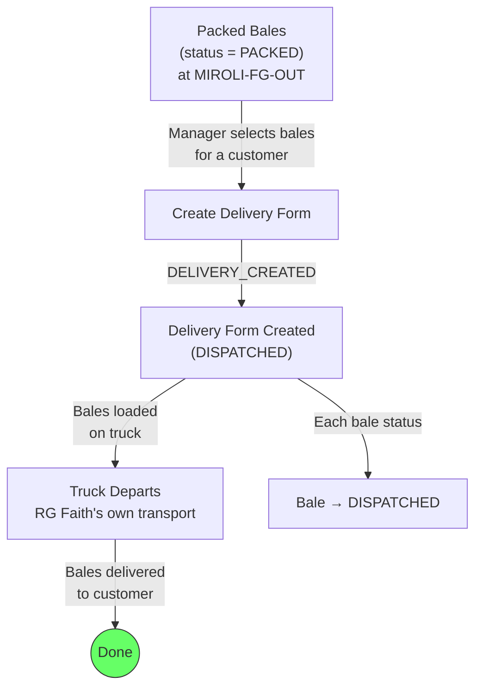

# Module 06 — Dispatch

## 1. Process Overview

### Process: Delivery Form Creation and Bale Dispatch

This module handles the final step in the material lifecycle: shipping finished bales from Miroli to customers. The manager creates a Delivery Form listing the bales for a specific customer (Haste), workers load the bales, and the truck departs on RG Faith's own transport.

A single delivery can include bales from multiple packing programs, multiple products, and multiple brands — as long as they are all for the same customer. Fresh bales are typically dispatched immediately after packing. Todiya bales may sit packed for days while buyer logistics are arranged.

Customer returns are out of scope — the system does not handle inbound returns of finished bales.

Flow:

```
  Select Bales              Create Delivery Form          Dispatch
     [ENTRY]                     [ENTRY]                   [ENTRY]
        |                           |                         |
   (identify packed              DELIVERY_CREATED          (load truck,
    bales by customer)              |                       sign off)
        |                     (form generated                 |
   bales selected               with bale list)          truck departs
        |                           |                         |
     [EXIT]                      [EXIT]                    [EXIT]
```

---

## 2. Entities and Aggregates

### Entities

| Entity | Aggregate Type | Relationships |
|---|---|---|
| Delivery Form | `DeliveryForm` | References Customer. Contains many Delivery Lines (bales). |
| Delivery Line | Part of `DeliveryForm` | References a Bale. |

### Entity Field Definitions

#### Delivery Form

| Field | Type | Description |
|---|---|---|
| id | UUID | Primary key |
| delivery_number | string | Human-readable serial number (auto-generated) |
| delivery_date | date | Date of dispatch |
| customer_id | UUID (FK) | Haste — which customer receives the goods |
| total_bales | integer | Count of bales in this shipment |
| total_metres | decimal | Sum of metres across all bales |
| total_pieces | integer | Sum of pieces across all bales |
| notes | string | Optional remarks |
| status | string | Current status |
| created_at | datetime | When the record was created |

#### Delivery Line

| Field | Type | Description |
|---|---|---|
| id | UUID | Primary key |
| delivery_form_id | UUID (FK) | Parent delivery form |
| bale_id | UUID (FK) | Which bale is being dispatched |
| bale_number | integer | Denormalized for display |
| lot_number | string | Denormalized — vendor lot number |
| trade_number_code | string | Denormalized — trade number / SKU |
| pieces | integer | Pieces in this bale |
| metres | decimal | Metres in this bale |

### Numbering

| Entity | Prefix | Format | Example |
|---|---|---|---|
| Delivery Form | DF | DF-{YYYY}-{NNNN} | DF-2026-0890 |

---

## 3. Process Steps

### Step: Create Delivery Form

Event type: `DELIVERY_CREATED`

Trigger:
  Manager opens the Create Delivery screen, selects a customer (Haste) from the dropdown, then
  selects the packed bales to include in this shipment (checkboxes on a list of PACKED bales
  for that customer). Enters delivery date and any notes. Clicks Submit.

Data points captured:
  - customer_id: UUID — selected from customer dropdown
  - delivery_date: date — defaults to today
  - bale_ids: list of UUID — which bales to include
  - notes: string (optional)

Payload:
  id: UUID (generated)
  delivery_number: string (generated)
  delivery_date: date
  customer_id: UUID
  notes: string?
  lines:
    - id: UUID (generated)
      bale_id: UUID
      bale_number: integer (resolved)
      lot_number: string (resolved)
      trade_number_code: string (resolved)
      pieces: integer (resolved from bale)
      metres: decimal (resolved from bale)
  total_bales: integer (count of lines)
  total_metres: decimal (sum of line metres)
  total_pieces: integer (sum of line pieces)

Aggregate: DeliveryForm / id

Location: MIROLI

Preconditions:
  - Customer must exist and be active
  - All bale_ids must reference bales with status = PACKED
  - All bales must be assigned to the selected customer (customer_id matches bale's customer_id)
  - At least one bale must be selected

Side effects:
  - Each bale's status changes from PACKED to DISPATCHED
  - fabric_inventory: state -> DISPATCHED for each bale's metres

Projections updated:
  - delivery_forms: new row (status = DISPATCHED)
  - delivery_lines: new rows per bale
  - bales: status -> DISPATCHED for each bale in the delivery
  - fabric_inventory: state -> DISPATCHED

Permissions:
  - events:DELIVERY_CREATED:emit

---

## 4. State Machines

### Delivery Form States

Statuses: `DISPATCHED`

A delivery form has a single state — once created, it is dispatched. There is no draft or approval step.

| From Status | Event | To Status |
|---|---|---|
| (new) | `DELIVERY_CREATED` | `DISPATCHED` |

Notes:
- Delivery forms are not editable after creation. If a correction is needed, a new delivery form should be created.
- No cancellation state — if a delivery is wrong, it is handled operationally (physical return, new delivery form).

---

## 5. Reports and Projections

### Reports

| # | Business Question | Projection Table | Key Fields | Updated By Events |
|---|---|---|---|---|
| 1 | "What was dispatched today / this week?" | `delivery_forms` | delivery_date, customer, total_bales, total_metres | `DELIVERY_CREATED` |
| 2 | "Show me Delivery Form DF-2026-0890" | `delivery_forms` + `delivery_lines` | All form + line details | `DELIVERY_CREATED` |
| 3 | "Total metres dispatched to customer X this month" | `delivery_forms` | customer_id, total_metres, delivery_date | `DELIVERY_CREATED` |
| 4 | "What packed bales are awaiting dispatch?" | `bales` | status=PACKED, customer, bale_number | `BALE_REGISTERED`, `DELIVERY_CREATED` |
| 5 | "Dispatch history for customer X" | `delivery_forms` + `delivery_lines` | All deliveries for customer_id | `DELIVERY_CREATED` |
| 6 | "Total dispatch volume this month (bales, metres)" | `delivery_forms` | sum of total_bales, total_metres | `DELIVERY_CREATED` |

---

## 6. Roles and Permissions

### Roles

| Role | Description | Permissions |
|---|---|---|
| Facility Manager | Creates delivery forms, manages dispatch | `events:DELIVERY_CREATED:emit` |
| Supervisor | Creates delivery forms | `events:DELIVERY_CREATED:emit` |

### Permissions

| Permission Code | Description | Used By Step |
|---|---|---|
| `events:DELIVERY_CREATED:emit` | Create a delivery form and dispatch bales | Create Delivery Form |

---

## 7. Locations

| Location | Type | Code | Parent | Purpose |
|---|---|---|---|---|
| Finished Goods | zone | `MIROLI-FG-OUT` | MIROLI | Source — packed bales stored here before dispatch |
| Miroli Facility | warehouse | `MIROLI` | root | Delivery event location |

---

## 8. Screen List

| # | Screen Name | Type | Used By | Purpose | Key Actions |
|---|---|---|---|---|---|
| 1 | Ready for Dispatch | list | Manager, Supervisor | Browse packed bales awaiting dispatch, grouped by customer | Create Delivery Form |
| 2 | Create Delivery Form | form | Manager, Supervisor | Select customer, check bales to include, enter date and notes | Submit |
| 3 | Delivery Forms | list | Manager | Browse all delivery forms — filter by date, customer | View detail |
| 4 | Delivery Form Detail | detail | Manager | View form header, all bale lines, totals | Print Delivery Form |
| 5 | Dispatch Dashboard | dashboard | Manager | Today's dispatches, total bales/metres, bales awaiting dispatch count | Drill down |

---

## 9. Process Flowchart


