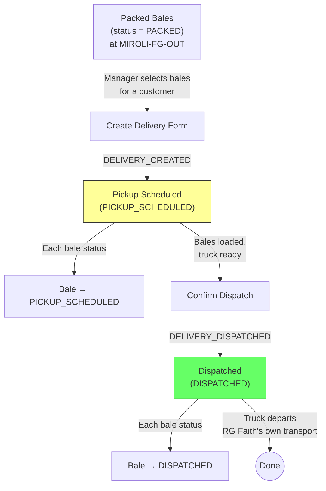

# Module 06 — Dispatch

## 1. Process Overview

### Process: Delivery Form Creation and Bale Dispatch

This module handles the final step in the material lifecycle: shipping finished bales from Miroli to customers. Dispatch is a **two-step process**: first, a Delivery Form is created and bales are scheduled for pickup (PICKUP_SCHEDULED); then, when the truck physically departs, the delivery is marked as dispatched (DISPATCHED).

A single delivery can include bales from multiple packing programs, multiple products, and multiple brands — as long as they are all for the same customer. Fresh bales are typically dispatched immediately after packing. Todiya bales may sit packed for days while buyer logistics are arranged.

Customer returns are out of scope — the system does not handle inbound returns of finished bales. Transport is owned by RG Faith — the vendor confirms readiness, and RG Faith sends its own vehicles.

Flow:

```
  Select Bales              Schedule Pickup                Dispatch
     [ENTRY]                    [ENTRY]                     [ENTRY]
        |                          |                           |
   (identify packed            DELIVERY_CREATED             DELIVERY_DISPATCHED
    bales by customer)             |                           |
        |                    (form generated,              (truck departs,
   bales selected             bales scheduled)              delivery confirmed)
        |                          |                           |
     [EXIT]                     [EXIT]                      [EXIT]
```

---

## 2. Entities and Aggregates

### Entities

| Entity | Aggregate Type | Relationships |
|---|---|---|
| Delivery Form | `DeliveryForm` | References Customer. Contains many Delivery Lines (bales). |
| Delivery Line | Part of `DeliveryForm` | References a Bale. |

### Entity Field Definitions

#### Delivery Form

| Field | Type | Description |
|---|---|---|
| id | UUID | Primary key |
| delivery_number | string | Human-readable serial number (auto-generated) |
| delivery_date | date | Date of dispatch |
| customer_id | UUID (FK) | Haste — which customer receives the goods |
| total_bales | integer | Count of bales in this shipment |
| total_metres | decimal | Sum of metres across all bales |
| total_pieces | integer | Sum of pieces across all bales |
| notes | string | Optional remarks |
| status | string | Current status |
| created_at | datetime | When the record was created |

#### Delivery Line

| Field | Type | Description |
|---|---|---|
| id | UUID | Primary key |
| delivery_form_id | UUID (FK) | Parent delivery form |
| bale_id | UUID (FK) | Which bale is being dispatched |
| bale_number | integer | Denormalized for display |
| lot_number | string | Denormalized — vendor lot number |
| trade_number_code | string | Denormalized — trade number / SKU |
| pieces | integer | Pieces in this bale |
| metres | decimal | Metres in this bale |

### Numbering

| Entity | Prefix | Format | Example |
|---|---|---|---|
| Delivery Form | DF | DF-{YYYY}-{NNNN} | DF-2026-0890 |

---

## 3. Process Steps

### Step: Create Delivery Form (Schedule Pickup)

Event type: `DELIVERY_CREATED`

Trigger:
  Manager opens the Create Delivery screen, selects a customer (Haste) from the dropdown, then
  selects the packed bales to include in this shipment (checkboxes on a list of PACKED bales
  for that customer). Enters scheduled date and any notes. Clicks Submit.

Data points captured:
  - customer_id: UUID — selected from customer dropdown
  - scheduled_date: date — planned dispatch date, defaults to today
  - bale_ids: list of UUID — which bales to include
  - notes: string (optional)

Payload:
  id: UUID (generated)
  delivery_number: string (generated)
  scheduled_date: date
  customer_id: UUID
  notes: string?
  lines:
    - id: UUID (generated)
      bale_id: UUID
      bale_number: integer (resolved)
      lot_number: string (resolved)
      trade_number_code: string (resolved)
      pieces: integer (resolved from bale)
      metres: decimal (resolved from bale)
  total_bales: integer (count of lines)
  total_metres: decimal (sum of line metres)
  total_pieces: integer (sum of line pieces)

Aggregate: DeliveryForm / id

Location: MIROLI

Preconditions:
  - Customer must exist and be active
  - All bale_ids must reference bales with status = PACKED
  - All bales must be assigned to the selected customer (customer_id matches bale's customer_id)
  - At least one bale must be selected

Side effects:
  - Each bale's status changes from PACKED to PICKUP_SCHEDULED
  - fabric_inventory: state -> PICKUP_SCHEDULED for each bale's metres

Projections updated:
  - delivery_forms: new row (status = PICKUP_SCHEDULED)
  - delivery_lines: new rows per bale
  - bales: status -> PICKUP_SCHEDULED for each bale in the delivery
  - fabric_inventory: state -> PICKUP_SCHEDULED

Permissions:
  - events:DELIVERY_CREATED:emit

---

### Step: Dispatch Delivery (Confirm Departure)

Event type: `DELIVERY_DISPATCHED`

Trigger:
  Manager or supervisor opens a Delivery Form with status PICKUP_SCHEDULED and confirms
  that the truck has physically departed with the bales. Enters actual dispatch date.
  Clicks Dispatch.

Data points captured:
  - id: UUID — which delivery form
  - dispatch_date: date — actual date the truck departed, defaults to today
  - notes: string (optional) — dispatch remarks

Payload:
  id: UUID
  dispatch_date: date
  notes: string?

Aggregate: DeliveryForm / id

Location: MIROLI

Preconditions:
  - Delivery form must exist with status = PICKUP_SCHEDULED

Side effects:
  - Each bale's status changes from PICKUP_SCHEDULED to DISPATCHED
  - fabric_inventory: state -> DISPATCHED for each bale's metres

Projections updated:
  - delivery_forms: status -> DISPATCHED, dispatch_date set
  - bales: status -> DISPATCHED for each bale in the delivery
  - fabric_inventory: state -> DISPATCHED

Permissions:
  - events:DELIVERY_DISPATCHED:emit

---

## 4. State Machines

### Delivery Form States

Statuses: `PICKUP_SCHEDULED`, `DISPATCHED`

| From Status | Event | To Status |
|---|---|---|
| (new) | `DELIVERY_CREATED` | `PICKUP_SCHEDULED` |
| `PICKUP_SCHEDULED` | `DELIVERY_DISPATCHED` | `DISPATCHED` |

Notes:
- PICKUP_SCHEDULED means the delivery form is created and bales are earmarked for this shipment. The truck has not yet departed.
- DISPATCHED means the truck has physically left Miroli with the bales. This is terminal.
- Delivery forms are not editable after dispatch. If a correction is needed before dispatch, the delivery can be modified while in PICKUP_SCHEDULED status.
- No cancellation state — if a scheduled delivery is cancelled, bales should be returned to PACKED status (handled operationally).

---

## 5. Reports and Projections

### Reports

| # | Business Question | Projection Table | Key Fields | Updated By Events |
|---|---|---|---|---|
| 1 | "What was dispatched today / this week?" | `delivery_forms` | dispatch_date, customer, total_bales, total_metres (status=DISPATCHED) | `DELIVERY_DISPATCHED` |
| 2 | "Show me Delivery Form DF-2026-0890" | `delivery_forms` + `delivery_lines` | All form + line details | `DELIVERY_CREATED`, `DELIVERY_DISPATCHED` |
| 3 | "Total metres dispatched to customer X this month" | `delivery_forms` | customer_id, total_metres, dispatch_date (status=DISPATCHED) | `DELIVERY_DISPATCHED` |
| 4 | "What packed bales are awaiting dispatch?" | `bales` | status=PACKED, customer, bale_number | `BALE_REGISTERED`, `DELIVERY_CREATED` |
| 5 | "What deliveries are scheduled but not yet dispatched?" | `delivery_forms` | status=PICKUP_SCHEDULED, customer, scheduled_date | `DELIVERY_CREATED`, `DELIVERY_DISPATCHED` |
| 6 | "Dispatch history for customer X" | `delivery_forms` + `delivery_lines` | All deliveries for customer_id | `DELIVERY_CREATED`, `DELIVERY_DISPATCHED` |
| 7 | "Total dispatch volume this month (bales, metres)" | `delivery_forms` | sum of total_bales, total_metres (status=DISPATCHED) | `DELIVERY_DISPATCHED` |

---

## 6. Roles and Permissions

### Roles

| Role | Description | Permissions |
|---|---|---|
| Facility Manager | Creates delivery forms, confirms dispatch | `events:DELIVERY_CREATED:emit`, `events:DELIVERY_DISPATCHED:emit` |
| Supervisor | Creates delivery forms, confirms dispatch | `events:DELIVERY_CREATED:emit`, `events:DELIVERY_DISPATCHED:emit` |

### Permissions

| Permission Code | Description | Used By Step |
|---|---|---|
| `events:DELIVERY_CREATED:emit` | Create a delivery form and schedule pickup | Create Delivery Form (Schedule Pickup) |
| `events:DELIVERY_DISPATCHED:emit` | Confirm truck departure | Dispatch Delivery (Confirm Departure) |

---

## 7. Locations

| Location | Type | Code | Parent | Purpose |
|---|---|---|---|---|
| Finished Goods | zone | `MIROLI-FG-OUT` | MIROLI | Source — packed bales stored here before dispatch |
| Miroli Facility | warehouse | `MIROLI` | root | Delivery event location |

---

## 8. Screen List

| # | Screen Name | Type | Used By | Purpose | Key Actions |
|---|---|---|---|---|---|
| 1 | Ready for Dispatch | list | Manager, Supervisor | Browse packed bales awaiting dispatch, grouped by customer | Create Delivery Form |
| 2 | Create Delivery Form | form | Manager, Supervisor | Select customer, check bales to include, enter scheduled date and notes | Submit |
| 3 | Scheduled Pickups | list | Manager, Supervisor | Browse delivery forms with status PICKUP_SCHEDULED | Dispatch (confirm departure) |
| 4 | Delivery Forms | list | Manager | Browse all delivery forms — filter by date, customer, status | View detail |
| 5 | Delivery Form Detail | detail | Manager | View form header, all bale lines, totals, status (scheduled/dispatched) | Print Delivery Form, Dispatch |
| 6 | Dispatch Dashboard | dashboard | Manager | Today's dispatches, scheduled pickups, total bales/metres, bales awaiting dispatch count | Drill down |

---

## 9. Process Flowchart


