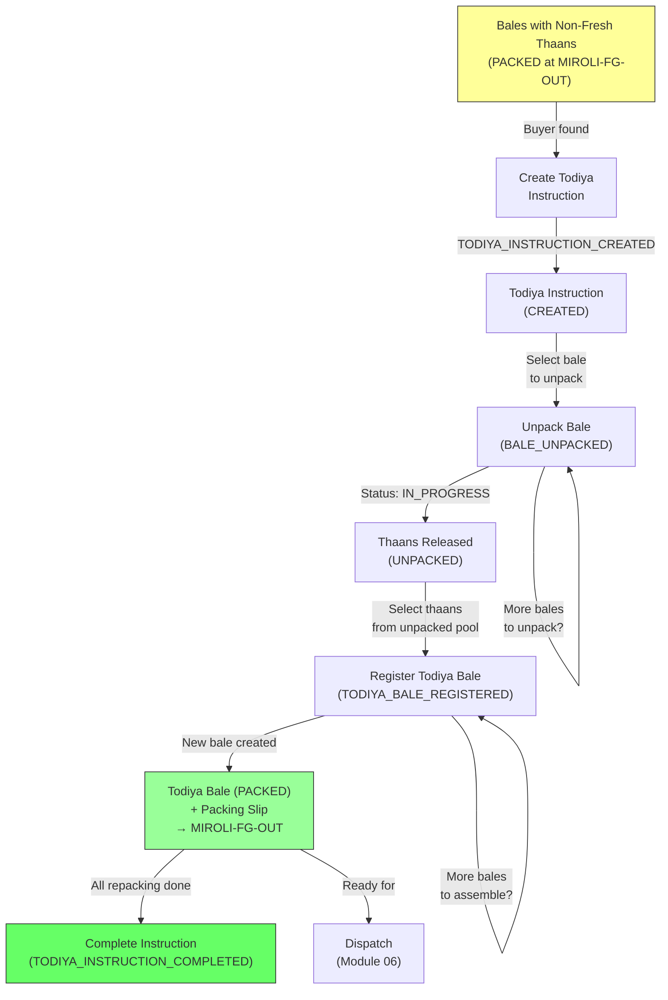

# Module 07 — Todiya (Unpack and Repack)

## 1. Process Overview

### Process: Unpack Existing Bales, Repack Thaans into New Todiya Bales

"Todiya" (from Hindi/Gujarati for "breaking") is the process of unpacking existing bales that contain non-Fresh thaans and repacking selected thaans into new bales for a Todiya buyer. No re-cutting or re-folding occurs — thaans pass through unchanged, retaining their original metres, source roll, and grade. Only the bale-to-thaan mapping changes.

During regular packing execution (Module 05), non-Fresh thaans (Good Cut, Fent, Rags, Chindi) are created and packed into bales alongside or separately from Fresh material. These bales with non-Fresh content sit in finished goods storage awaiting a buyer. When a buyer is found for accumulated non-Fresh material, the manager creates a Todiya Instruction specifying which bales to unpack and how to repack. Workers unpack the selected bales, select thaans, and assemble them into new Todiya bales with fresh branding and packaging.

Key characteristics:
- **No re-cutting, no re-folding:** Thaans are physically moved from old bales to new bales, nothing else
- **Thaans are unchanged:** Same metres, same source roll, same grade — identity is preserved
- **Cross-bale mixing:** Thaans from multiple unpacked bales can go into one new Todiya bale
- **Grade mixing:** Different grades can be combined in one Todiya bale (e.g., Good Cut + Fent)
- **Trigger:** Buyer found for non-Fresh material (sales-driven)

The "accumulation" is effectively the set of bales containing non-Fresh thaans that are in PACKED status — there is no separate running balance of loose material by grade.

Flow:

```
  Identify Candidates        Unpack Bales               Repack into Todiya Bales
       [ENTRY]                  [ENTRY]                        [ENTRY]
          |                        |                              |
   Bales with non-Fresh       BALE_UNPACKED                TODIYA_BALE_REGISTERED
   thaans identified              |                              |
          |                  (bale opened,                  (thaans assembled
   TODIYA_INSTRUCTION_        thaans released)               into new bale,
   CREATED                        |                          bale number assigned,
          |                  thaans available                 packing slip generated)
       [EXIT]                 for repacking                      |
                                  |                           [EXIT]
                               [EXIT]
```

---

## 2. Entities and Aggregates

### Entities

| Entity | Aggregate Type | Relationships |
|---|---|---|
| Todiya Instruction | `TodiyaInstruction` | References Customer, Brand, Product, Trade Number. References source Bales to unpack. Produces new Todiya Bales. |
| Bale (extended) | `Bale` (from Module 05) | Gains UNPACKED status. Thaans released when unpacked. |
| Thaan (extended) | `Thaan` (from Module 05) | Gains UNPACKED status. Transitions from BALED to UNPACKED to BALED (in new Todiya bale). |

### Entity Field Definitions

#### Todiya Instruction

| Field | Type | Description |
|---|---|---|
| id | UUID | Primary key |
| instruction_number | string | Human-readable instruction number (auto-generated) |
| customer_id | UUID (FK) | Todiya buyer |
| source_bale_ids | list of UUID | Which bales to unpack |
| brand_id | UUID (FK) | Brand for new Todiya bales |
| product_id | UUID (FK) | Product for new Todiya bales |
| trade_number_id | UUID (FK) | Trade number for new Todiya bales |
| notes | string | Buyer-specific instructions (e.g., "Good Cut only!") |
| status | string | Current lifecycle status (CREATED, IN_PROGRESS, COMPLETED) |
| created_at | datetime | When the record was created |

Note: The Todiya Instruction is a standalone entity — it does not reuse the PackingProgram entity from Module 05. It is simpler because no cutting, folding, or line-item structure is needed.

#### Bale Status Addition

The Bale entity (defined in Module 05) gains an additional status:

| Status | Description |
|---|---|
| `UNPACKED` | Bale has been physically opened via Todiya. Thaans released for repacking. |

Transition: `PACKED` -> `UNPACKED` (via `BALE_UNPACKED` event)

Note: An unpacked bale is effectively consumed. Its thaans are either repacked into new Todiya bales or remain unpacked awaiting repacking.

#### Thaan Status Addition

The Thaan entity (defined in Module 05) gains an additional status:

| Status | Description |
|---|---|
| `UNPACKED` | Thaan has been released from its original bale. Available for repacking into a new Todiya bale. |

Transition: `BALED` -> `UNPACKED` (via `BALE_UNPACKED`) -> `BALED` (via `TODIYA_BALE_REGISTERED`, in a new bale)

Note: The thaan itself is unchanged through this process — same metres, same source roll, same grade. Only the bale assignment changes.

### Numbering

| Entity | Prefix | Format | Example |
|---|---|---|---|
| Todiya Instruction | TI | TI-{YYYY}-{NNNN} | TI-2026-0012 |

Todiya bales use the same running bale number serial as regular bales (from Module 05).

---

## 3. Process Steps

### Step: Create Todiya Instruction

Event type: `TODIYA_INSTRUCTION_CREATED`

Trigger:
  Sales team finds a buyer for non-Fresh material. Facility manager opens the Todiya Candidates
  screen, identifies bales with non-Fresh thaans, then opens the Create Todiya Instruction screen.
  Selects bales to unpack, enters buyer and branding details. Clicks Submit.

Data points captured:
  - customer_id: UUID — the Todiya buyer
  - source_bale_ids: list of UUID — which bales to unpack
  - brand_id: UUID — brand for new Todiya bales
  - product_id: UUID — product for new Todiya bales
  - trade_number_id: UUID — trade number for new Todiya bales
  - notes: string (optional) — buyer-specific instructions

Payload:
  id: UUID (generated)
  instruction_number: string (generated)
  customer_id: UUID
  source_bale_ids: [UUID]
  brand_id: UUID
  product_id: UUID
  trade_number_id: UUID
  notes: string?
  status: "CREATED"
  created_at: datetime

Aggregate: TodiyaInstruction / id

Location: MIROLI-FG-OUT

Preconditions:
  - All source bales must exist with status PACKED
  - All source bales must contain at least one non-Fresh thaan
  - All referenced master data (customer, brand, product, trade number) must be active

Side effects:
  - None — bales are not yet unpacked at this stage, only earmarked

Projections updated:
  - todiya_instructions: new row (status = CREATED)

Permissions:
  - events:TODIYA_INSTRUCTION_CREATED:emit

---

### Step: Unpack Bale

Event type: `BALE_UNPACKED`

Trigger:
  Worker or supervisor opens the Unpack Bale screen for an active Todiya Instruction, selects
  a bale from the source list, and clicks Unpack. The bale is physically opened and its thaans
  are released for repacking.

Data points captured:
  - todiya_instruction_id: UUID — which Todiya Instruction this unpack is part of
  - bale_id: UUID — which bale to unpack

Payload:
  todiya_instruction_id: UUID
  bale_id: UUID
  unpacked_at: datetime

Aggregate: Bale / bale_id

Location: MIROLI-FG-OUT

Preconditions:
  - Todiya Instruction must exist with status CREATED or IN_PROGRESS
  - Bale must be listed in the instruction's source_bale_ids
  - Bale must have status PACKED

Side effects:
  - bale: status -> UNPACKED
  - thaans in this bale: status -> UNPACKED (released for repacking)
  - Todiya Instruction: status -> IN_PROGRESS (if was CREATED)

Projections updated:
  - bales: status -> UNPACKED for this bale
  - thaans: status -> UNPACKED for all thaans in this bale
  - todiya_instructions: status -> IN_PROGRESS (if first unpack)
  - unpacked_thaans: new rows available for selection during Todiya bale registration

Permissions:
  - events:BALE_UNPACKED:emit

---

### Step: Register Todiya Bale

Event type: `TODIYA_BALE_REGISTERED`

Trigger:
  Worker or supervisor opens the Register Todiya Bale screen for an active Todiya Instruction.
  Selects thaans from the pool of unpacked thaans (from one or more unpacked bales). Assembles
  them into a new bale. Clicks Submit. A bale number is auto-assigned and a packing slip is
  generated. Packaging materials are backflushed.

Data points captured:
  - todiya_instruction_id: UUID — which Todiya Instruction this bale belongs to
  - thaan_ids: list of UUID — which thaans go into this new bale
  - packing_date: date — defaults to today

Payload:
  id: UUID (generated)
  bale_number: integer (generated — next in running serial, shared with Module 05)
  todiya_instruction_id: UUID
  thaan_ids: [UUID]
  customer_id: UUID (from instruction)
  brand_id: UUID (from instruction)
  product_id: UUID (from instruction)
  trade_number_id: UUID (from instruction)
  pieces: integer (count of thaan_ids)
  total_metres: decimal (sum of thaan metres)
  packing_date: date

Aggregate: Bale / id

Location: MIROLI-FG-OUT

Preconditions:
  - Todiya Instruction must exist with status IN_PROGRESS
  - All selected thaans must have status UNPACKED
  - All selected thaans must belong to bales listed in this instruction's source_bale_ids
  - At least one thaan required

Side effects:
  - New bale created with status PACKED
  - Selected thaans: status -> BALED, bale_id updated to new bale
  - Packing slip auto-generated (dispatch-ready)
  - Packaging materials backflushed (same pattern as Module 05 bale registration)

Projections updated:
  - bales: new row (status = PACKED, source = TODIYA)
  - thaans: status -> BALED, bale_id -> new bale id
  - todiya_instructions: bale count incremented

Permissions:
  - events:TODIYA_BALE_REGISTERED:emit

---

### Step: Complete Todiya Instruction

Event type: `TODIYA_INSTRUCTION_COMPLETED`

Trigger:
  Manager marks the Todiya Instruction as complete when all desired repacking is done. This is
  a manual completion — the manager decides when all needed Todiya bales have been assembled.

Payload:
  todiya_instruction_id: UUID
  completed_at: datetime

Aggregate: TodiyaInstruction / todiya_instruction_id

Preconditions:
  - Todiya Instruction must have status IN_PROGRESS
  - At least one Todiya bale must have been registered

Side effects:
  - Todiya Instruction: status -> COMPLETED

Projections updated:
  - todiya_instructions: status -> COMPLETED

Permissions:
  - events:TODIYA_INSTRUCTION_COMPLETED:emit

Note: Any thaans that remain UNPACKED after completion stay in the unpacked pool. They can be picked up by a future Todiya Instruction or remain in storage.

---

### Step: Dispatch Todiya Bales

Todiya bales are dispatched via the normal process in Module 06 (Dispatch). No special handling is needed — Todiya bales appear in the dispatch-ready pool alongside regular bales.

---

## 4. State Machines

### Todiya Instruction States

Statuses: `CREATED`, `IN_PROGRESS`, `COMPLETED`

Transitions:

| From Status | Event | To Status |
|---|---|---|
| (new) | `TODIYA_INSTRUCTION_CREATED` | `CREATED` |
| `CREATED` | `BALE_UNPACKED` (first bale unpacked) | `IN_PROGRESS` |
| `IN_PROGRESS` | `TODIYA_INSTRUCTION_COMPLETED` | `COMPLETED` |

```
CREATED --BALE_UNPACKED (first)--> IN_PROGRESS --TODIYA_INSTRUCTION_COMPLETED--> COMPLETED
```

Notes:
- COMPLETED is terminal. Manager marks completion manually when all repacking is done.
- IN_PROGRESS allows both unpacking and repacking operations.

### Bale States (extended from Module 05)

Module 05 defines: `PACKED`, `DISPATCHED`

This module adds:

| From Status | Event | To Status |
|---|---|---|
| `PACKED` | `BALE_UNPACKED` (Todiya) | `UNPACKED` |

```
PACKED --BALE_UNPACKED--> UNPACKED (terminal for original bale)
```

Note: UNPACKED is terminal for the original bale. The thaans from this bale are repacked into new Todiya bales, which start at PACKED status.

### Thaan States (extended from Module 05)

Module 05 defines: `BALED`

This module adds:

| From Status | Event | To Status |
|---|---|---|
| `BALED` | `BALE_UNPACKED` (parent bale unpacked) | `UNPACKED` |
| `UNPACKED` | `TODIYA_BALE_REGISTERED` (thaan selected for new bale) | `BALED` |

```
BALED --BALE_UNPACKED--> UNPACKED --TODIYA_BALE_REGISTERED--> BALED (in new bale)
```

Note: The thaan's identity (metres, source roll, grade) does not change through these transitions. Only the bale assignment changes.

---

## 5. Reports and Projections

### Reports

| # | Business Question | Projection Table | Key Fields | Updated By Events |
|---|---|---|---|---|
| 1 | "Which bales contain non-Fresh thaans and are available for Todiya?" | `bales` + `thaans` | bale status = PACKED, thaan grade != FRESH, bale_number, grade, metres | `BALE_REGISTERED` (Module 05), `BALE_UNPACKED` |
| 2 | "What Todiya Instructions are active?" | `todiya_instructions` | status = CREATED or IN_PROGRESS, instruction_number, customer | `TODIYA_INSTRUCTION_CREATED`, `BALE_UNPACKED`, `TODIYA_INSTRUCTION_COMPLETED` |
| 3 | "Todiya history by customer" | `todiya_instructions` + `bales` | customer, instruction_number, bales produced, total metres | All Todiya events |
| 4 | "What are the unpacked bales and where did their thaans go?" | `bales` + `thaans` | bale status = UNPACKED, thaan status (UNPACKED or BALED in new bale), disposition | `BALE_UNPACKED`, `TODIYA_BALE_REGISTERED` |

---

## 6. Roles and Permissions

### Roles

| Role | Description | Permissions |
|---|---|---|
| Facility Manager | Creates Todiya Instructions, completes instructions, monitors candidates | `events:TODIYA_INSTRUCTION_CREATED:emit`, `events:BALE_UNPACKED:emit`, `events:TODIYA_BALE_REGISTERED:emit`, `events:TODIYA_INSTRUCTION_COMPLETED:emit` |
| Supervisor | Unpacks bales, registers Todiya bales | `events:BALE_UNPACKED:emit`, `events:TODIYA_BALE_REGISTERED:emit` |

### Permissions

| Permission Code | Description | Used By Step |
|---|---|---|
| `events:TODIYA_INSTRUCTION_CREATED:emit` | Create a Todiya Instruction | Create Todiya Instruction |
| `events:BALE_UNPACKED:emit` | Mark a bale as unpacked, releasing its thaans | Unpack Bale |
| `events:TODIYA_BALE_REGISTERED:emit` | Register a new Todiya bale from repacked thaans | Register Todiya Bale |
| `events:TODIYA_INSTRUCTION_COMPLETED:emit` | Mark a Todiya Instruction as complete | Complete Todiya Instruction |

---

## 7. Locations

| Location | Type | Code | Parent | Purpose |
|---|---|---|---|---|
| Finished Goods | zone | `MIROLI-FG-OUT` | MIROLI | Where packed bales (including non-Fresh candidates) are stored; where unpacking and repacking physically happens |

Note: Todiya no longer requires a separate Accumulation Area (`MIROLI-ACCUM`). Non-Fresh material lives in bales at `MIROLI-FG-OUT` until unpacked and repacked. The cutting/packing area (`MIROLI-PACK`) is also not used — no cutting or folding occurs during Todiya.

---

## 8. Screen List

| # | Screen Name | Type | Used By | Purpose | Key Actions |
|---|---|---|---|---|---|
| 1 | Todiya Candidates | list | Manager | List of bales containing non-Fresh thaans with status PACKED — available for unpacking | Create Todiya Instruction |
| 2 | Create Todiya Instruction | form | Manager | Select bales to unpack, specify buyer, brand, product, trade number | Submit |
| 3 | Todiya Instructions | list | Manager | Browse all Todiya Instructions with status, customer, progress filters | View detail |
| 4 | Todiya Instruction Detail | detail | Manager, Supervisor | View instruction details, source bales, unpacked bales, Todiya bales produced, thaan disposition | Unpack Bale, Register Todiya Bale, Complete |
| 5 | Unpack Bale | form | Supervisor | Select a bale from the instruction's source list, confirm unpack | Unpack |
| 6 | Register Todiya Bale | form | Supervisor | Select thaans from unpacked pool, assemble into new bale | Submit (auto-assigns bale number, generates packing slip) |

---

## 9. Process Flowchart


