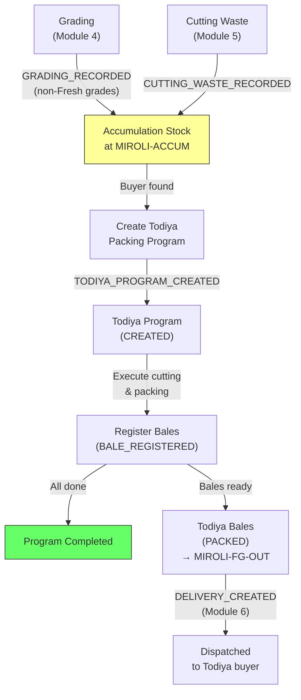

# Module 07 — Todiya (Accumulated Leftovers Repacking)

## 1. Process Overview

### Process: Accumulation Tracking and Todiya Packing Programs

"Todiya" (from Hindi/Gujarati for "breaking") manages the lifecycle of non-Fresh material — Good Cut (in metres), Fent, Rags, and Chindi (in kg) — that accumulates from two sources: quality grading (Module 04) and cutting waste during packing (Module 05). When enough leftover stock accumulates and a buyer is found, the manager creates a Todiya Packing Program to repack the accumulated material into bales for sale.

Todiya programs follow the same physical execution flow as regular packing programs (Module 05) — cut, fold, brand, pack — but differ in key ways:
- **Material source:** Accumulated leftover stock instead of fresh-graded lots
- **Grade mixing:** May combine Good Cut + Fent in one bale (regular programs never mix grades)
- **MRL mixing:** May combine material from multiple original grey lots (MRLs)
- **Trigger:** Buyer found for leftovers (sales-driven, not order-driven)

Today, "Todiya" is mostly a software/accounting operation — inventory is reassigned in records, though some physical repacking may still occur.

Flow:

```
  Accumulation              Todiya Program              Todiya Dispatch
     [ENTRY]                    [ENTRY]                    [ENTRY]
        |                          |                          |
  Material accumulates      TODIYA_PROGRAM_              DELIVERY_CREATED
  from grading +             CREATED                     (Module 06)
  cutting waste                    |                          |
        |                    (repack accumulated          bales shipped
  Stock grows over             material)                  to buyer
  weeks/months                     |                          |
        |                    BALE_REGISTERED                   |
     [EXIT]                     [EXIT]                     [EXIT]
```

---

## 2. Entities and Aggregates

### Entities

| Entity | Aggregate Type | Relationships |
|---|---|---|
| Accumulation Stock | `AccumulationStock` | Running totals by grade. Updated by Grading (Module 04) and Cutting Waste (Module 05). Consumed by Todiya programs. |
| Todiya Packing Program | `PackingProgram` (same as Module 05, with program_type = TODIYA) | References accumulated stock. Produces Bales. |

### Entity Field Definitions

#### Accumulation Stock (projection)

| Field | Type | Description |
|---|---|---|
| id | UUID | Primary key |
| grade | string | GOOD_CUT, FENT, RAGS, or CHINDI |
| total_quantity | decimal | Running total accumulated — in metres for GOOD_CUT, in kg for FENT/RAGS/CHINDI |
| unit | string | METRES (for GOOD_CUT) or KG (for FENT/RAGS/CHINDI) |
| total_metres_equivalent | decimal | Approximate metres equivalent (for kg grades, converted using average Chadat; for GOOD_CUT, equals total_quantity) |
| last_updated_at | datetime | When stock was last updated |

Note: Accumulation stock is a **projection** — it is computed from `GRADING_RECORDED` and `CUTTING_WASTE_RECORDED` events, minus material consumed by Todiya programs. It is not directly created by users. Good Cut is tracked in metres; Fent, Rags, and Chindi are tracked in kg.

#### Todiya Packing Program

Uses the same `PackingProgram` entity from Module 05, with `program_type = TODIYA`. Key differences:

| Field | Difference from Regular |
|---|---|
| program_type | `TODIYA` instead of `REGULAR` |
| mrl_id | May be null (material from multiple grey lots) |
| inbound_receipt_id | May be null |
| source_grades | List of grades being packed (e.g., [GOOD_CUT, FENT]) |
| source_quantity | Total quantity of accumulated material being used (metres for Good Cut, kg for others) |

---

## 3. Process Steps

### Step: Create Todiya Packing Program

Event type: `TODIYA_PROGRAM_CREATED`

Trigger:
  Sales team finds a buyer for accumulated leftover stock. Facility manager opens the Create
  Todiya Program screen, selects which grades to include (Good Cut, Fent, etc.), enters the
  kg to pack, adds line items with brand/product/customer specifications. Clicks Submit.

Data points captured:
  - source_grades: list of string — which grades to include (GOOD_CUT, FENT, RAGS)
  - source_quantity: decimal — total quantity of accumulated material to use (metres for GOOD_CUT, kg for others)
  - customer_id: UUID — the Todiya buyer
  - line items (same structure as regular packing program lines):
    - brand_id, product_id, trade_number_id, fold_type_id, customer_id
    - cut_length_metres, pieces_per_bale, planned_bales
  - notes: string — buyer-specific instructions (e.g., "Good cut only!")

Payload:
  id: UUID (generated)
  program_number: string (generated)
  program_type: "TODIYA"
  mrl_id: null (or specific MRL if single-source)
  source_grades: [string]
  source_quantity: decimal
  customer_id: UUID
  program_date: date
  notes: string?
  lines: (same structure as Module 05)

Aggregate: PackingProgram / id

Location: MIROLI-PACK

Preconditions:
  - Accumulation stock must have sufficient quantity for the requested grades (metres for Good Cut, kg for others)
  - source_quantity must be > 0
  - At least one line item required
  - All referenced master data must be active

Side effects:
  - accumulation_stock: reserved quantity deducted from available totals (metres for Good Cut, kg for others)
  - fabric_inventory: state -> TODIYA_PROGRAM_ASSIGNED for consumed accumulation stock

Projections updated:
  - packing_programs: new row (program_type = TODIYA, status = CREATED)
  - packing_program_lines: new rows per line
  - accumulation_stock: totals reduced by source_quantity, distributed across grades

Permissions:
  - events:TODIYA_PROGRAM_CREATED:emit

---

### Step: Register Todiya Bale

Uses the same `BALE_REGISTERED` event from Module 05. The bale is tagged with the Todiya program reference. Same process — register pieces, metres, auto-assign bale number.

See Module 05, Step: Register Bale. The only difference is the source packing program has `program_type = TODIYA`.

---

### Step: Record Todiya Program Waste

Uses the same `CUTTING_WASTE_RECORDED` event from Module 05. Any waste from Todiya cutting goes back to accumulation.

---

## 4. State Machines

### Todiya Packing Program States

Same as Module 05 Packing Program states: `CREATED`, `IN_PROGRESS`, `COMPLETED`, `CANCELLED`

The transitions are identical.

### Accumulation Stock

Accumulation stock is not a stateful entity with lifecycle transitions — it is a running balance that increases and decreases:

```
Increases:
  GRADING_RECORDED (grade = GOOD_CUT)                     → +metres
  GRADING_RECORDED (grade = FENT/RAGS/CHINDI)             → +kg
  CUTTING_WASTE_RECORDED (Good Cut)                       → +metres
  CUTTING_WASTE_RECORDED (Fent/Chindi)                    → +kg

Decreases:
  TODIYA_PROGRAM_CREATED                                  → -(metres or kg by grade)
```

---

## 5. Reports and Projections

### Reports

| # | Business Question | Projection Table | Key Fields | Updated By Events |
|---|---|---|---|---|
| 1 | "How much accumulated stock do we have, by grade?" | `accumulation_stock` | grade, total_quantity (metres or kg), total_metres_equivalent | `GRADING_RECORDED`, `CUTTING_WASTE_RECORDED`, `TODIYA_PROGRAM_CREATED` |
| 2 | "What Todiya programs are active?" | `packing_programs` | program_type=TODIYA, status, customer | Todiya and bale events |
| 3 | "History of Todiya sales by customer" | `delivery_forms` + `packing_programs` | program_type=TODIYA, customer, total bales/metres | `DELIVERY_CREATED` |
| 4 | "Accumulation trend — is leftover stock growing or shrinking?" | `accumulation_stock` (historical) | grade, total_kg over time | All accumulation events |
| 5 | "Which grades have the most accumulated stock?" | `accumulation_stock` | grade, total_kg ranked | All accumulation events |

---

## 6. Roles and Permissions

### Roles

| Role | Description | Permissions |
|---|---|---|
| Facility Manager | Creates Todiya programs, monitors accumulation | `events:TODIYA_PROGRAM_CREATED:emit`, `events:BALE_REGISTERED:emit`, `events:CUTTING_WASTE_RECORDED:emit` |
| Supervisor | Executes Todiya programs (registers bales) | `events:BALE_REGISTERED:emit` |

### Permissions

| Permission Code | Description | Used By Step |
|---|---|---|
| `events:TODIYA_PROGRAM_CREATED:emit` | Create a Todiya packing program | Create Todiya Program |
| `events:BALE_REGISTERED:emit` | Register a Todiya bale (shared with Module 05) | Register Bale |
| `events:CUTTING_WASTE_RECORDED:emit` | Record Todiya cutting waste (shared with Module 05) | Record Waste |

---

## 7. Locations

| Location | Type | Code | Parent | Purpose |
|---|---|---|---|---|
| Accumulation Area | zone | `MIROLI-ACCUM` | MIROLI | Where accumulated leftover material is stored |
| Cutting/Packing Area | zone | `MIROLI-PACK` | MIROLI | Where Todiya programs are executed |
| Finished Goods | zone | `MIROLI-FG-OUT` | MIROLI | Packed Todiya bales stored here |

---

## 8. Screen List

| # | Screen Name | Type | Used By | Purpose | Key Actions |
|---|---|---|---|---|---|
| 1 | Accumulation Dashboard | dashboard | Manager | Current accumulated stock by grade (Good Cut in metres; Fent/Rags/Chindi in kg with approx metres equivalent), trend over time | Create Todiya Program |
| 2 | Create Todiya Program | form | Manager | Select grades, enter kg, add line items with brand/product/customer | Submit |
| 3 | Todiya Programs | list | Manager | Browse Todiya programs (filter from Packing Programs list by type=TODIYA) | View detail |
| 4 | Todiya Program Detail | detail | Manager, Supervisor | View program details, bales produced, progress | Register Bale, Record Waste |

Note: Bale registration and waste recording reuse the same screens from Module 05 (Register Bale, Record Cutting Waste), filtered to the selected Todiya program.

---

## 9. Process Flowchart


