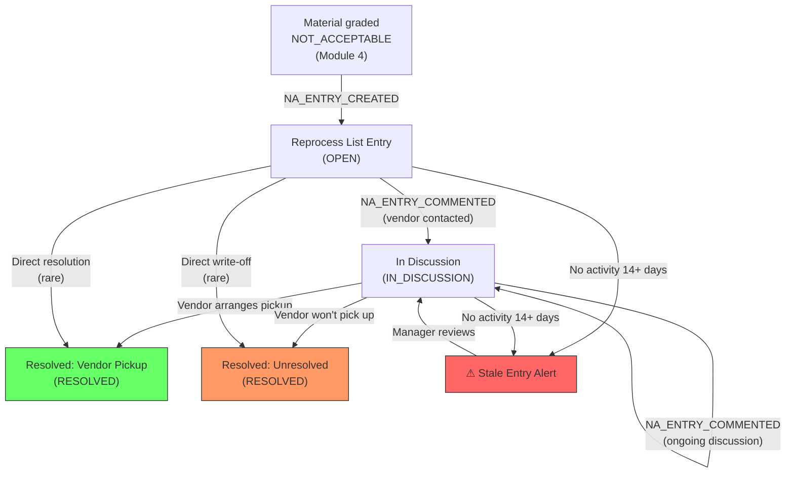

# Module 08 — Not Acceptable Resolution

## 1. Process Overview

### Process: Reprocess List Management and Vendor Return Tracking

This module tracks material graded as "Not Acceptable" (Module 04) — rejected fabric that needs to be returned to the vendor mill. It functions as an issue tracker: rejected material is recorded on the Reprocess List, the vendor is contacted, back-and-forth discussion occurs, and eventually the vendor either picks up the material or it remains at Miroli indefinitely.

This is an informal, trust-based process with no formal dispute mechanism, no credit notes, and no penalties. Resolution timelines vary from days to months — some entries on the Reprocess List remain open for over a year.

Not Acceptable material is always measured in metres (never kilograms).

Flow:

```
  Record Rejection          Vendor Communication         Resolution
      [ENTRY]                     [ENTRY]                  [ENTRY]
         |                           |                        |
  NA_ENTRY_CREATED            NA_ENTRY_COMMENTED         NA_ENTRY_RESOLVED
         |                           |                        |
    (add to Reprocess         (back-and-forth            (vendor picks up
     List)                     discussion)                OR remains at
         |                           |                    facility)
  material stored              aging tracked                  |
  separately                        |                     [EXIT]
         |                        [EXIT]
      [EXIT]
```

---

## 2. Entities and Aggregates

### Entities

| Entity | Aggregate Type | Relationships |
|---|---|---|
| Not Acceptable Entry | `NotAcceptableEntry` | References Inbound Receipt and MRL. References Vendor (the mill that processed the fabric). Has many comments. |

### Entity Field Definitions

#### Not Acceptable Entry

| Field | Type | Description |
|---|---|---|
| id | UUID | Primary key |
| entry_number | string | Human-readable entry number (auto-generated) |
| inbound_receipt_id | UUID (FK) | Which lot the rejected material came from |
| mrl_id | UUID (FK) | Denormalized — parent MRL |
| mrl_number | string | Denormalized for display |
| vendor_id | UUID (FK) | Which mill processed this fabric (resolved from MRL) |
| lot_number | string | Vendor's lot number |
| quality_code_id | UUID (FK) | Quality code of the rejected material |
| tone_code_id | UUID (FK) | Tone code (if applicable) |
| metres | decimal | Metres of rejected material (always metres, never kg) |
| remark | string | Reason for rejection — defect description |
| avak_date | date | Original arrival date at Miroli (from inbound receipt) |
| status | string | Current lifecycle status |
| last_activity_at | datetime | Last time a comment or update was made — used for aging alerts |
| resolved_at | datetime | When the entry was resolved (null while open) |
| resolution_type | string | How it was resolved: VENDOR_PICKUP or UNRESOLVED (null while open) |
| created_at | datetime | When the entry was created |

---

## 3. Process Steps

### Step: Create Not Acceptable Entry

Event type: `NA_ENTRY_CREATED`

Trigger:
  When material is graded as NOT_ACCEPTABLE (Module 04), the system automatically creates a
  Reprocess List entry. Alternatively, a supervisor can manually create one from the Not
  Acceptable screen.

Data points captured:
  - inbound_receipt_id: UUID
  - metres: decimal — metres of rejected material
  - remark: string — reason for rejection

Payload:
  id: UUID (generated)
  entry_number: string (generated)
  inbound_receipt_id: UUID
  mrl_id: UUID (resolved)
  mrl_number: string (resolved)
  vendor_id: UUID (resolved from MRL)
  lot_number: string (resolved)
  quality_code_id: UUID (resolved)
  tone_code_id: UUID? (resolved)
  metres: decimal
  remark: string
  avak_date: date (resolved from inbound receipt)

Aggregate: NotAcceptableEntry / id

Location: MIROLI-NA

Preconditions:
  - Inbound receipt must exist
  - metres must be > 0

Side effects:
  - fabric_inventory: state already set to NOT_ACCEPTABLE by grading module
  - Entry appears on Reprocess List

Projections updated:
  - not_acceptable_entries: new row (status = OPEN, last_activity_at = now)

Permissions:
  - events:NA_ENTRY_CREATED:emit

---

### Step: Add Comment to Not Acceptable Entry

Event type: `NA_ENTRY_COMMENTED`

Trigger:
  Manager or supervisor adds a comment to an existing entry — recording vendor communication,
  expected pickup date, or other updates. This resets the aging clock.

Data points captured:
  - id: UUID — which entry
  - comment: string — update text

Payload:
  id: UUID
  comment: string
  commented_at: datetime

Aggregate: NotAcceptableEntry / id

Location: None

Preconditions:
  - Entry must exist with status = OPEN or IN_DISCUSSION

Side effects:
  - last_activity_at reset to now
  - Status changes to IN_DISCUSSION if it was OPEN

Projections updated:
  - not_acceptable_entries: last_activity_at -> now, status -> IN_DISCUSSION (if was OPEN)

Permissions:
  - events:NA_ENTRY_COMMENTED:emit

---

### Step: Resolve — Vendor Pickup

Event type: `NA_ENTRY_RESOLVED`

Trigger:
  Vendor arranges pickup and the rejected material physically leaves Miroli. Supervisor
  records the resolution.

Data points captured:
  - id: UUID — which entry
  - resolution_type: "VENDOR_PICKUP"
  - notes: string (optional) — pickup details

Payload:
  id: UUID
  resolution_type: "VENDOR_PICKUP"
  notes: string?

Aggregate: NotAcceptableEntry / id

Location: MIROLI-NA

Preconditions:
  - Entry must exist with status = OPEN or IN_DISCUSSION

Side effects:
  - fabric_inventory: NOT_ACCEPTABLE entry removed (material left the facility)

Projections updated:
  - not_acceptable_entries: status -> RESOLVED, resolution_type -> VENDOR_PICKUP, resolved_at -> now
  - fabric_inventory: entry removed or state -> RETURNED_TO_VENDOR

Permissions:
  - events:NA_ENTRY_RESOLVED:emit

---

### Step: Resolve — Unresolved (Write-off)

Event type: `NA_ENTRY_RESOLVED`

Trigger:
  Manager decides the vendor will not pick up the material. Marks the entry as unresolved.
  Material remains at Miroli.

Data points captured:
  - id: UUID — which entry
  - resolution_type: "UNRESOLVED"
  - notes: string (optional) — reason for write-off

Payload:
  id: UUID
  resolution_type: "UNRESOLVED"
  notes: string?

Aggregate: NotAcceptableEntry / id

Location: MIROLI-NA

Preconditions:
  - Entry must exist with status = OPEN or IN_DISCUSSION

Side effects:
  - fabric_inventory: NOT_ACCEPTABLE entry remains (material stays at facility)
  - Entry removed from active Reprocess List

Projections updated:
  - not_acceptable_entries: status -> RESOLVED, resolution_type -> UNRESOLVED, resolved_at -> now

Permissions:
  - events:NA_ENTRY_RESOLVED:emit

---

## 4. State Machines

### Not Acceptable Entry States

Statuses: `OPEN`, `IN_DISCUSSION`, `RESOLVED`

Transitions:

| From Status | Event | To Status |
|---|---|---|
| (new) | `NA_ENTRY_CREATED` | `OPEN` |
| `OPEN` | `NA_ENTRY_COMMENTED` | `IN_DISCUSSION` |
| `OPEN` | `NA_ENTRY_RESOLVED` | `RESOLVED` |
| `IN_DISCUSSION` | `NA_ENTRY_COMMENTED` | `IN_DISCUSSION` |
| `IN_DISCUSSION` | `NA_ENTRY_RESOLVED` | `RESOLVED` |

```
OPEN --NA_ENTRY_COMMENTED--> IN_DISCUSSION --NA_ENTRY_COMMENTED--> IN_DISCUSSION
  |                                |
  +--NA_ENTRY_RESOLVED--> RESOLVED (terminal: VENDOR_PICKUP or UNRESOLVED)
                                   |
              +--------------------+
              |
  IN_DISCUSSION --NA_ENTRY_RESOLVED--> RESOLVED (terminal)
```

Notes:
- RESOLVED is terminal. The resolution_type field distinguishes between VENDOR_PICKUP and UNRESOLVED.
- Entries with no activity for extended periods should be flagged — the system should highlight stale entries.

---

## 5. Reports and Projections

### Reports

| # | Business Question | Projection Table | Key Fields | Updated By Events |
|---|---|---|---|---|
| 1 | "Reprocess List — all open Not Acceptable entries" | `not_acceptable_entries` | status=OPEN or IN_DISCUSSION, vendor, mrl, metres, age | All NA events |
| 2 | "Aging report — entries older than 30/60/90 days" | `not_acceptable_entries` | created_at, last_activity_at, status | All NA events |
| 3 | "Vendor-wise rejection rate and pending returns" | `not_acceptable_entries` | vendor_id, sum of metres, status | `NA_ENTRY_CREATED`, `NA_ENTRY_RESOLVED` |
| 4 | "Total Not Acceptable metres at the facility" | `not_acceptable_entries` + `fabric_inventory` | status=OPEN/IN_DISCUSSION, sum of metres | All NA events |
| 5 | "Resolution history — how long do entries take to resolve?" | `not_acceptable_entries` | created_at, resolved_at, resolution_type | `NA_ENTRY_RESOLVED` |
| 6 | "Entries with no activity for 14+ days" | `not_acceptable_entries` | last_activity_at < 14 days ago, status != RESOLVED | `NA_ENTRY_COMMENTED` |

---

## 6. Roles and Permissions

### Roles

| Role | Description | Permissions |
|---|---|---|
| Supervisor | Creates entries, adds comments | `events:NA_ENTRY_CREATED:emit`, `events:NA_ENTRY_COMMENTED:emit` |
| Facility Manager | Full access — creates, comments, resolves | `events:NA_ENTRY_CREATED:emit`, `events:NA_ENTRY_COMMENTED:emit`, `events:NA_ENTRY_RESOLVED:emit` |

### Permissions

| Permission Code | Description | Used By Step |
|---|---|---|
| `events:NA_ENTRY_CREATED:emit` | Create a Reprocess List entry | Create NA Entry |
| `events:NA_ENTRY_COMMENTED:emit` | Add a comment/update | Add Comment |
| `events:NA_ENTRY_RESOLVED:emit` | Resolve an entry (vendor pickup or write-off) | Resolve |

---

## 7. Locations

| Location | Type | Code | Parent | Purpose |
|---|---|---|---|---|
| Not Acceptable Storage | zone | `MIROLI-NA` | MIROLI | Where rejected material is stored separately |

---

## 8. Screen List

| # | Screen Name | Type | Used By | Purpose | Key Actions |
|---|---|---|---|---|---|
| 1 | Reprocess List | list | Supervisor, Manager | Browse all open NA entries — filter by vendor, age, MRL | Add Comment, Resolve |
| 2 | NA Entry Detail | detail | Supervisor, Manager | View one entry — full details, comment history, aging info | Comment, Resolve (Pickup / Write-off) |
| 3 | Create NA Entry | form | Supervisor | Record a new Not Acceptable entry (if not auto-created from grading) | Submit |
| 4 | Vendor Rejection Summary | dashboard | Manager | Vendor-wise rejection totals, aging distribution, resolution stats | Drill down to vendor entries |

---

## 9. Process Flowchart


