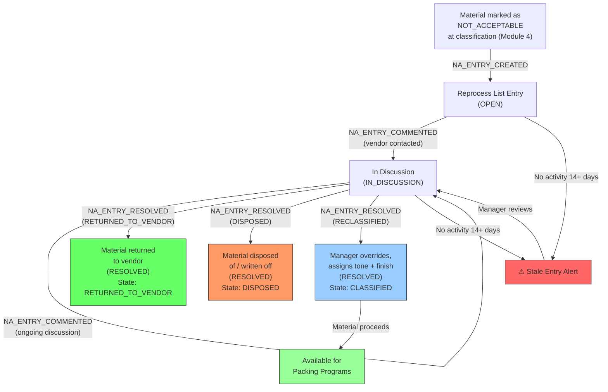

# Module 08 — Not Acceptable Resolution

## 1. Process Overview

### Process: Reprocess List Management and Vendor Return Tracking

This module tracks material identified as "Not Acceptable" at the classification stage (Module 04) — rejected fabric that cannot proceed to packing. It functions as an issue tracker: rejected material is recorded on the Reprocess List, the vendor is contacted, back-and-forth discussion occurs, and eventually one of three outcomes occurs: (1) the vendor picks up the material (RETURNED_TO_VENDOR), (2) the material is written off / disposed (DISPOSED), or (3) the manager overrides the rejection and reclassifies the material with tone and finish codes (RECLASSIFIED), allowing it to proceed to packing.

This is an informal, trust-based process with no formal dispute mechanism, no credit notes, and no penalties. Resolution timelines vary from days to months — some entries on the Reprocess List remain open for over a year.

Material identified as NA at classification is always measured in metres (never kg) — per CLAUDE.md and domain glossary. NA is identified before packing execution and is entirely separate from packing gradation (Fresh, Good Cut, Fent, Rags, Chindi).

Timing is highly variable: some entries are resolved in days, others remain open for months or even years. There is no enforced SLA or aging escalation — entries simply appear on a report sorted by age.

Flow:

```
  Classification            Create NA Entry         Vendor Communication      Resolution
      [ENTRY]                   [ENTRY]                   [ENTRY]             [ENTRY]
         |                         |                         |                    |
  Material marked NA        NA_ENTRY_CREATED         NA_ENTRY_COMMENTED     NA_ENTRY_RESOLVED
  (CLASSIFICATION_                |                         |                    |
   RECORDED,                Reprocess List          Vendor contacted      Option 1: Vendor pickup
   is_not_acceptable=true)  entry created            Discussion ongoing         (RETURNED_TO_VENDOR)
         |                         |                         |                    |
     [EXIT]                      |                         |                Option 2: Write-off
                                 |                         |                     (DISPOSED)
                               [EXIT]                    [EXIT]                  |
                                                                            Option 3: Manager override
                                                                                 (RECLASSIFIED)
                                                                                   |
                                                                                [EXIT]
```

---

## 2. Entities and Aggregates

### Entities

| Entity | Aggregate Type | Relationships |
|---|---|---|
| Not Acceptable Entry | `NotAcceptableEntry` | References Inbound Receipt and MRL. References Vendor (the mill that processed the fabric). Has many comments. |

### Entity Field Definitions

#### Not Acceptable Entry

| Field | Type | Description |
|---|---|---|
| id | UUID | Primary key |
| entry_number | string | Human-readable entry number (auto-generated) |
| inbound_receipt_id | UUID (FK) | Which lot the rejected material came from |
| mrl_id | UUID (FK) | Denormalized — parent MRL |
| mrl_number | string | Denormalized for display |
| vendor_id | UUID (FK) | Which mill processed this fabric (resolved from MRL) |
| lot_number | string | Vendor's lot number |
| quality_code_id | UUID (FK) | Quality code of the rejected material |
| tone_code_id | UUID (FK) | Tone code (if applicable) |
| metres | decimal | Metres of rejected material (always metres, never kg) |
| remark | string | Reason for rejection — defect description |
| avak_date | date | Original arrival date at Miroli (from inbound receipt) |
| status | string | Current lifecycle status |
| last_activity_at | datetime | Last time a comment or update was made — used for aging alerts |
| resolved_at | datetime | When the entry was resolved (null while open) |
| resolution_type | string | How it was resolved: RETURNED_TO_VENDOR, DISPOSED, or RECLASSIFIED (null while open) |
| reclassified_tone_code_id | UUID (FK) | If resolution_type = RECLASSIFIED: which tone code was assigned (null otherwise) |
| reclassified_finish_code_id | UUID (FK) | If resolution_type = RECLASSIFIED: which finish code was assigned (null otherwise) |
| created_at | datetime | When the entry was created |

---

## 3. Process Steps

### Step: Create Not Acceptable Entry

Event type: `NA_ENTRY_CREATED`

Trigger:
  When material is marked as Not Acceptable during classification (Module 04), via CLASSIFICATION_RECORDED
  event with is_not_acceptable=true, the system automatically creates a Reprocess List entry.
  Alternatively, a supervisor can manually create one from the Not Acceptable screen.

Data points captured:
  - inbound_receipt_id: UUID
  - metres: decimal — metres of rejected material
  - remark: string — reason for rejection

Payload:
  id: UUID (generated)
  entry_number: string (generated)
  inbound_receipt_id: UUID
  mrl_id: UUID (resolved)
  mrl_number: string (resolved)
  vendor_id: UUID (resolved from MRL)
  lot_number: string (resolved)
  quality_code_id: UUID (resolved)
  tone_code_id: UUID? (resolved)
  metres: decimal
  remark: string
  avak_date: date (resolved from inbound receipt)

Aggregate: NotAcceptableEntry / id

Location: MIROLI-HOLD

Preconditions:
  - Inbound receipt must exist
  - metres must be > 0

Side effects:
  - fabric_inventory: state already set to NOT_ACCEPTABLE by classification module (CLASSIFICATION_RECORDED with is_not_acceptable=true, location=MIROLI-HOLD)
  - Entry appears on Reprocess List

Projections updated:
  - not_acceptable_entries: new row (status = OPEN, last_activity_at = now)

Permissions:
  - events:NA_ENTRY_CREATED:emit

---

### Step: Add Comment to Not Acceptable Entry

Event type: `NA_ENTRY_COMMENTED`

Trigger:
  Manager or supervisor adds a comment to an existing entry — recording vendor communication,
  expected pickup date, or other updates. This resets the aging clock.

Data points captured:
  - id: UUID — which entry
  - comment: string — update text

Payload:
  id: UUID
  comment: string
  commented_at: datetime

Aggregate: NotAcceptableEntry / id

Location: None

Preconditions:
  - Entry must exist with status = OPEN or IN_DISCUSSION

Side effects:
  - last_activity_at reset to now
  - Status changes to IN_DISCUSSION if it was OPEN

Projections updated:
  - not_acceptable_entries: last_activity_at -> now, status -> IN_DISCUSSION (if was OPEN)

Permissions:
  - events:NA_ENTRY_COMMENTED:emit

---

### Step: Resolve Not Acceptable Entry

Event type: `NA_ENTRY_RESOLVED`

Trigger:
  Facility Manager or authorized supervisor opens a Reprocess List entry and chooses one of three
  resolution options:

  Option 1 (Vendor Pickup): Vendor has physically picked up the material. Material leaves facility.

  Option 2 (Dispose): Write-off — material is disposed of or remains at facility but will not be
  processed further. Material leaves facility or is scrapped.

  Option 3 (Reclassify): Manager overrides the Not Acceptable marking, assigns tone code and finish
  code, and allows material to proceed to packing as CLASSIFIED.

Data points captured:
  - na_entry_id: UUID
  - resolution_type: string — RETURNED_TO_VENDOR, DISPOSED, or RECLASSIFIED
  - resolution_notes: string — optional notes about the resolution
  - reclassified_tone_code_id: UUID (required if resolution_type = RECLASSIFIED, null otherwise)
  - reclassified_finish_code_id: UUID (required if resolution_type = RECLASSIFIED, null otherwise)

Payload:
  id: UUID (na_entry_id)
  resolution_type: string
  resolution_notes: string
  reclassified_tone_code_id: UUID (if applicable)
  reclassified_finish_code_id: UUID (if applicable)
  resolved_at: datetime (now)

Aggregate: NotAcceptableEntry / id

Location: MIROLI-HOLD

Preconditions:
  - Entry must exist with status = OPEN or IN_DISCUSSION
  - If resolution_type = RECLASSIFIED: reclassified_tone_code_id and reclassified_finish_code_id must be provided
  - If resolution_type = RETURNED_TO_VENDOR or DISPOSED: reclassified fields must be null

Side effects:
  - If resolution_type = RETURNED_TO_VENDOR:
    * fabric_inventory: state → RETURNED_TO_VENDOR, location → OUT (material left facility)
  - If resolution_type = DISPOSED:
    * fabric_inventory: state → DISPOSED, location → OUT (material left facility)
  - If resolution_type = RECLASSIFIED:
    * fabric_inventory: state → CLASSIFIED, location → MIROLI-CLASSIFIED
    * Material now eligible for packing programs
    * Tone and finish codes recorded in fabric_inventory record

Projections updated:
  - not_acceptable_entries: status → RESOLVED, resolution_type set, resolved_at → now, reclassified fields populated if applicable
  - fabric_inventory: state and location updated per resolution_type

Permissions:
  - events:NA_ENTRY_RESOLVED:emit (FACILITY_MANAGER, SUPERVISOR with authorization)

Business rules:
  - RECLASSIFIED resolution requires both tone and finish codes
  - Once resolved, entry cannot be reopened (resolution is permanent)
  - Material that is RETURNED_TO_VENDOR or DISPOSED exits the system entirely

---

## 4. State Machines

### Not Acceptable Entry States

Statuses: `OPEN`, `IN_DISCUSSION`, `RESOLVED`

Transitions:

| From Status | Event | To Status |
|---|---|---|
| (new) | `NA_ENTRY_CREATED` | `OPEN` |
| `OPEN` | `NA_ENTRY_COMMENTED` | `IN_DISCUSSION` |
| `OPEN` | `NA_ENTRY_RESOLVED` | `RESOLVED` |
| `IN_DISCUSSION` | `NA_ENTRY_COMMENTED` | `IN_DISCUSSION` |
| `IN_DISCUSSION` | `NA_ENTRY_RESOLVED` | `RESOLVED` |

```
OPEN --NA_ENTRY_COMMENTED--> IN_DISCUSSION --NA_ENTRY_COMMENTED--> IN_DISCUSSION
  |                                |
  +--NA_ENTRY_RESOLVED--> RESOLVED (terminal: RETURNED_TO_VENDOR, DISPOSED, or RECLASSIFIED)
                                   |
              +--------------------+
              |
  IN_DISCUSSION --NA_ENTRY_RESOLVED--> RESOLVED (terminal)
```

Notes:
- RESOLVED is terminal. The resolution_type field distinguishes between RETURNED_TO_VENDOR, DISPOSED, and RECLASSIFIED.
- Entries with no activity for extended periods should be flagged — the system should highlight stale entries.

---

## 5. Reports and Projections

### Reports

| # | Business Question | Projection Table | Key Fields | Updated By Events |
|---|---|---|---|---|
| 1 | "Reprocess List — all open Not Acceptable entries" | `not_acceptable_entries` | status=OPEN or IN_DISCUSSION, vendor, mrl, metres, age | All NA events |
| 2 | "Aging report — entries older than 30/60/90 days" | `not_acceptable_entries` | created_at, last_activity_at, status | All NA events |
| 3 | "Vendor-wise rejection rate and pending returns" | `not_acceptable_entries` | vendor_id, sum of metres, status | `NA_ENTRY_CREATED`, `NA_ENTRY_RESOLVED` |
| 4 | "Total Not Acceptable metres at the facility" | `not_acceptable_entries` + `fabric_inventory` | status=OPEN/IN_DISCUSSION, sum of metres | All NA events |
| 5 | "Resolution history — how long do entries take to resolve?" | `not_acceptable_entries` | created_at, resolved_at, resolution_type | `NA_ENTRY_RESOLVED` |
| 6 | "Entries with no activity for 14+ days" | `not_acceptable_entries` | last_activity_at < 14 days ago, status != RESOLVED | `NA_ENTRY_COMMENTED` |

---

## 6. Roles and Permissions

### Roles

| Role | Description | Permissions |
|---|---|---|
| Supervisor | Creates entries, adds comments | `events:NA_ENTRY_CREATED:emit`, `events:NA_ENTRY_COMMENTED:emit` |
| Facility Manager | Full access — creates, comments, resolves | `events:NA_ENTRY_CREATED:emit`, `events:NA_ENTRY_COMMENTED:emit`, `events:NA_ENTRY_RESOLVED:emit` |

### Permissions

| Permission Code | Description | Used By Step |
|---|---|---|
| `events:NA_ENTRY_CREATED:emit` | Create a Reprocess List entry | Create NA Entry |
| `events:NA_ENTRY_COMMENTED:emit` | Add a comment/update | Add Comment |
| `events:NA_ENTRY_RESOLVED:emit` | Resolve an entry (vendor pickup or write-off) | Resolve |

---

## 7. Locations

| Location | Type | Code | Parent | Purpose |
|---|---|---|---|---|
| Not Acceptable Hold | zone | `MIROLI-HOLD` | MIROLI | Material marked as Not Acceptable at classification, awaiting resolution (vendor pickup, disposal, or reclassification) |
| Not Acceptable Storage | zone | `MIROLI-NA` | MIROLI | DEPRECATED — replaced by MIROLI-HOLD. Material marked as Not Acceptable during classification now uses MIROLI-HOLD. |

---

## 8. Screen List

| # | Screen Name | Type | Used By | Purpose | Key Actions |
|---|---|---|---|---|---|
| 1 | Reprocess List | list | Supervisor, Manager | Browse all open NA entries — filter by vendor, age, MRL | Add Comment, Resolve |
| 2 | NA Entry Detail | detail | Supervisor, Manager | View one entry — full details, comment history, aging info | Comment, Resolve (Pickup / Write-off) |
| 3 | Create NA Entry | form | Supervisor | Record a new Not Acceptable entry (if not auto-created from grading) | Submit |
| 4 | Vendor Rejection Summary | dashboard | Manager | Vendor-wise rejection totals, aging distribution, resolution stats | Drill down to vendor entries |

---

## 9. Process Flowchart


