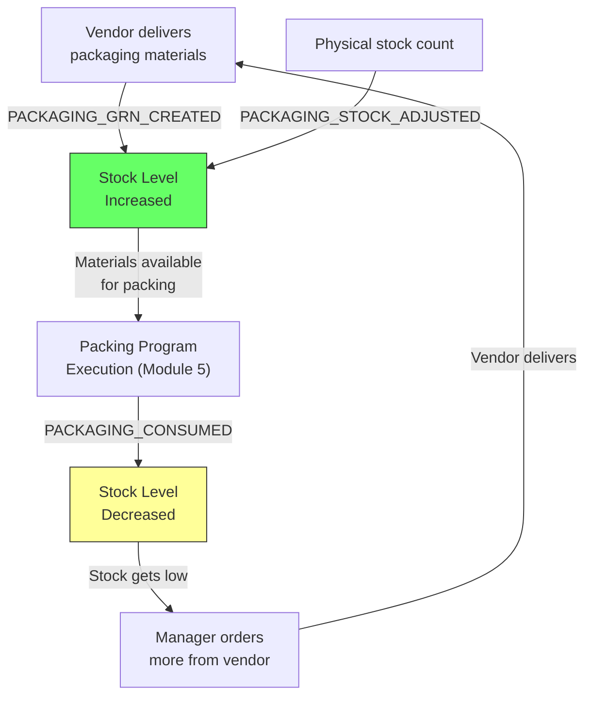

# Module 09 — Packaging Materials

## 1. Process Overview

### Process: Packaging Material Receipt, Stock Tracking, and Consumption

This module tracks a separate inventory domain — the packaging materials consumed during the packing process: plastic sheets, stickers, labels, cardboard boxes, thread/twine, brochures, and brand stamps. It is independent from the fabric inventory tracked by the rest of the system.

There are two types of packaging items:
- **Consumable:** Gets used up during packing. Needs restocking. Tracked with stock levels. (Plastic, cardboard, stickers, thread, brochures)
- **Reusable:** Does not deplete. A master list of available assets. (Brand stamps — SSTM, etc.)

There is **no purchase order system** for packaging materials. The process is receipt-only: a vendor delivers materials, RG Faith records a GRN (Goods Receipt Note), and stock levels are updated. Consumption is tracked as materials are used during packing program execution (Module 05).

Flow:

```
  Vendor Delivery           Record GRN                Consumption
     [ENTRY]                  [ENTRY]                   [ENTRY]
        |                        |                         |
  materials arrive         PACKAGING_GRN_             PACKAGING_CONSUMED
        |                   CREATED                        |
    (receive and                 |                    (used during
     count)                 stock levels               packing)
        |                   increased                      |
     [EXIT]                   [EXIT]                  stock levels
                                                      decreased
                                                         |
                                                      [EXIT]
```

---

## 2. Entities and Aggregates

### Entities

| Entity | Aggregate Type | Relationships |
|---|---|---|
| Packaging GRN | `PackagingGrn` | References Vendor (type = PACKAGING_SUPPLIER) and Packaging SKU. |
| Packaging Stock Level | Projection (not an aggregate) | One record per Packaging SKU. Running balance. |
| Packaging Consumption | `PackagingConsumption` | References Packaging SKU and Packing Program. |

### Entity Field Definitions

#### Packaging GRN

| Field | Type | Description |
|---|---|---|
| id | UUID | Primary key |
| grn_number | string | Human-readable GRN number (auto-generated) |
| packaging_sku_id | UUID (FK) | What was received |
| vendor_id | UUID (FK) | Who supplied it (type = PACKAGING_SUPPLIER) |
| quantity | decimal | How much was received |
| unit_of_measure | string | UOM (from SKU master — units, kg, rolls, etc.) |
| vendor_reference | string | Vendor's invoice or delivery note number |
| receipt_date | date | Date of receipt |
| notes | string | Optional remarks |
| created_at | datetime | When the record was created |

#### Packaging Stock Level (projection)

| Field | Type | Description |
|---|---|---|
| id | UUID | Primary key |
| packaging_sku_id | UUID (FK) | Which packaging item |
| current_stock | decimal | Running balance (= total received - total consumed) |
| unit_of_measure | string | UOM (from SKU master) |
| last_received_at | datetime | Last GRN date for this item |
| last_consumed_at | datetime | Last consumption date for this item |

#### Packaging Consumption

| Field | Type | Description |
|---|---|---|
| id | UUID | Primary key |
| packaging_sku_id | UUID (FK) | What was consumed |
| packing_program_id | UUID (FK) | Which packing program consumed it (optional — may be a general consumption entry) |
| quantity | decimal | How much was consumed |
| consumption_date | date | Date of consumption |
| notes | string | Optional remarks |
| created_at | datetime | When the record was created |

### Numbering

| Entity | Prefix | Format | Example |
|---|---|---|---|
| Packaging GRN | PGRN | PGRN-{YYYY}-{NNNN} | PGRN-2026-0015 |

---

## 3. Process Steps

### Step: Record Packaging GRN

Event type: `PACKAGING_GRN_CREATED`

Trigger:
  Worker or supervisor opens the Record GRN screen after a packaging vendor delivers materials.
  Selects the packaging SKU from the dropdown, enters quantity, vendor, vendor reference, and
  receipt date. Clicks Submit.

Data points captured:
  - packaging_sku_id: UUID — what was received
  - vendor_id: UUID — who supplied it (filtered to PACKAGING_SUPPLIER type)
  - quantity: decimal — how much
  - vendor_reference: string — invoice or delivery note number
  - receipt_date: date — defaults to today
  - notes: string (optional)

Payload:
  id: UUID (generated)
  grn_number: string (generated)
  packaging_sku_id: UUID
  vendor_id: UUID
  quantity: decimal
  unit_of_measure: string (resolved from SKU)
  vendor_reference: string
  receipt_date: date
  notes: string?

Aggregate: PackagingGrn / id

Location: MIROLI-PKGMAT

Preconditions:
  - packaging_sku_id must reference an active packaging SKU of type CONSUMABLE
  - vendor_id must reference an active vendor of type PACKAGING_SUPPLIER
  - quantity must be > 0

Side effects:
  - packaging_stock_levels: current_stock increased by quantity

Projections updated:
  - packaging_grns: new row
  - packaging_stock_levels: current_stock += quantity, last_received_at -> now

Permissions:
  - events:PACKAGING_GRN_CREATED:emit

---

### Step: Record Packaging Consumption

Event type: `PACKAGING_CONSUMED`

Trigger:
  Supervisor records packaging material consumption. This can be tied to a specific packing
  program or recorded as general consumption. Opens the Record Consumption screen, selects
  the packaging SKU, enters quantity consumed, optional packing program reference. Clicks Submit.

Data points captured:
  - packaging_sku_id: UUID — what was consumed
  - quantity: decimal — how much
  - packing_program_id: UUID (optional) — if tied to a specific program
  - consumption_date: date — defaults to today
  - notes: string (optional)

Payload:
  id: UUID (generated)
  packaging_sku_id: UUID
  packing_program_id: UUID?
  quantity: decimal
  unit_of_measure: string (resolved from SKU)
  consumption_date: date
  notes: string?

Aggregate: PackagingConsumption / id

Location: MIROLI-PKGMAT

Preconditions:
  - packaging_sku_id must reference an active packaging SKU of type CONSUMABLE
  - quantity must be > 0
  - current_stock must be >= quantity (cannot consume more than available — warning, not blocking)

Side effects:
  - packaging_stock_levels: current_stock decreased by quantity

Projections updated:
  - packaging_consumptions: new row
  - packaging_stock_levels: current_stock -= quantity, last_consumed_at -> now

Permissions:
  - events:PACKAGING_CONSUMED:emit

---

### Step: Stock Adjustment

Event type: `PACKAGING_STOCK_ADJUSTED`

Trigger:
  Supervisor performs a physical stock count and the actual quantity differs from the system
  quantity. Opens the Stock Adjustment screen, enters the actual count. System calculates
  the difference.

Data points captured:
  - packaging_sku_id: UUID
  - actual_quantity: decimal — the physical count
  - reason: string — why the adjustment is needed

Payload:
  id: UUID (generated)
  packaging_sku_id: UUID
  previous_stock: decimal (current system value)
  actual_quantity: decimal
  adjustment: decimal (computed: actual - previous)
  reason: string

Aggregate: PackagingSku / packaging_sku_id

Location: MIROLI-PKGMAT

Preconditions:
  - packaging_sku_id must reference an active packaging SKU
  - actual_quantity must be >= 0

Side effects:
  - packaging_stock_levels: current_stock set to actual_quantity

Projections updated:
  - packaging_stock_levels: current_stock -> actual_quantity

Permissions:
  - events:PACKAGING_STOCK_ADJUSTED:emit

---

## 4. State Machines

Packaging materials do not have lifecycle states. Stock levels are running balances that increase (GRN) and decrease (consumption).

---

## 5. Reports and Projections

### Reports

| # | Business Question | Projection Table | Key Fields | Updated By Events |
|---|---|---|---|---|
| 1 | "What is the current stock of each packaging item?" | `packaging_stock_levels` | sku, current_stock, uom | All packaging events |
| 2 | "What packaging items are running low?" | `packaging_stock_levels` | current_stock < threshold (user-defined) | All packaging events |
| 3 | "GRN history for packaging materials" | `packaging_grns` | grn_number, sku, vendor, quantity, date | `PACKAGING_GRN_CREATED` |
| 4 | "Consumption history — what was used and when?" | `packaging_consumptions` | sku, quantity, packing_program, date | `PACKAGING_CONSUMED` |
| 5 | "How much packaging material does program X consume?" | `packaging_consumptions` | packing_program_id, sku, quantity | `PACKAGING_CONSUMED` |
| 6 | "Reusable assets — what brand stamps do we have?" | `packaging_skus` | sku_type=REUSABLE, name, status | `PACKAGING_SKU_CREATED` (Module 01) |

---

## 6. Roles and Permissions

### Roles

| Role | Description | Permissions |
|---|---|---|
| Receiving Worker | Records packaging GRNs | `events:PACKAGING_GRN_CREATED:emit` |
| Supervisor | Records consumption, performs stock adjustments | `events:PACKAGING_CONSUMED:emit`, `events:PACKAGING_STOCK_ADJUSTED:emit` |
| Facility Manager | Full access | All packaging permissions |

### Permissions

| Permission Code | Description | Used By Step |
|---|---|---|
| `events:PACKAGING_GRN_CREATED:emit` | Record a packaging material receipt | Record Packaging GRN |
| `events:PACKAGING_CONSUMED:emit` | Record packaging material consumption | Record Consumption |
| `events:PACKAGING_STOCK_ADJUSTED:emit` | Adjust stock after physical count | Stock Adjustment |

---

## 7. Locations

| Location | Type | Code | Parent | Purpose |
|---|---|---|---|---|
| Packaging Materials Store | zone | `MIROLI-PKGMAT` | MIROLI | Where packaging materials are stored |

---

## 8. Screen List

| # | Screen Name | Type | Used By | Purpose | Key Actions |
|---|---|---|---|---|---|
| 1 | Packaging Stock | list | Supervisor, Manager | Current stock levels for all packaging items | Record GRN, Record Consumption, Adjust Stock |
| 2 | Record Packaging GRN | form | Worker, Supervisor | Enter receipt details — SKU, vendor, quantity, reference | Submit |
| 3 | Record Consumption | form | Supervisor | Enter consumption — SKU, quantity, optional packing program link | Submit |
| 4 | Stock Adjustment | form | Supervisor | Enter physical count, system shows difference | Submit |
| 5 | Packaging GRN History | list | Manager | Browse all packaging GRNs — filter by SKU, vendor, date | View detail |
| 6 | Consumption History | list | Manager | Browse all consumption records — filter by SKU, program, date | View detail |

---

## 9. Process Flowchart


